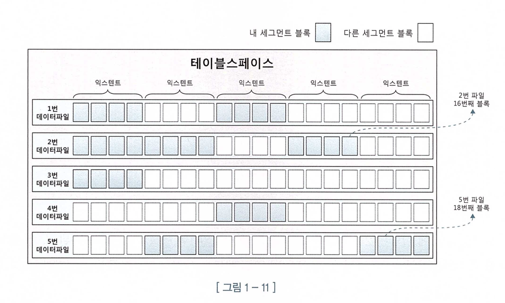

# 📌 서론

<aside>
✏️ 개인적으로 첫단원 치고는 넓고 어려운 내용을 다루고 있다고 생각한다. 그래서 가볍게 이해하고 이해가 안되는 부분은 다음 단원을 공부하면서 조금씩 채워 넣거나 다시 읽는 것이 좋다고 생각 함.

</aside>

# ⚙️ Oracle 설치

아래 링크를 참조하여 docker를 이용하여 설치 함.

[M2칩 맥 OS 오라클DB 설치(docker, colima) - 디지털 마케팅 튜토리얼 (hard-carry.com)](https://hard-carry.com/way-to-install-oracledb-on-silicon-mac-m2)

## $ Colima?

오라클을 설치 할때 docker-desktop 으로는 설치할 수 없다. 따라서 colima를 별도로 설치 해야 한다.  처음 보는 솔루션이라 가볍게 찾아 보았다.

간단한 특징이라고 하는데 해당 [링크](https://peterica.tistory.com/420)를 참조 했다.

일단 docker-desktop을 대체하는 용도인듯 하다.

- Intel 및 M1 Mac 지원
- 간단한 CLI 인터페이스
- Docker 및 Containerd 지원
- 포트 포워딩
- 볼륨 마운트
- 쿠버네티스
- 다중 인스턴스

## $ Docker로 Oracle 설치

위에서 언급한 colima를 시작하고 여기서 아키텍트를 선택하여 맥에서 사용하는 arm 아키가 아닌 amd 아키텍트를 선택하여 시작하여야 한다.

```bash
> brew install colima

# 콜리마 시작 - 시간이 좀 걸림.
> colima start --memory 4 --arch x86_64

# oracle pull
> docker pull deepdiver/docker-oracle-xe-11g

# docker run
> docker run -d --name oracle11g \
-p 1521:1521 \
-p 8080:8080 \
deepdiver/docker-oracle-xe-11g

# docker ps
> docker ps
CONTAINER ID   IMAGE                            COMMAND                   CREATED       STATUS       PORTS                                                                                          NAMES
27a4d...       deepdiver/docker-oracle-xe-11g   "/bin/sh -c 'sed -i …"    8 hours ago   Up 8 hours   0.0.0.0:1521->1521/tcp, :::1521->1521/tcp, 22/tcp, 0.0.0.0:8080->8080/tcp, :::8080->8080/tcp   oracle11g

```

## $ Data grip으로 연결

초기 계정

user : system

password : oracle


책과는 테이블명이나 여러가지로 싱크가 맞지 않는 느낌이다.

# 🔥 SQL 처리 과정과 I/O

## $ SQL 파싱과 최적화

기본적인 SQL이 파싱이 되는 과정과 최적화 되는 과정을 러프하게 설명고 최적화 하는 과정에서 잘못된 선택을 할 경우에 인간이 개입할 수 있는 방법에 대해서 설명한다.

### SQL 옵티마이저

<aside>
🔥 SQL을 구조적, 집학적 선언적 질의 언어 이지만 SQL 언어를 해석하여 집합을 생성해주는 프로그램인 `프로시저를 생성`해내는 엔진은 `SQL 옵티마이저` 이다.

</aside>

### SQL 최적화

위에서 언급한 것과 같이 프로시저를 생성하고 컴파일하여 실행 가능한 상태로 만드는 과정을 SQL최적화 라고 하는데 단계는 아래와 같다.

1. SQL을 파싱 작업
    1. 최적화를 하기전 문법적 의미적 오류가 없는지 체크한다. verification 기능을 여기서 처리하는 듯 하다.
2. SQL 최적화 ⭐️⭐️⭐️
    1. 미리 수집한 통계데이터를 기반으로 실행경로를 생성하고 가장 효율적인 계획을 선택함.
3. 로우 소스 생성
    1. 최적화까지 나온 실행경로로 실행가능한 코드 또는 프로시저 형태로 포매팅을 한다.

### SQL 최적화 과정

- 사용자에게 전달받은 쿼리를 수행하는 데 후보군이 될만 실행계획을 찾는다.
- 데이터 딕셔너리에 미리 수집한 오브젝트 통계 및 시스템 통계 정보를 이용해 예상비용(cost)을 산정한다.
- 최저 비용을 나타내는 실행계획을 선택 함.


비용기반 옵티마이저는 비용을 기준으로 최적화를 진행한다. 다만 이것이 `절대적 옳음으로 생각하면 안된다.` 예상 비용이므로 실제 비용과 다를 수 있고 책에서는 내비게이션과 비교를 많이 하게 되는데 운전을 많이 하는 사람들은 알겠지만 `내가 아는 길은 정말 답답하게 안내`할때가 많다.

인간의 직감이 무서운 이유이다. 따라서 튜닝 포인트는 바로 이런 부분에서 나온다고 생각 한다.

옵티마이저가 가끔 답답하게 플랜을 생성한다면 `힌트를 통해서 변경`할 수 있다. 이것이 인간의 개입이라 생각한다. 결국엔 엔진의 한계점이라 생각 함.  → AI가 발전한다면 점점 줄어들지 않을까 생각하지만 결국은 리소스의 문제일듯.

아래는 힌트를 사용하는 방법이다. `/*+ (테이블명 index명)*/` 문법으로 명시해 주면 옵티마이저가 참조 하여 경로를 변경 한다.

```sql
SELECT /*+ INDEX(A 고객_PK) */ 
	고객명, 연락처, 주소, 가입일시
FROM 고객 A 
WHERE 고객ID = ' 00000008'
```

## $ SQL 공유 및 재사용

### 소프트 파싱 vs 하드 파싱

아래표와 같이 `캐시에 존재` 한다면 `소프트 파싱` **캐시에 없다면 하드 파싱**이라 한다.

최적화 하는 방식은 좀 더 딥하게 봐야 겠지만 `CPU를 많이 소비` 하는 몇 안되는 작업이라고 한다. 그래서 이를 방지 하기 위해 `라이브러리 캐시`에 사용된 쿼리는 캐싱을 해 두는 것이다.


### 바인드 변수의 중요성

어플리케이션을 개발할 때 가장 기본적인 것이라 생각한다. 결국 위에서 설명한 연장선인데 결국엔 라이브러리 캐시에서 소프트 파싱을 하기 위해 캐시 히트가 되게 하기 위한 방법중에 하나이다.

어플리케이션에서 바인드 변수 처리 하지 않으면 계속해서 하드 파싱을 하게 될 것이다. 예를들어 아래와 같이 로그인을 하는 쿼리문을 작성하고 만약 로그인한 아이디가 다르다면 계속 하드 파싱하여 최적화 및 로우코드 생성 단계를 거치게 된다.

```sql
SELECT * FROM CUSTOMER WHERE LOGIN_ID = 'oraking'
SELECT * FROM CUSTOMER WHERE LOGIN_ID = 'javaking' 
SELECT * FROM CUSTOMER WHERE LOGIN_ID = 'tommy' 
SELECT * FROM CUSTOMER WHERE LOGIN_ID = 'karajan'
```

따라서 아래와 같이 동일한 SQL일 경우에는 특정 바인딩 되는 값을 변수 처리해 줌으로써 소프트 파싱을 유도할 수 있다.

```sql
SELECT * FROM CUSTOMER WHERE LOGIN_ID = ?
```

자바 코드를 예를 들면 `PreparedStatement` 객체를 사용하는 것이다.

PreparedStatement 객체는 DBMS에 쿼리문을 작성하여 요청할 때 바인딩 처리하여 요청 한다.

```java
public void login(String login_id) throws Exception { 
	String SQLStmt = "SELECT * FROM CUSTOMER WHERE LOGIN_ID = ?"; 
	PreparedStatement st = con.prepareStatement(SQLStmt);
	st.setString(1, login_id); 
	ResultSet rs = st.executeQuery(); 
	if(rs.next()) {
		// do anything
	}
	rs.close(); 
	st.close();
}
```

## $ 데이터 저장 구조 및 I/O 메커니즘

이번 단원에서 가장 어렵고 방대한 내용을 다룬다. 결국 이번 챕터를 이해한다면 일정 수준이상의 튜너가 될 수 있다고 생각한다. 다만 역시나 러프하게 내용을 다루고 있기 때문에 부가적으로 공부해야될 내용이 많다.

결국엔 어플리케이션의 성능을 좌우 하는것은 I/O이다 사실 고전적인 3tier 시스템에서 가장 문제가 되는 것은 디비이고 디비문제는 곧 I/O문제 였다. I/O문제는 저장 장치에서 부터 시작되는데 결국은 CPU와 메모리 그리도 저장장치간에 속도차이가 문제이다. 저장 장치의 가장큰 문제는 물리적 접근을 통한 지연시간이다. 그래서 책에서도 `IO를 잠` 이라고 표현하는데 그럴수 밖에 없는 것이 I/O가 일어날땐 CPU는 그냥 대기를 해야 한다. 요청한 데이터를 불러와야 처리를 할텐데 IO call이 아무리 빠르게 처리해도 한계가 있기 때문이다. 최근에 와서는 SSD와 NVME등의 최신 저장장치를 이용하여 빠른 속도를 제공하지만 그럼에도 많은 속도 차이가 나는 것은 사실이다.

### NVME vs Memory

갑자기 최근 스펙에 대해 궁금해서 현재 어느정도 속도차이가 날지 검색해 보았다. [관련 링크](https://www.quora.com/Is-an-NVMe-SSD-as-fast-as-RAM-Can-it-replace-it)

결과론적으로는 아예 상대가 안된다. 그냥 태생부터 다른 느낌이다.

Let me give you few benchmark results.

This is Samsung 980 Pro, one of best PCIe-4 SSDs:


And this is AIDA64 memory result for Intel 12900K:


Let’s look at fastest speed, SSD fully sequential is 6,684 MB/s while in memory is 93,646 MB/s or `15 times faster`!

그냥 아예 비교조차 되지 않는다. 그리고 4k 랜덤 접근의 경우 88mb 인데 일반적으로 대용량을 전달하는 것 외에는 시퀄셜하게 접근하는 경우는 많지 않기 때문에 체감 속도는 아마도 4k 랜덤 엑세스가 현실적인 속도이다.  그리고 실제로 클라우드 볼륨에서 사용하는 IOPS 단위도 4k 랜덤 속도를 의미 함.

### 데이터 베이스 저장 구조

데이터를 효율적으로 저장하기 위해 아래와 같이 설계를 했다고 생각이 든다. 각각의 영역마다 역활과 기능과 동작이 정해져 있다.


세그먼트라는 단어가 조금 낯설다고 해야 되나? 세그먼트를 우리말로 바꾸면 조각이라는 의미인데 어쨌든 여기에 테이블, 인덱스와 같이 데이터 저장공간이 필요한 오브젝트라고 한다.  그리고 세그먼트 안에는여러 익스텐트로 구성되는데 용어뜻처럼 공간을 확장하는 단위이다. 그리고 익스텐트는 여러 데이터 블록으로 구성되어 있다.

이 `데이터 블록`이 실제로 입력된 데이터가 `저장되는 공간`이다. 각각의 세그먼트 영역마다 위에서 설명한 구조로 구성되어 있다고 생각하면 될거 같다.

그리고 여기서 언급하는 내용중 데이터 블록을 논리적으로는 익스텐트 안에 연속된 공간에 있지만 실제로는 물리적으로 떨어져 있을 가능성이 높다고 한다. 여러가지 이유가 있겠지만 `파일 경합`을 줄이기 위해서 가능한 분산 저장한다고 한다.




### 그 외 기억에 남는 내용

- 데이터를 읽고 쓰는 단위는 데이터 블록인데 1 byte 컬럼 하나만 읽어도 블록을 통째로 읽어야 한다는 점.
    - 만약 데이터 블록이 8kb 라면 엄청나게 비효율적인 IO가 발생된다라는 점.  ( x 8000배..)
- 물리적 IO를 줄이기 위해 버퍼와 캐시를 적극 사용하고 있고 그 사이즈 또한 적절하게 조절할 수 있다.
    - 버퍼 캐시 효율을 측정하는 공식이 존재하며 정확하게 이해가 되진 않았지만 여기서 매우 중요한 사실은 불필요한 논리적 IO를 줄여야 성능을 향상 시킬 수 있다는 점이다.
    
        

    - 결국은 캐시의 공간은 한정되어 있고 한정된 공간내에서 캐시 히트율을 올리는 것이 튜닝의 핵심이라는 것 같다.
- 그 외에 알고있던 내용이긴 하지만 인덱스 와 풀스캔을 싱글 I/O와 멀티 I/O의 예제를 통해 다시금 정답은 없다는 것을 리마인드 함.

# 🚀 결론

- 챕터 1 부터 포기할번 했다. 후반부에 데이터 구조 IO 와 관련된 내용은 이 책의 핵심이 되는 내용이라 생각이 든다. 그래서 그냥 적당히 2번 정도 읽고 아 이런 것도 있구나 하고 넘겼다.
- 2장 부터는 좀 더 심화 과정이므로 조금은 딥하게 볼 수 있을 것 같다.
- 인간의 개입은 아직까지는 필연이라고 생각이 든다. 경험이 많은 택시 드라이버는 네비게이션 보다 훨씬 낮은 에너지로 좋은 경로를 찾아 낸다.  개발자가 왜 도메인을 잘 이해해야 하며 데이터 구조를 잘 만들어야 하는지에 대한 역설이라 생각 함.
- DBMS 엔진을 이해하고 도메인 또는 데이터 구조를 설계할 수 있다면 별다른 튜닝이 없이도 높은 효율을 낼 수 있는 서비스가 나오지 않을까 라는 생각을 하게 되었다.

# 📎 Reference

- [0주차 - Oracle 설치 (notion.site)](https://www.notion.so/0-Oracle-934401cc83f34a3c9487ea0487107d49?pvs=21)