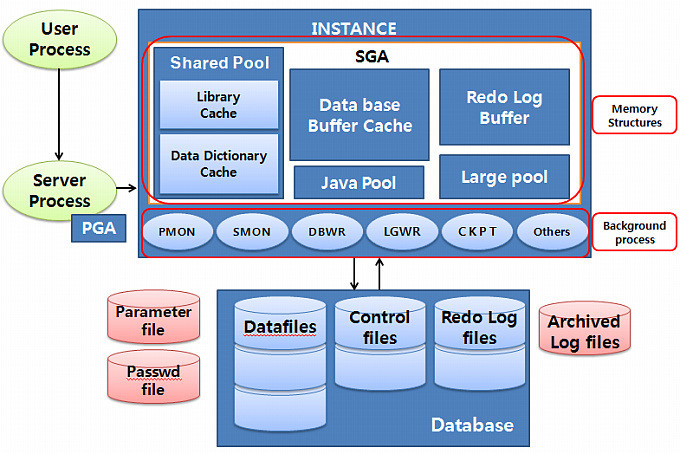
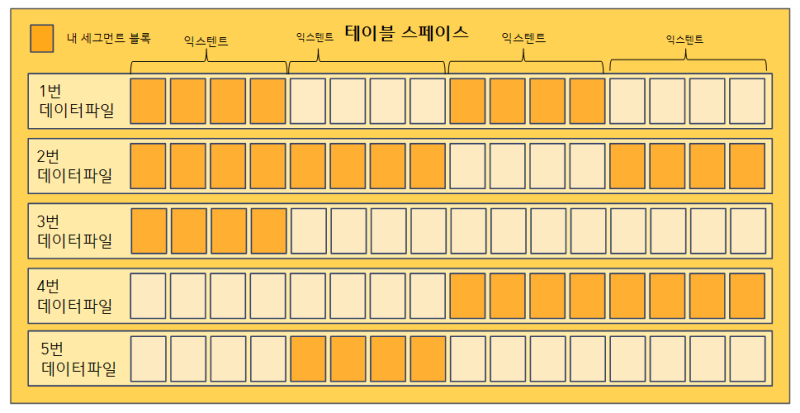

# 1장 - SQL 처리 과정과 I/O

## 1.1 SQL 파싱과 최적화

### SQL 최적화 과정

1. SQL 파싱
가장 먼저 SQL 파서가 파싱을 발생시킴
* 파싱 트리 생성 : SQL 문을 이루는 개별 구성요소를 분석해서 파싱 트리 생성
* Syntex 체크 : 문법 오류 확인
* Sementic 체크 : 의미상 오류가 없는지 확인


2. SQL 최적화
옵티마이저로 다양한 실행 경로 생성 후, 그 중 가장 효율적인 경로 선택

3. 로우 소스 생성
옵티마이저가 생성한 실행경로를 실제 실행가능 코드로 포맷팅
로우 소스 생성기

### SQL 옵티마이저
최적의 데이터 액서스 경로를 선택해주는 DBMS 핵심 엔진

#### 옵티마이저의 최적화 단계
1. 사용자로부터 전달받은 쿼리를 수행하는데 후보군이 될 만한 실행계획들을 찾아냄
2. 데이터 딕서너리에 미리 수집해 둔 오브젝트 통계 및 시스템 통계정보를 통해 실행 계획의 예상비용 산정
3. 최저 비용을 나타내는 실행계획 선택

#### 옵티마이저 힌트

옵티마이저도 실수를 할 때가 있음
이럴 때 옵티마이저 힌트를 통해 데이터 액서스 경로를 바꿀 수 있다.

예시
```sql
SELECT /*+ INDEX(A 고객_PK)*/
    고객명, 연락처, 주소, 가입일시
FROM 고객 A
WHERE 고객ID = '00001';
```

## 1.2 SQL 공유 및 재사용

### 소프트 파싱 vs 하드 파싱

라이브러리 캐시 : 내부 프로시저를 반복 재사용 할 수 있도록 캐싱해 두는 메모리 공간

라이브러리 캐시는 SGA 구성 요소 중 하나이다.



SGA :  서버 프로세스와 백그라운드 프로세스가 공통으로 액서스 하는 데이터와 제어구조를 캐싱하는 메모리 공간.

**소프트 파싱** : 라이브러리 캐시에서 찾아서 실행단계로 넘어가는 것

**하드 파싱** : 라이브러리 캐시에 찾지 못해 최적화 단계를 거치는 것

사용자가 SQL 문을 전달하면 DBMS는 SQL 을 파싱한 후, 해당 SQL이 라이브러리 캐시에 존재하는지 확인 한다.

만약 찾으면 이를 바로 실행시키지만, 만약 찾지 못하면 최적화 단계로 넘어간다.


하드 파싱은 꽤나 많은 자원을 사용하는 작업 중 하나로 라이브러리 캐시를 통해 이를 줄일 수 있다.


### 바인드 변수

#### 이름없는 SQL 문제

사용자 정의 함수/프로시저, 트리거, 패키지와 달리 SQL 문은 따로 이름이 없고, SQL 문 전체가 이름을 대신한다. 

내부 프로시저를 라이브러리 캐시에 적재함으로써 여러 사용자가 공유하면서 재사용한다.

SQL의 작은 부분이라도 수정이 되면 SQL 자체가 이름이므로 새로운 객체가 탄생한다.

이로 인해 SQL 문을 따로 저장해 두지 않는다.

#### 공유 가능 SQL

이 때문에 동적으로 변하는 파라미터 같은 경우 파라미터 Driven 방식으로 SQL 문을 작성하면 좋다.

**파라미터 하드 코딩 시**
```java
public void login(String loginId) {
    String sql = "SELECT * FROM CUSTOMER WHERE login_id = '" + loginId + "'";
    Statement st = con.createStatement();
    ResultSet rs = st.executeQuery(sql);

    // logic...

    rs.close();
    st.close();
}
```

**result**
```sql
SELECT * FROM CUSTOMER WHERE login_id = 'aaa'
SELECT * FROM CUSTOMER WHERE login_id = 'bbb'
SELECT * FROM CUSTOMER WHERE login_id = 'ccc'
SELECT * FROM CUSTOMER WHERE login_id = 'ddd'
SELECT * FROM CUSTOMER WHERE login_id = 'eee'
...
-- 이렇게 라이브러리 캐시에 일일이 저장이 됨

```

**파라미터 Driven 방식**
```java
public void login(String loginId) {
    String sql = "SELECT * FROM CUSTOMER WHERE login_id = ?";
    PrepareStatement st = con.prepareStatement(sql);
    st.setString(1, loginId);
    ResultSet rs = st.executeQuery();

    // logic...

    rs.close();
    st.close();
}
```

**result**
```sql
SELECT * FROM CUSTOMER WHERE login_id = :1
...
-- 라이브러리 캐시에 얘만 저장 됨

```


## 1.3 데이터 저장 구조 및 I/O 메커니즘

### SQL 이 느린 이유

원인 : 디스크 I/O

OS 또는 I/O 서브 시스템이 IO를 처리하는 동안 프로세스는 처자기 때문이다(...)

프로세스는 아래와 같은 생명주기를 가진다. 


프로세스는 디스크에 데이터를 읽어야 할 때 CPU를 OS에 반환하고 waiting 상태에서 IO가 완료되기를 기다린다.

#### 데이터베이스 구조


* 테이블 스페이스 : 세그먼트를 담는 컨테이너
* 세그먼트 : 테이블, 인덱스 등 데이터 저장 공간이 필요한 오브젝트, 테이블/인덱스도 하나의 세그먼트


* 익스텐트 : 공간 확장 단위, 테이블/인덱스가 데이터를 입력하다 공간이 부족해지면 해당 오브젝트가 속한 테이블 스페이스로부터 익스텐트를 추가로 할당 받는다. 한 익스텐트는 하나의 테이블이 독점한다. 

* 블록(페이지) : 사용자가 입력한 레코드를 실질적으로 저장하는 공간, 한 블록은 하나의 테이블이 독점한다. 

세그먼트에 할당된 모든 익스텐트가 같은 데이터파일에 위치하지 않을 수 있다. 파일 경합을 줄이기 위해 DBMS의 데이터를 가능한 한 여러 데이터 파일로 분산해서 저장한다.

