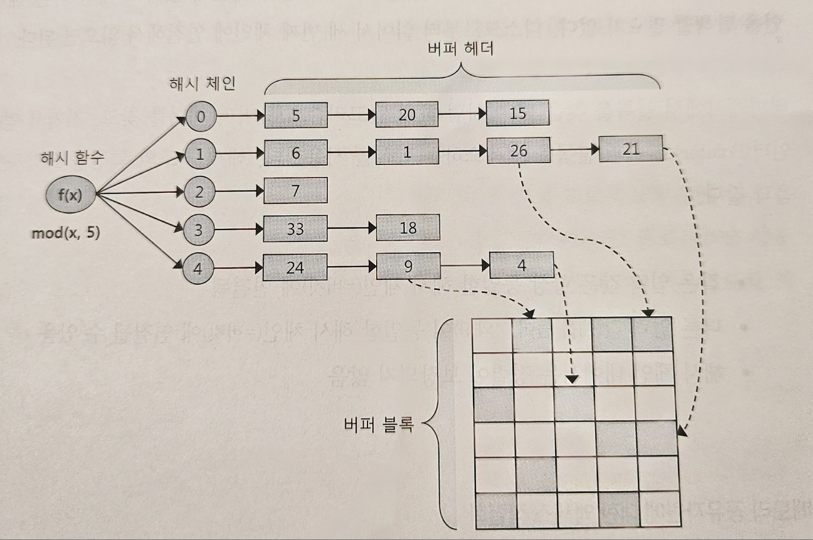

# 1장 - SQL 처리 과정과 I/O

## 1.1 SQL 파싱과 최적화

### SQL 최적화 과정

1. SQL 파싱
가장 먼저 SQL 파서가 파싱을 발생시킴
* 파싱 트리 생성 : SQL 문을 이루는 개별 구성요소를 분석해서 파싱 트리 생성
* Syntex 체크 : 문법 오류 확인
* Sementic 체크 : 의미상 오류가 없는지 확인


2. SQL 최적화
옵티마이저로 다양한 실행 경로 생성 후, 그 중 가장 효율적인 경로 선택

3. 로우 소스 생성
옵티마이저가 생성한 실행경로를 실제 실행가능 코드로 포맷팅
로우 소스 생성기

### SQL 옵티마이저
최적의 데이터 액서스 경로를 선택해주는 DBMS 핵심 엔진

#### 옵티마이저의 최적화 단계
1. 사용자로부터 전달받은 쿼리를 수행하는데 후보군이 될 만한 실행계획들을 찾아냄
2. 데이터 딕서너리에 미리 수집해 둔 오브젝트 통계 및 시스템 통계정보를 통해 실행 계획의 예상비용 산정
3. 최저 비용을 나타내는 실행계획 선택

#### 옵티마이저 힌트

옵티마이저도 실수를 할 때가 있음
이럴 때 옵티마이저 힌트를 통해 데이터 액서스 경로를 바꿀 수 있다.

예시
```sql
SELECT /*+ INDEX(A 고객_PK)*/
    고객명, 연락처, 주소, 가입일시
FROM 고객 A
WHERE 고객ID = '00001';
```

## 1.2 SQL 공유 및 재사용

### 소프트 파싱 vs 하드 파싱

라이브러리 캐시 : 내부 프로시저를 반복 재사용 할 수 있도록 캐싱해 두는 메모리 공간

라이브러리 캐시는 SGA 구성 요소 중 하나이다.


SGA :  서버 프로세스와 백그라운드 프로세스가 공통으로 액서스 하는 데이터와 제어구조를 캐싱하는 메모리 공간.

**소프트 파싱** : 라이브러리 캐시에서 찾아서 실행단계로 넘어가는 것

**하드 파싱** : 라이브러리 캐시에 찾지 못해 최적화 단계를 거치는 것

사용자가 SQL 문을 전달하면 DBMS는 SQL 을 파싱한 후, 해당 SQL이 라이브러리 캐시에 존재하는지 확인 한다.

만약 찾으면 이를 바로 실행시키지만, 만약 찾지 못하면 최적화 단계로 넘어간다.


하드 파싱은 꽤나 많은 자원을 사용하는 작업 중 하나로 라이브러리 캐시를 통해 이를 줄일 수 있다.


### 바인드 변수

#### 이름없는 SQL 문제

사용자 정의 함수/프로시저, 트리거, 패키지와 달리 SQL 문은 따로 이름이 없고, SQL 문 전체가 이름을 대신한다. 

내부 프로시저를 라이브러리 캐시에 적재함으로써 여러 사용자가 공유하면서 재사용한다.

SQL의 작은 부분이라도 수정이 되면 SQL 자체가 이름이므로 새로운 객체가 탄생한다.

이로 인해 SQL 문을 따로 저장해 두지 않는다.

#### 공유 가능 SQL

이 때문에 동적으로 변하는 파라미터 같은 경우 파라미터 Driven 방식으로 SQL 문을 작성하면 좋다.

**파라미터 하드 코딩 시**
```java
public void login(String loginId) {
    String sql = "SELECT * FROM CUSTOMER WHERE login_id = '" + loginId + "'";
    Statement st = con.createStatement();
    ResultSet rs = st.executeQuery(sql);

    // logic...

    rs.close();
    st.close();
}
```

**result**
```sql
SELECT * FROM CUSTOMER WHERE login_id = 'aaa'
SELECT * FROM CUSTOMER WHERE login_id = 'bbb'
SELECT * FROM CUSTOMER WHERE login_id = 'ccc'
SELECT * FROM CUSTOMER WHERE login_id = 'ddd'
SELECT * FROM CUSTOMER WHERE login_id = 'eee'
...
-- 이렇게 라이브러리 캐시에 일일이 저장이 됨

```

**파라미터 Driven 방식**
```java
public void login(String loginId) {
    String sql = "SELECT * FROM CUSTOMER WHERE login_id = ?";
    PrepareStatement st = con.prepareStatement(sql);
    st.setString(1, loginId);
    ResultSet rs = st.executeQuery();

    // logic...

    rs.close();
    st.close();
}
```

**result**
```sql
SELECT * FROM CUSTOMER WHERE login_id = :1
...
-- 라이브러리 캐시에 얘만 저장 됨

```


## 1.3 데이터 저장 구조 및 I/O 메커니즘

### SQL 이 느린 이유

원인 : 디스크 I/O

OS 또는 I/O 서브 시스템이 IO를 처리하는 동안 프로세스는 처자기 때문이다(...)

프로세스는 아래와 같은 생명주기를 가진다. 


프로세스는 디스크에 데이터를 읽어야 할 때 CPU를 OS에 반환하고 waiting 상태에서 IO가 완료되기를 기다린다.

#### 데이터베이스 구조


* 테이블 스페이스 : 세그먼트를 담는 컨테이너

* 세그먼트 : 테이블, 인덱스 등 데이터 저장 공간이 필요한 오브젝트, 테이블/인덱스도 하나의 세그먼트


* 익스텐트 : 공간 확장 단위, 한 익스텐트는 하나의 테이블이 독점한다. 

* 블록(페이지) : 사용자가 입력한 레코드를 실질적으로 저장하는 공간, 한 블록은 하나의 테이블이 독점한다. 

세그먼트에 할당된 모든 익스텐트가 같은 데이터파일에 위치하지 않을 수 있다. 파일 경합을 줄이기 위해 DBMS의 데이터를 가능한 한 여러 데이터 파일로 분산해서 저장한다.


#### 블록 단위 I/O

* I/O를 하는 단위는 블록이다. 

#### 시퀀셜 액서스 vs 랜덤 액서스

* 시퀀셜 액서스 : 논리적/물리적으로 연결된 순서대로 블록을 읽는 방식
    - ex) 인덱스 리프 블록
    - 오라클은 익스텐트 목록을 세그먼트 해더에 맵으로 관리, 익스텐트 맵은 각 익스텐트의 첫번째 블록 주소값을 가짐 -> 읽어야 하는 목록을 익스텐트 맵에서 읽고 순차적으로 읽으면 Full table scan

* 랜덤 액서스 : 논리적/물리적 순서를 따르지 않고, 레코드 하나를 읽기 위해 한 블록씩 접근하는 방식


### 논리적 I/O vs 물리적 I/O

#### DB 버퍼 캐시 

디스크에서 읽은 데이터 블록을 캐싱

#### 논리적 I/O vs 물리적 I/O

* 논리적 블록  I/O  : SQL을 처리하는 과정에서 발생한 총 블록 I/O (메모리 I/O + Direct Path I/O)

* 물리적 I/O : 디스크에서 발생한 총 블록 I/O (논리적 블록 I/O의 일부)

**버퍼캐시 히트율**

> 읽은 전체 블록 중 물리적 디스크 IO를 수반하지 않고 메모리에서 찾은 비율

```
BCHR(버퍼캐시 히트율) = ( 캐시에서 곧바로 찾은 블록 수/ 총 읽은 블록 수 ) * 100
= ( ( 논리적 IO - 물리적 IO ) / 논리적 IO ) * 100
= ( 1 - (물리적 IO) / (논리적 IO) ) * 100
```


온라인 트랜잭션이 많은 어플리케이션의 경우 히트율이 99퍼는 되어야 한다

성능 향상을 위해서는 물리적 IO를 줄이기보단 논리적 IO를 줄이는데 힘써야 한다. 물리적 IO 통제 불능 외부변수이기 때문


논리적 IO를 줄여 물리적 IO를 줄이는 것이 곧 SQL 튜닝이다.

### Single Block I/O vs MultiBlock I/O

**Single Block I/O**

> 한번에 한 블록씩 메모리에 적재하는 방법

* 인덱스 루트 블록을 읽을 때
* 인덱스 루트 블록에서 얻은 주소 정보로 브랜치 블록을 읽을 때
* 인덱스 브랜치 블록에서 얻은 주소 정보로 리프 블록을 읽을 때
* 인덱스 리프 블록에서 얻은 주소 정보로 테이블 블록을 읽을 때


**MultiBlock IO**

> 한번에 여러블록을 메모리에 적재하는 방법

* full table scan
* 한번에 많은 양을 가져와야 유리하므로 MultiBlock I/O 단위를 크게 설정하면 좋다.


#### Table full scan vs Index Range scan

**Table Full scan**

테이블에 속한 블록 전체를 읽어오는 방식

한번의 수면(IO call)으로 많은 IO를 읽어 온다.

**Index Range Scan**

인덱스를 이용한 테이블 액서스

Single Block I/O + 랜덤 액서스 방식으로 읽어온다.

**Table full scan vs Index Range scan**

많은 데이터를 읽어야 할 때는 Index Range Scan이 불리하다.

### 캐시 탐색 매커니즘

버퍼 캐시 탐색을 하는 경우

* 인덱스 루트 블록을 읽을 때
* 인덱스 루트 블록에서 얻은 주소 정보로 브랜치 블록을 읽을 때
* 인덱스 브랜치 블록에서 얻은 주소 정보로 리프 블록을 읽을 때
* 인덱스 리프 블록에서 얻은 주소 정보로 테이블 블록을 읽을 떄
* 테이블 블록을 Full scan 할 때 


**버퍼캐시 구조**


버퍼캐시는 해시 구조로 관리된다.

해시 탐색 알고리즘을 모듈러 알고리즘을 사용한다 가정하고 설명하면

버퍼캐시에서 20번째 블록을 찾으려 한다면 블록 번호를 5로 나누어 나누면 0이 된다. 이 블록이 캐싱되어 있다면 버퍼 헤더가 0번째 해시 체인과 연결되어 있는 블록을 읽으면 된다.


**메모리 공유 자원에 대한 액서스 직렬화**

하나의 버퍼블록에 두개의 프로세스가 동시에 접근하려 한다면 문제가 발생할 수 있다. 

이를 위해 한번에 하나의 프로세스가 순차적으로 접근할 수 있도록 구현해야 하며, 이를 위해 직렬화 매커니즘이 필요하다.

직렬화를 하기 위해 프로세스를 줄 세우는 매커니즘을 래치(Latch)라고 한다.

캐시 버퍼 체인 뿐만이 아니라 버퍼 블록 자체에도 직렬화 매커니즘이 존재한다. 이를 버퍼 Lock라고 한다.