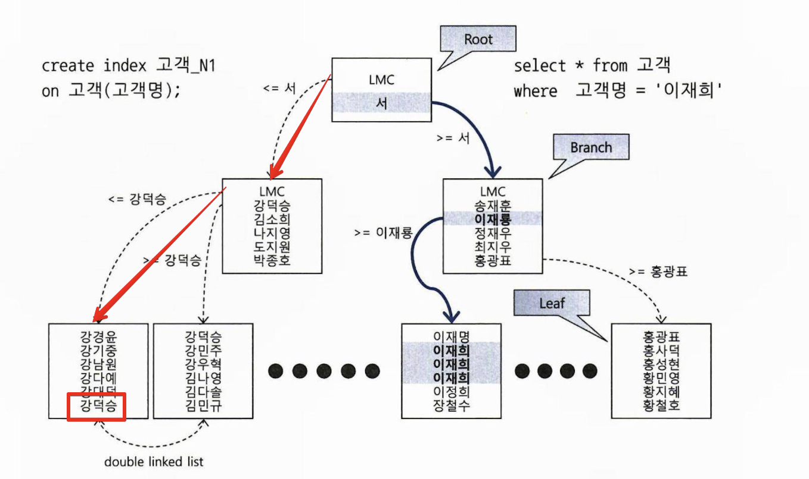
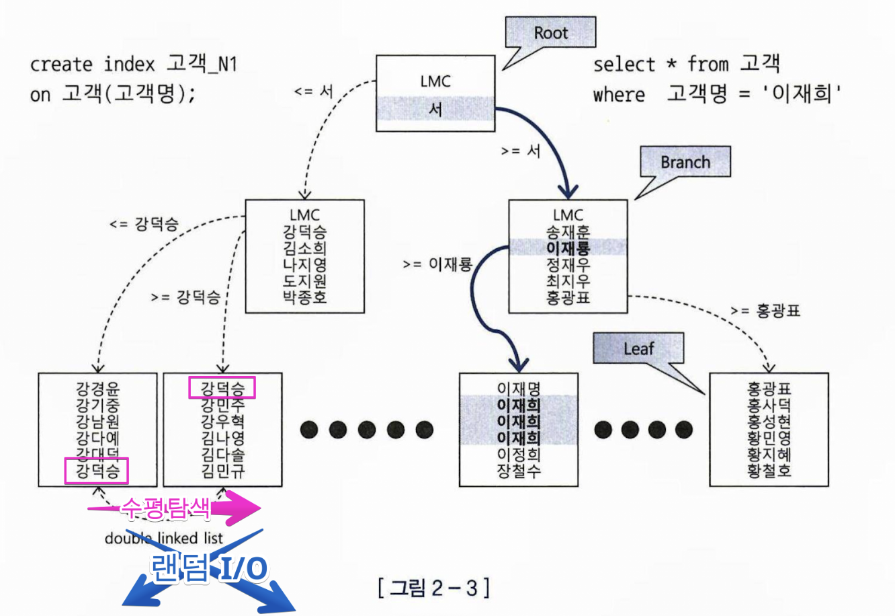
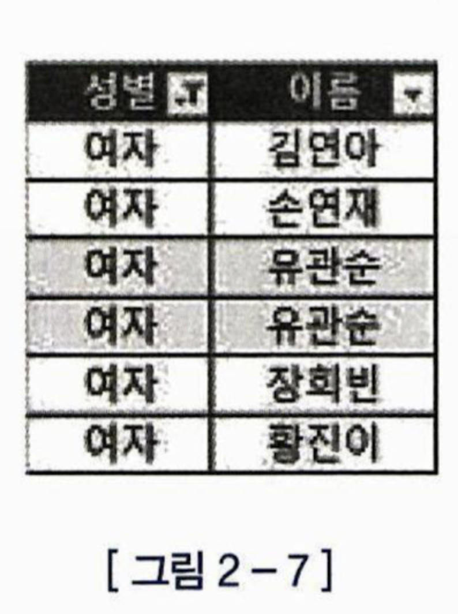
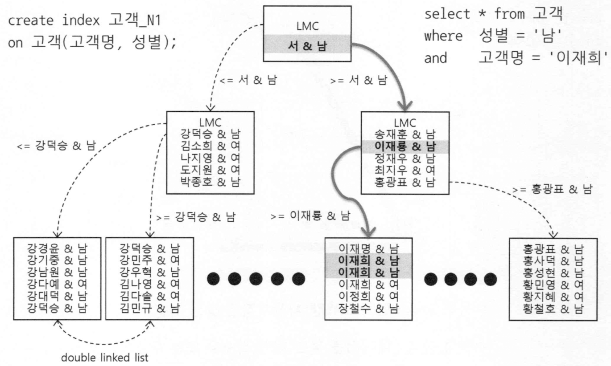
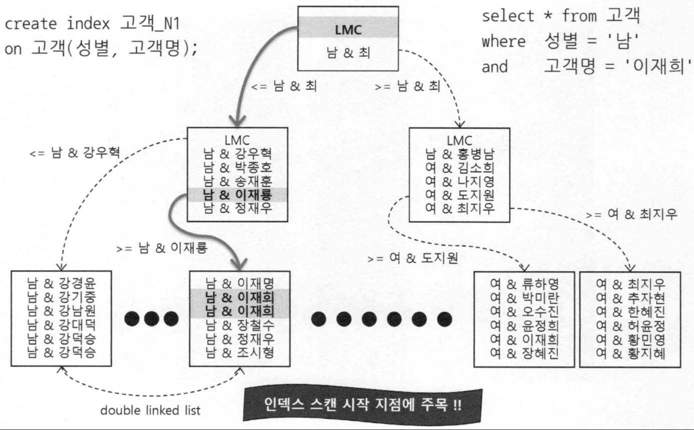
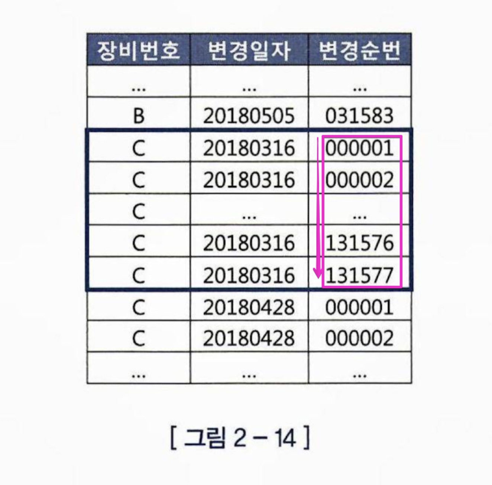

# 데이터를 탐색하는 두가지 방법

테이블 전체를 스캔한다.
인덱스를 이용한다.

# 인덱스 튜닝의 두가지 핵심 요소

## 1. 인덱스 자체를 스캔하는 과정에서 발생하는 비효율을 줄이기

ex) 학생명부에서 시력이 1.0 ~ 1.5인 홍길동 학생 찾기

시력과 이름순으로 정렬된 학생 명부

VS

이름과 시력순으로 정렬된 학생 명부

## 2. 랜덤 액세스 최소화 시키기

시력이 1~1.5인 학생이 50명, 이름이 홍길동인 학생이 5명이라고 했을때,

시력으로 정렬된 명부 VS 이름으로 정렬된 명부

=

2명을 찾기 위해 50번 탐색 VS 2명을 찾기위해 5번만 탐색

## 랜덤 엑세스 최소화 튜닝이 더 영향이 크다

인덱스 자체를 스캔하는 과정 : 학생명부 뒤지기
랜덤 엑세스 : 학생을 부르기 위해 직접 반으로 찾아가기(= 랜덤 I/O)

SQL 튜닝은 랜덤 I/O와의 전쟁이다.


# 인덱스 수직 탐색, 수평탐색

"강덕승" 찾기 예시

## 수직 탐색



인덱스 수평탐색의 시작점을 찾는 과정
인덱스의 리프노드에는 테이블 레코드를 가리키는 주소값(ROWID)이 있다.
그래서 결국 테이블 레코드를 가져오기 위해서는 루트노드에서 -> 리프노드까지 탐색을 해야한다.


## 수평탐색



수직 탐색으로 부터 찾은 시작점 부터 시작해서 찾고자하는 데이터가 더이상 안나타날때 까지 리프블록을 수평적으로 탐색

수평탐색이 길어지면, 실제 레코드를 가져와야할때, 랜덤 I/O가 늘어나게 됨

## 결합인덱스 순서와 인덱스 탐색의 상관관계

Q. 
WHERE 절에
이름 = '이재희' AND 성별 = '남' 로 검색한다면,
인덱스를 (성별, 이름) 순으로 만드는게 좋을까? (이름, 성별) 순으로 만드는게 좋을까?

오개념 : 이름이 더 카디널리티가 높으니까 이름이 먼저와야 하지 않을까?



엑셀이라면 맞는 이야기라고 생각 할 수 있다. 이름으로 한번만 필터링 하면 되지 굳이 성별로 먼저 필터링까지 할 필요 없으니까 말이다. 하지만 B*트리  인덱스에서는 다른이야기


1. 고객명, 성별 순 결합 인덱스 일 경우 -> 수직 2, 수평 1



2. 성별, 고객명 순 결합 인덱스 : 수직 2, 수평 1



조건절에 인덱스 구성컬럼을 모두 "=" 조건으로 사용했기 때문에, 
인덱스 탐색에서 찾는 수는 동일! 그들간의 순서는 상관 없다.


만약 WHERE = 이재희 만 찾는 다면 ?

# 인덱스를 사용한다는 것은 = 인덱스 Range 스캔을 하겠다는 것

공부할 때는 인덱스 Range 스캔을 하지 못하는 경우를 먼저 공부하는 방법으로 터득하는 것이 좋다.

## 인덱스를 타지 못하는 경우

### 시작지점을 못찾는 경우

조건 절 컬럼 가공 (자동형변환 주의)
LIKE 중간부터

### 쿼리를 바꿔서라도 타게 가능한 경우

OR 조건 : OR Expansion -> Union All 로 처리 -> Range 스캔을 여러번
WHERE IN 절 : -> Range 스캔을 리스트 원소 갯수만큼 여러번

## 결합인덱스 순서도 중요하다 

조건절 사용 컬럼이 선두에 와야한다.


소속팀 + 사원명 + 연령 순 인덱스에서

```SQL

SELECT 
	사원번호,
	소속팀, 
	연령, 
	입사일자, 
	전화번호
FROM
	사원
WHERE
	사원명 = '홍길동'
;
```


인덱스를 탈까? : NO
사원명 : 점조건

소속팀 + 사원명 + 연령
   x             .       |     

인덱스에서 선두컬럼 부터 못찾기 때문에 인덱스를 타지 못한다

# 인덱스 잘 타니까 튜닝 끝?

인덱스를 타긴타는데 잘타느냐 못타느냐 도 고려가 필요

필요한 레코드는 1건인데
인덱스 레인지 스캔으로 100만건 검색하는 경우

=> 과연 인덱스를 잘 탔다고 할수 있을까?


# 인덱스로 소트 연산을 생략 할 수 있다.

인덱스 :  찾고자하는 데이터를 미리 정렬된 상태로 구성 => 잘하면 정렬을 또 안해도 될 수 있다.


PK : 장비번호 + 변경일자 + 변경순번 


장비 번호, 변경일자가 같은 것끼리는 이미 정렬 되어있다.

```SQL

SELECT
	*
FROM 상태변경이력
WHERE 장비번호 = 'C'
AND 변경일자 = '20180316'
ORDER BY 변경순번
;
```

=> 변경순번으로 조회 할 경우 정렬 생략이 가능

```SQL
SELECT
	*
FROM 상태변경이력
WHERE 장비번호 = 'C'
AND 변경일자 = '20180316'
ORDER BY 변경순번 DESC
;
```
=> 리프블록 끼리는 양방향 Linked List 구조로 되어있기 때문에 내림차순도 가능하다.

=> 상세한 튜닝기법은 5장에서 더 설명

## 소트연산 생략 못하는 경우 : ORDER BY 절 에서 컬럼 변환

```SQL
SELECT
	*
FROM
	상태변경이력
WHERE
	장비번호 = 'C'
ORDER BY
	변경일자 || 변경순번
```

## 소트연산 생략 못하는 경우 : ORDER BY 절 에서 컬럼 변환

ORDER BY 절 또한 컬럼을 변형해서 사용할 경우 소트연산 생략을 하지 못한다.

```SQL

SELECT *
FROM 상태변경이력
WHERE 장비번호 = 'C'
ORDER BY 변경일자 || 변경순번
;
```


```SQL
SELECT *
FROM (
	SELECT 
		TO_CHAR(A.주문번호, 'FM00000000') AS 주문번호,
		A.업체번호,
		A.주문금액
	FROM 
		주문 A
	WHERE
		A.주문일자 = :dt
	AND
		A.주문번호 > NVL(:next_ord_no, 0)
	ORDER BY 주문번호
)
WHERE ROWNUM <= 30
;
```


# 자동 형변환

인덱스 컬럼을 조건절에서 변형해서 사용할 경우 시작지점을 찾지 못해 인덱스를 못탄다고 했다.
근데 내가 직접 변환을 하지 않아도 자동으로(암묵적) 변환 될 수 있다.

숫자 > 문자 but, LIKE 일땐 숫자가 문자로변환
날짜 > 문자


자동형변환은 위험하다

- 위의 인덱스 컬럼 변형의 예시
- decode(a, b, c, d) 의 예시

그러므로 자동형변환에 너무 의존하지 말고, 인덱스 컬럼 기준 반대편 컬럼 또는 값에 형변환 함수를 명확히 해주자

