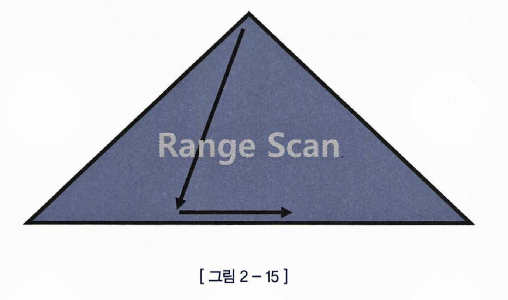
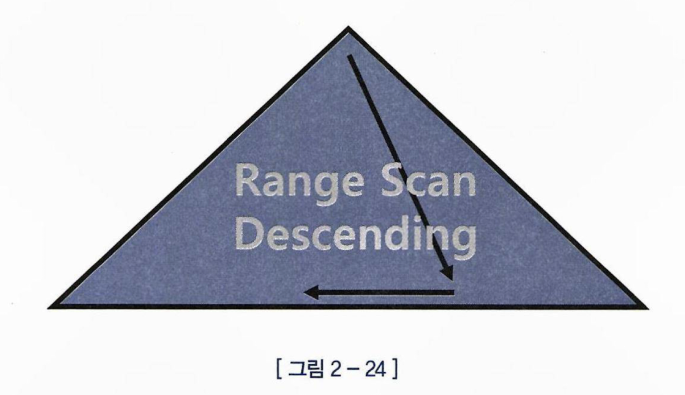
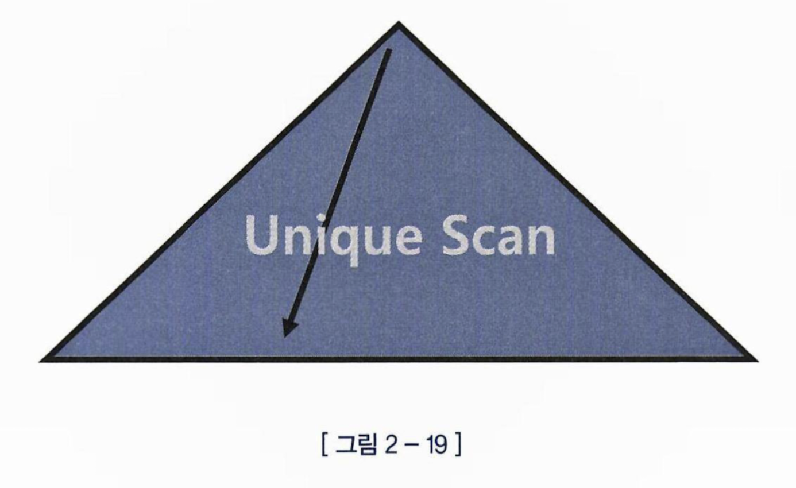
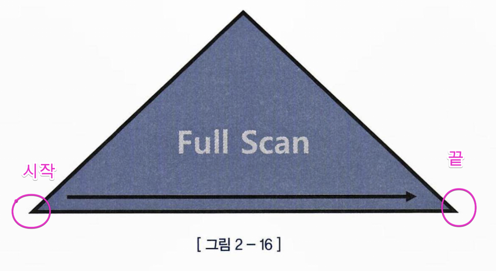
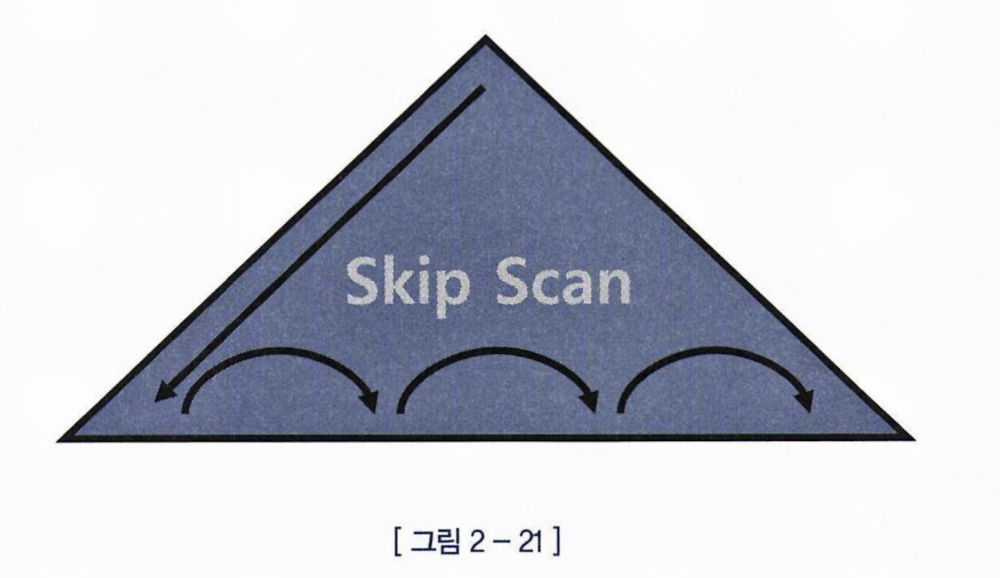

# Index Range Scan


선두컬럼을 가공하지 않은 상태로 조건절에 사용하면 Index Range Scan은 무조건 가능하다

```
set autotrace traceonly exp
select * from emp where deptno = 20;
```

실행계획에서

INDEX (RANGE SCAN) 으로 확인이 가능하다.

# Index Range Scan Descending



ORDER BY 절에 DESC 로 쿼리할때 또는 MAX 값을 구할때 옵티마이저는 알아서 인덱스를 거꾸로 읽는 실행계획을 수립한다.
* 만약 옵티마이저가 인덱스를 거꾸로 읽지 않는다면, index_desc 힌트를 사용해 유도 할 수 있다.

```
select * from emp
where empno > 0
order by empno desc
```

마찬가지로 실행계획에서 확인이 가능하다

INDEX (RANGE SCAN DESCENDING)

# Index Unique Scan


Unique 인덱스를 '=' 조건으로 탐색하는 경우에 작동한다.

```sql
create unique index pk_emp on emp(empno);
alter table emp add 2 constranint pk_emp primary key(empno) using index pk_emp;

set autotrace traceonly explain

select 
	empno,
	ename
from emp
where empno = 7788;
```

인덱스 스캔을 통해 찾은 시작 지점이 곧 찾고자 하는 레코드 일 경우에 작동되는 것 같다.

마찬가지로, 실행계획에서 확인 할 수 있다.
INDEX (UNIQUE SCAN)

# Index Full Scan


수직탐색 없이 모든 리프노드를 수평 탐색 하는 방식

sql 예제 : 인덱스 선두컬럼을 조건절에서 활용 못하는 경우
```sql
create index emp_ename_sal_idx on emp (ename, sal);

set autotrace traceonly exp
select * 
from emp
where sal > 2000
order by ename
;
```

## 테이블 Full Scan VS 인덱스 Full Scan

테이블이 차지하는 공간 보다 인덱스가 차지하는 공간이 훨씬 작다.
그래서 인덱스에서 필터링을 수행할 수 있다면, 테이블을 다읽고 필터링하기보단 인덱스를 다읽고 필터링 하는게 더 이득이다.

하지만 인덱스 컬럼 이외의 컬럼 데이터도 필요한 경우에는 레코드에서 해당 레코드에 접근하기 위해 랜덤 I/O가 발생하기 때문에

레코드 수가 많다면, 차라리 테이블 Full Scan이 나을 수 있다.

## 소트연산 생략도 가능하다.

```sql
select /*+ first_rows */ *
from emp
where sal > 1000
order by ename;
```

대부분의 사원이 sal > 1000 을 만족한다면 
인덱스 풀 스캔보다 테이블 풀 스캔이 더 적합 할 수 있다.

그래서 옵티마이저가 테이블 풀스캔을 할것 같지만,

사용자가 first_rows 힌트, 옵티마이저가 첫 번째 row 를 빨리 찾는데 집중하기 때문에 소트 연산을 생략하기 위해 인덱스 풀스캔을 선택한것을 확인 할 수 있다.

# Index Fast Full Scan

Index Full Scan 에서 인덱스 트리 구조를 무시하고, 리프노드가 물리적으로 디스크에 저장된 순서대로 인덱스 리프 블록들을 Multiblock I/O 방식으로 읽어들인다.

그렇기 때문에 결과집합이 정렬되지 않는다.
쿼리에 사용한 컬럼이 모두 인덱스에 포함돼 있을 때만 사용할 수 있다.

# Index Skip Scan


인덱스 선두컬럼이 조건절에 없어도 인덱스를 활용할수있는 기능(9i 버전 이후 사용가능)

"인덱스 선두컬럼의 Distinct Value 개수가 적고, 후행컬럼의 Distinct Value 개수가 많을때 유용"

index_ss, no_index_ss 힌트로 유도가능

예시1)

[성별 + 연봉] 순서로 인덱스가 있는데 고객번호로 조회 할때
```sql

select /*+ index_ss(사원 사원_IDX) */ *
from 사원
where 연봉 between 2000 and 4000
;

```

실행계획에 INDEX (SKIP SCAN) 으로 표시된다.


예시2) 인덱스 선두컬럼이 아니라, 중간 컬럼이 조건절에 없는 경우에도 SKIP SCAN 가능

[업종유형코드 + 업종코드 + 기준일자] 로 인덱스가 있는 경우
```sql
select /*+ index_ss(A 일별업종거래_PK) */ *
from 일별업종별거래 A
where 업종유형코드 = '01'
and 기준일자 between '20080501' and '20080531'
;
```

예시3) 인덱스 선두컬럼이 조건절에 '=' 조건이 아니라 부등호, BETWEEN, LIKE 같은 범위 검색 조건이여도 Index Skip Scan이 가능하다.

[기준일자+업종유형코드] 순서로 인덱스
```sql
select /*+ index_ss(A 일별업종거래_PK) */
	기준일자,
	업종코드,
	체결건수,
	체결수량,
	거래대금
from 일별업종별거래 A
where 기준일자 between '20080501' and '20080531'
and 업종유형코드 = '01'
;
```

