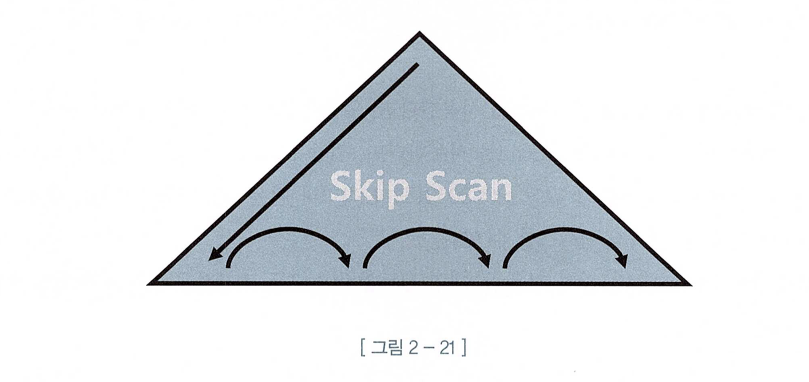

# 📌 서론

<aside>
✏️ 인덱스의 기본적인 아웃라인과 사용법과 동작에 대해 이해하고 이를 확장하는 기능을 살펴 본다.

</aside>

# 인덱스 구조 탐색

## 아웃라인

- 전체 검색 방법
- 정렬해두고 찾아가는 방식 (인덱스)
    - 소량 데이터를 범위 검색

### 인덱스 튜닝 요소

1. 스캔 과정의 비효율을 줄이자.
    1. 여러 컬럼으로 조회 하는 경우에 해당 컬럼으로 정렬이 되어 있다면 소량만 스캔하면 됨.
        1. 대신 인덱스 비용과 트레이드 오프를 해야 하므로 고민이 필요 함.
2. `랜덤 엑세스` 횟수 줄이자. ⭐️⭐️⭐️ (우선순위가 더 높음)
    1. 인덱스 스캔후 `레코드 접근시 랜덤  I/O를 사용`함.
    2. 그러므로 인덱스 스캔후 레코드 접근이 많이 필요하다면 이를 줄일 수 있는 스캔이 더 좋음.
    3. I/O라는건 결국 테이블 `데이터 블록에 접근`하는 것인데 이것을 줄이기 위한 방법이 튜닝의 핵심이다.
3. 결국 소량 스캔을 하는 것이 가장 좋다는 말임.
    1. `인덱스 스캔하는 원리`를 이해해야하고 `데이터 구성`을 이해해야 한다.
    2. 그럼에도 불구하고 소량 스캔이 되지 않을 경우에는 다른 인덱스 스캔이나 풀테이블 스캔도 고려해야 한다.

## B*Tree 인덱스

> B*Tree 에서 B는 `Balanced`의 약자. 어떤 값으로 탐색하더라도 인덱스 루트에서 리프 블록에 도달하기까지 읽는 블록 수가 같음을 의미 함. → Delete 작업으로 인한 `불균형(Unbalanced)` 상태에 놓일 수 있다는 자료가 있으나 그렇지 않다.
>


### LMC

> 가장 왼쪽 첫 번째 레코드를 의미 한다. `Leftmost Child`의 줄임말이며 자식 노드중 가장 왼쪽 즉 첫번째를 의미 함.
>

### 그림 2-3 설명

- Root 레코드의 왼쪽 브런치는 `강덕승 ≥ && 송재훈 ≤` 조건의 레코드가 저장 되어 있음.
- Leaf 블록에 저장된 레코드는 키값 순으로 정렬되어 있고 테이블 레코드를 가리키는 주소값인 ROWID를 갖고 있다.
- ROWID는 `데이터 블록 주소`와 `로우 번호`로 구성되므로 이 값으로 테이블 레코드를 찾을 수 있음. (I/O)
    - `데이터 블록 주소` : 데이터 파일 번호 + 블록번호
    - 블록 번호 : 데이터파일 내에서 부여한 상대적 순번
    - `로우 번호` : 블록내 순번

### 수직적

> 정렬된 인덱스 레코드 중 `조건을 만족하는 첫 번째 레코드를 찾는 과정`. 즉, 인덱스 스캔 시작지점을 찾는 과정.
>

수직적 데이터를 찾아가는 예시 77페이지

### 수평적

> 찾고자 하는 데이터가 더 안 나타날 때까지 인덱스 리프 블록을 수평적으로 스캔. 인덱스에서 `본격적으로 데이터를 찾는 과정`이다.
>

인덱스 리프 블록끼리는 서로 앞뒤 블록에 대한 주소값을 가지는데 양방향 연결 리스트 구조다.


- 조건절에 만족하는 데이터 모두를 찾는다.
    - 정렬이 되어 있으므로 찾고자 하는 조건에서 벗어나면 스캔을 멈출수 있다.
- ROWID를 얻기 위해서
    - 인덱스 스캔 후에는 SQL에 따라 테이블을 액세스가 필요할 경우가 대부분이기 때문에 ROWID가 필요.

# 인덱스 기본 사용법

> 인덱스 기본 사용법은 인덱스 `Range Scan` 하는 방법을 의미 한다.
>
- 인간이 무언가 빠르게 찾기 위해 사용한 방법을 컴퓨터에도 그대로 적용한 느낌이다.
- 인간이 사용하는 정렬을 통한 검색이 가장 빠른 매커니즘일까? AI는 다른 답을 찾을 수 있을지 궁금하다.

## Range Scan 조건

<aside>
💡 가장 중요한건 스캔할 `시작지점`과  `끝지점`이 있어야 한다.

</aside>

Student 테이블에 birth 컬럼에 인덱스를 만들었고 2007년생을 조회하고 싶다면 아래와 같이 쿼리를 요청할 수 있다.

```sql
Select * from student
**where birth between '20070101' and '20071231'**
```


다만 년도와 상관없이 5월생을 조회해야 한다면 어떻게 될까?  → 전체 스캔을 해야 한다.

일단 인덱스 컬럼을 가공했기 때문에 시작점과 끝지점을 찾을 수 없다.

상식적으로 생각해봐도  `년월일 기준으로 정렬`을 해놨다고 태어난 년도는 상관없이 특정 월생 자료를 가져와야 한다면 시스템은 `몇년도 부터 특정월(시작점)이 있는지 언제까지 있는지(끝지점)를 알수없다.` 그러므로 전체 스캔을 해야 한다.

```sql
Select * from student
**where substr(birth, 5,2) = '05'**
```


## 인덱스를 사용할 수 없는 상황

1. 인덱스 컬럼에 함수등 컬럼 가공이 되는 경우
2. like, OR, IN 사용

ex)

```sql
where substr(birth, 5,2) = '05'

where nvl(order_cnt,0) < 100

where comp_name like '%bit%'
```

OR 의 경우 옵티마이저가 OR Expansion을 이용하면 Range Scan이 동작할 수 있다.

```sql
-- 원래 SQL
select * from customer
where (tel_no = :tel_no OR customer_name = :cust_nm)

-- OR Expansion을 이용하여 옵티마이저가 변환한 쿼리
selct * from customer
where customer_name = :cust_nm
union all
selct * from customer
where tel_no = :tel_no 
and (customer_name <> :cust_nm or customer_name is null)
```

IN 조건절의 경우에도 OR와 비슷한데 `IN-List Iterator` 방식을 사용 한다.

```sql
-- 원래 SQL
select * from customer
where tel_no in (:tel_no1, :tel_no2)

-- IN-List Iterator을 이용하여 옵티마이저가 변환한 쿼리
selct * from customer
where tel_no = :tel_no1
union all
selct * from customer
where tel_no = :tel_no2
 

```

## 인덱스 분포도(selectivity)

> 인덱스 분포도가 좋다는 말은 인덱스 Range Scan을 하더라도 효율이 좋다는 의미인데 그만큼 데이터 값이 중복없이 존재한다는 의미를 나타낸다.
>

아래와 같은 쿼리가 있다고 하자.

```sql
select * from order
where order_dt = :order_dt /* 하루 평균 100만건 */
and product_nm like '%PING%'; /* like 중간값 검색이므로 인덱스 사용할 수 없음. */
```

order_dt, product_nm 으로 인덱스가 구성이 되어 있고 하루에 발생하는 주문의 양은 100만건일때 위에 쿼리는 index range scan으로 동작하지만 `100만건을 스캔`해야 한다. 스캔범위가 너무 넓고 효율성이 떨어지므로 분포도가 나쁘다 할 수 있다. 이런 쿼리들은 왕왕 문제를 야기 한다. → 3장 인덱스 스캔 효율화에서 개선 방법을 찾아봄.

## 인덱스를 이용한 소트 연산 생략

> 인덱스를 Range Scan 할 수 있는 이유는 데이터가 정렬되어 있기 때문이고 이를 이용해 order by절과 같은 정렬이 필요한 연산을 생략할 수 있다는 의미이다.
>

이건 그냥 인덱스의 구조를 잘 알고 있다면 부가적 요소이자 응용력이라 생각한다.

기본적으로 order by, select 절에서 사용하는 max, min 함수등에서 정렬연산을 따로 수행하지 않는다.

예를 들어 아래와 같은 영어 점수가 90점이상인 학생에 대한 쿼리를 수행한다고 하고 eng_point에 인덱스 생성이 되어 있다면 굳이 order by 구문을 수행할 필요가 없다. 인덱스 Descending 방식으로  (우 → 좌) 탐색하면 된다.

```sql
select name, eng_point from student
where eng_point >= 90
order by eng_point desc;
```

다만 위에서 인덱스를 사용할 수 없는 언급한 내용과 비슷하게 아래와 같은 이유로 사용하지 못할 수도 있다.

- Order by 또는 Select list 에서 컬럼을 가공하는 경우
- 데이터 타입을 변경하는 경우

ex) 인덱스가 order_code, order_dt, order_seq 순으로 구성되어 있다.

```sql
/* 정상적으로 정렬 연산없이 조회 가능 */
select * from order_history
where order_code = 'A001XX'
order by order_dt, order_seq

/* order by에서 컬럼을 가공하였으므로 정렬 연산 생략 불가 */
select * from order_history
where order_code = 'A001XX'
order by order_dt || order_seq
```

ex) 아래는 order_dt, order_no 인덱스가 구성이 되어 있다.

select 절의 가공된 후 order_no을 order by 절에서 사용하고 있으므로 정렬 연산이 일어 났다.

```sql
select * from (
	select to_char(a.order_no, 'FM00000') AS **order_no**, a.order_price
	from order a
	where a.order_dt = :dt
	and a.order_no > nvl(:order_no,0)
	order by **order_no**
) where rownum <= 30

/* 정렬 연산을 생략 하려면 table alias 를 사용하면 된다. */
select * from (
	select to_char(a.order_no, 'FM00000') AS order_no, a.order_price
	from order a
	where a.order_dt = :dt
	and a.order_no > nvl(:order_no,0)
	order by **a.order_no** /* order table의 alias 인 a를 붙여 주면 정상적으로 동작. */
****) where rownum <= 30
```

ex) 데이터 타입을 변경할 경우

인덱스 컬럼인 변경순번의 타입을 변경했으므로 정렬 연산을 수행하게 된다.

```sql
SELECT nvl(max(**to_number(변경순번)**),0) 
from 상태변경이력
where 장비번호 = 'C'
and 변경일자 = '20180316'

/* 아래와 같이 순서를 변경해주면 정상적으로 정렬 연산을 생략할 수 있다. */
SELECT nvl((to_number(**max(변경순번)**),0) 
from 상태변경이력
where 장비번호 = 'C'
and 변경일자 = '20180316'
```

# 인덱스 확장기능 사용법

인덱스 확장기능은 무엇을 이야기 할까? 그냥 공부에 들어가기전에 고민해본 것은 아마도 기본적인 인덱스 기능으로 해결이 안되는 부분을 해결하기 위해 나오지 않았을까 한다.

index range scan은 많은 데이터에서 소량의 데이터를 조회할때 힘을 발휘한다. 그렇다면 다수의 데이터에서 다수의 데이터를 조회해야 한다면 어떻게 해야 될까? 그런 부분에서 조금은 해법이 될 수 있는 기능이 있을거라 생각이 든다.

## Index full scan

> 수직적 탐색 없이 리프 블록 시작부터 끝까지 수평적으로 탐색하는 방식.
>


- 최적의 인덱스가 없을때 차선으로 선택된다.
- 대부분의 레코드는 필터링되고 소량의 데이터만 엑세스하는 상황이라면 Table full scan 보다 유리함.
- 책에서도 나오지만 빈번하게 사용하는 쿼리라면 index full scan을 사용하는 것이 좋지 않으므로 해당 컬럼으로 인덱스를 잡아 주는 것이 좋다.

## Index unique scan

> 수직적 탐색만으로 데이터를 찾는 방식으로 `=` 조건으로 탐색할 경우 작동 함.
>


- 직접 실습하지 않아도 탐색 시간이 매우 빠를것으로 예상 된다.
- 당연하겠지만 between, 부등호, like 등과 같이 범위 검색 조건일 경우에는 index range scan으로 동작 한다.
- 유니크 결합인덱스의 경우에도 일부 컬럼만 검색하는 경우에도 index range scan이 발생한다.
  주문상품 PK 인덱스를 `주문일자 + 고객ID + 상품ID` 로 구성했는데, `주문 일자와 + 고객ID로만 검색하는 경우`를 말한다．
    - 근데 이건 너무 당연한 내용이라 생각함. 상품 ID까지 있어야 단건이라는 소리인데 상품 ID를 빼면 당연히 다건 조회가 된다.

## Index skip scan

> 오라클은 `인덱스 선두 컬럼이 조건절에 없어도` **인덱스를 활용**하는 새로운 스캔 방식을 선보임 오라클9i에서 사용이 가능하다.  (다른 DBMS에서도 지원이 되는지 궁금)
>
- 인덱스 선두 컬럼의 Distinct Value 개수가 적고 후행 컬럼의 Distinct Value 개수가 많을 때  유용하다
- 이게 약간 극단적인 상황인데 `Distinct Value가 적다`라는 건 `중복되는 데이터가 많다`는 의미이고 `Distinct Value가 많을때`는 `중복된 데이터 없다`는 의미이다.

아래와 같이 `성별`과 `연봉`으로 인덱스가 구성되어 있고 위에서 언급한 것과 같이 Distinct value가 적은건 성별이고 Distinct value 비교적 높은건 연봉일 것이다.


아래와 같이 쿼리를 하게 된다면 index range scan은 할 수 없고 풀스캔을 피하고 index skip scan을 유도하기 위해 힌트를 준다.

```sql
select /*+ index_ss(emp emp_idx) */
	* 
from emp
where sal between 2000 and 4000;
```

1. **성별 '남'보다 작은 값이 있을까봐 일단 첫번때 리프 블록 액세스**
2. 연봉 >= 800인 2번째 리프 블록은 Skip
3. **연봉 >= 1500인 3번째 리프 블록 다음이 연봉 >= 5000이기 때문에 조건을 만족하는 값이 있을 가능성이 있어 3번째 리프 블록 액세스**
4. 연봉 >= 5000인 4번째 리프 블록은 애초에 조건에 만족하지 않기 때문에 Skip
5. 5번째 리프 블록 또한 같은 이유로 Skip
6. **6번째 리프 블록은 연봉 >= 10000이라 skip 될것 같지만, 다음 블록에서 성별 조건이 바뀌어서 일단 액세스**
7. **7번 블록은 성별 상관없이 연봉 >= 3000 이고, 다음 레코드는 연봉 >= 5000이기 때문에 액세스**
8. 8번 ~ 9번 블록은 연봉 >= 5000, 연봉 >= 7000 이기 때문에 조건에 만족하지 않아 Skip
9. **10번 블록 또한 연봉 >= 10000으로 조건에 만족하지 않지만, 다음 성별이 있을수 있으니 일단 액세스**

결론은 불필요하게 읽지 않아도 되는 부분은 논리적으로 skip 할수 있다.

아마도 풀스캔 보다는 좋은 성능으로 읽을 수 있지만 현업에서는 한번도 이런 상황이 없었던 터라.. 하지만 고객의 요구사항은 다양하기 때문에 알고 있다면 도움이 될수도 있겠다. 마찬가지로 빈번하게 사용된다면 index range scan이 될 수 있도록 구조를 변경하는 것이 좋을 것 같다.



## Index Fast Full Scan

> index Full Scan을 속도적 측면에서 보완된 인덱스. 다만 속도를 선택하고 논리적 정렬을 포기했다.
>

멀티 IO 방식으로 스캔하여 속도가 빠르지만 논리적 인덱스 트리 구조를 무시하므로 정렬을 보장하지 않는다.

- 풀테이블 스캔과 기능 비교도 궁금하다.
- 쿼리에 사용한 컬럼이 모두 인덱스에 포함돼 있을 때만 사용할 수 있다.
    - 정확한 예시가 없어서 확인이 필요 함.
- Index Range Scan 또는 Index Pull Scan과 달리, `인덱스가 파티션 돼 있지 않더라도 병렬 쿼리가 가능`한 것도 중요한 특징 중 하나
    - 이것도 정확하게 무슨의미인지 모르겠다.
    - 인덱스 파티션에 대해 잘 알지 못해서 그런듯.

# 🚀 결론

- 개발을 하다 보면 초기에 예상했던 기획적 내용이 많이 바뀔수 있다. 그러다 보면 인덱스 설계도 변경이 되어야 하는데 매번 인덱스를 적절하게 생성하고 변경할 수 있다면 좋겠지만 아직 그렇지 못한 환경들이 더 많다. 그러므로 차선으로 사용할 수 있는 인덱스에 대해 알고 있어야 하며 크리티컬한 부분에서는 당연히 마이그레이션 작업이 필요하겠지만 어쨌든 모든 작업들은 리소스이고 리소스는 곧 돈과 직결되므로 이런 기능적인 부분들도 알아둘 필요성을 느낀다.
- 대부분은 CS 상식적인 베이스에 있기 때문에 어렵지 않게 학습할 수 있었다. 인덱스의 매커니즘을 이해하고 있다면 어떻게 보면 너무 당연한 이야기들의 연속이었지만 다시한번 상기할 수 있었다.
- oracle 내용이 주를 이루다 보니 다른 표준적인 내용도 부가적으로 있었으면 좋겠다는 생각을 했다.

# 📎 Reference

- [인덱스 확장기능 사용법 (velog.io)](https://velog.io/@wooncloud/%EC%9D%B8%EB%8D%B1%EC%8A%A4-%ED%99%95%EC%9E%A5%EA%B8%B0%EB%8A%A5-%EC%82%AC%EC%9A%A9%EB%B2%95)
- [분포도(Selectivity)에 대한 기초 개념 : 네이버 블로그 (naver.com)](https://m.blog.naver.com/PostView.naver?isHttpsRedirect=true&blogId=kang_sok&logNo=60057985829)