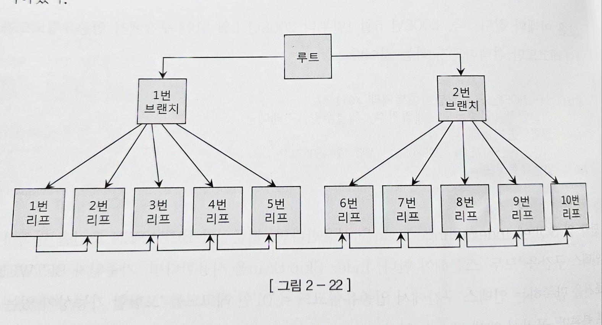

# 2. 인덱스 기본

## 2.1 인덱스 구조 및 탐색

###  인덱스 튜닝의 두가지 핵심요소

1. 인덱스 스캔 과정에서의 비효율 감소

2. 테이블 액서스 횟수 감소

    - 인덱스 스캔 후 랜덤 I/O 횟수를 줄이는 방법


1번 방법보다 2번이 더 중요하다 함

### 인덱스의 구조

일반적으로 B*Tree를 사용한다.


Root가 가장 위에 있고, branch를 거쳐 leaf가 있음

### 인덱스 탐색 과정
* 인덱스 수직적 탐색
* 인덱스 수평적 탐색

### 인덱스 수직적 탐색

* 인덱스 스캔 시작 위치를 찾는 과정
* 루트에서 시작하여 브랜치를 타고 찾고자 하는 값보다 크거나 작은 값을 만나면 직전 레코드가 가리키는 하위 블록으로 이동
* 인덱스 수직적 탐색은 **조건을 만족하는 첫번째 레코드를 찾는 과정**

### 인덱스 수평적 탐색
* 인덱스 수직적 탐색으로 스캔 시작 위치를 찾은 후, 리프 블록을 수평적으로 스캔하는 과정
* 인덱스 리프 블록은 양방향 연결 리스트 구조
* 인덱스 수평적 탐색을 하는 이유 : 
    1. 조건절에 만족하는 데이터를 모두 찾기 위해
    2. ROWID를 찾기 위해 -> 테이블 스캔을 위해


## 2.2 인덱스 기본 사용법

인덱스 기본 사용법 -> Index Range Scan

**인덱스(Range Scan)를 정상적으로 사용하려면 인덱스 칼럼을 가공하지 않아야 한다.**

### 인덱스를 RangeScan 할 수 없는 경우

보통 인덱스 칼럼을 가공하는 경우 정상적으로 사용(Range Scan)이 불가능 하다

일정 범위를 스캔하려면 시작 지점과 끝지점이 있어야 함

아래 같은 경우 시작점과 끝지점이 존재하여 쉽게 찾을 수 있다.

```sql
... WHERE 생년월일 BETWEEN '20060815' AND '20070109';
```


위의 사진 처럼 생년월일이 '20060815' 인 시작점을 찾고 이후로 Range Scan이 가능하다

그러나 아래와 같은 경우 Range Scan이 불가능하다

```sql
... WHERE substr(생년월일, 5, 2) = '05';
```

위와 같은 경우 스캔 시작 지점을 알 수 없어 불가능하다

아래와 같은 경우도 불가능하다
```
...where name like '%현우%'
```

만약 `~ like 현우%` 인 경우 '현우'로 시작하는 이름은 특정 구간에 몰려 있어 Range Scan이 가능하나 '현우'를 포함하는 값은 전체에 분포되어 있어 불가능하다

OR 조건으로 검색하는 경우도 Range Scan이 불가능하다

```
where (전화번호 = :tel_num OR 고객명 = :customer_name)
```


전화번호가 '0101111222' 혹은 이름이 '홍길동' 인 시작지점을 찾을 수 없기 때문이다.

IN 조건절도 Range Scan이 불가능하다. OR 조건과 똑같이 시작지점을 찾을 수 없기 때문이다.

그러나 IN 조건절은 IN-LIST 내부 요소 개수만큼 Range Scan을 반복하는 방식으로 가능은 하다

### 더 중요한 인덱스 사용 조건

Range Scan이 되기 위해서는 인덱스 선두 컬럼이 조건절에 있어야 한다. 

아래의 조건절은 인덱스 스캔이 불가능하다

```sql
-- 인덱스 컬럼 : [소속팀 + 사원명 + 연령]

select 사원번호, 소속팀, 연령, 입사일자, 전화번호
from 사원
where 사원명 = '홍길동'
```

위의 인덱스 같은 경우 사원명이 '홍길동'인 인덱스 리프가 인덱스 전체에 분포되어 있어 Range Scan이 불가능하다

아래와 같은 경우는 가능하다

```sql
-- 인덱스 컬럼 : [소속팀 + 사원명 + 연령]

select 사원번호, 소속팀, 연령, 입사일자, 전화번호
from 사원
where 소속팀 = '인사팀'
```


### 인덱스를 활용한 소트 연산 생략

인덱스는 테이블과 달리 정렬되어 있어 부수적으로 Sort 효과를 볼 수 있다.

### Order By 절에서 컬럼 가공

조건절이 아닌 Order By에서 컬럼을 가공하여 Range Scan이 불가능해지는 경우가 있다.

아래와 같은 쿼리문은 Range Scan이 가능하다

```sql
-- PK 인덱스 : [장비번호 + 변경일자 + 변경순번]
select * 
from 상태변경이력
where 장비번호 = 'C'
order by 변경일자, 변경순번
```

장비번호가 'C'인 레코드를 찾아서 Range Scan을 하면 이미 변경일자, 변경순번으로 정렬되기 때문이다.

그러나 아래와 같은 경우는 Range Scan이 되지 않는다

```sql
-- PK 인덱스 : [장비번호 + 변경일자 + 변경순번]
select * 
from 상태변경이력
where 장비번호 = 'C'
order by 변경일자 || 변경순번
```

`변경일자 || 변경순번`는 변경일자와 변경순번을 결합하여 정렬한다는 뜻이다. 

###  자동 형변환
Oracle은 자동으로 형변환을 해준다. 이는 편리하나 성능 측면에 문제가 발생할 수 있다.


## 2.3 인덱스 확장기능 사용법

* Index Range Scan
* Index Full Scan
* Index Unique Scan
* Index Skip Scan
* Index Range Scan Descending

### Index Range Scan
* 인덱스 루트에서 리프 블록까지 수직적으로 탐색 후 필요한 범위만큼 스캔하는 방법
* 인덱스를 Range Scan시 선두 칼럼을 가공하지 않은 상태로 조건절에서 사용해야 한다.
* 인덱스 스캔범위, 테이블 액서스 횟수에 따라 성능이 갈린다.

### Index Full Scan
* 수직적 탐색 없이 처음부터 끝까지 수평적 탐색하는 방식이다. 
* 대게 데이터 검색을 위한 최적의 인덱스가 없을 때 대용으로 사용된다.
* 대용량 테이블을 Table Full Scan 이 부담스러운 경우 사용된다.

* 종종 Sort 연산 생략을 위해 사용되는데 만약 힌트로 이를 유도할 때, 이때 시작점과 끝점 설정을 해야 한다.

### Index Unique Scan
* 수직적 탐색만으로 데이터를 찾는 스캔방식
* Unique 인덱스를 '='조건으로 탐색하는 경우 작동한다.

### Index Skip Scan
* 조건절에 빠진 인덱스 선두 컬럼의 Distinct Value 개수가 적고, 후행 칼럼의 Distinct Value 개수가 많을 때 유용하다.
(성별의 경우 Distinct Value 개수가 적고, 전화번호는 Distinct Value 개수가 많음)


성별과 연봉 두 컬럼으로 구성된 결합 인덱스


```
select * from 사원 where 성별 = '남' and 연봉 between 2000 and 4000
```

이런 경우 먼저 성별 = '남' 이면서 연봉이 2000 인 경우를 찾아야 한다. 

루트 블럭 위에서 4번째 블록이 성별 = '남' & 연봉 >= 5000인 레코드이므로 바로 그 직전인 루트 블록을 타고 3번 리프 블록으로 타고 들어간다.

이후 성별 = '남' & 연봉 >= 2000 를 다시 찾고 성별 = '남' & 연봉 <= 4000 까지 스캔하면 된다.

* 선두컬럼의 조건절이 있고, 중간 컬럼에 대한 조건절이 없는 경우에도 사용 가능하다

```sql
-- 인덱스 : 업종유형코드 + 업종코드 + 기준일자

select * 
from 일별업종거래
where 업종유형코드 = 'A'
and 기준일자 between '20001010' and '20011010'
```

### Index Fast Full Scan
* Index Full Scan 보다 빠른 인덱스 스캔 방법
* 논리적인 인덱스 트리구조를 무시하고 인덱스 세그먼트 전체를 Multiblock I/O방식으로 스캔한다.

논리적 인덱스 트리 구조


물리적 순서로 배치


속도는 빠르나 정렬이 되지 않고, 쿼리에 사용된 컬럼이 모두 인덱스에 포함되어야 한다.

### Index Range Scan Descending
* Index Range Scan를 뒤에서부터 앞으로 스캔하여 내림차순으로 정렬된 결과집합을 얻음

