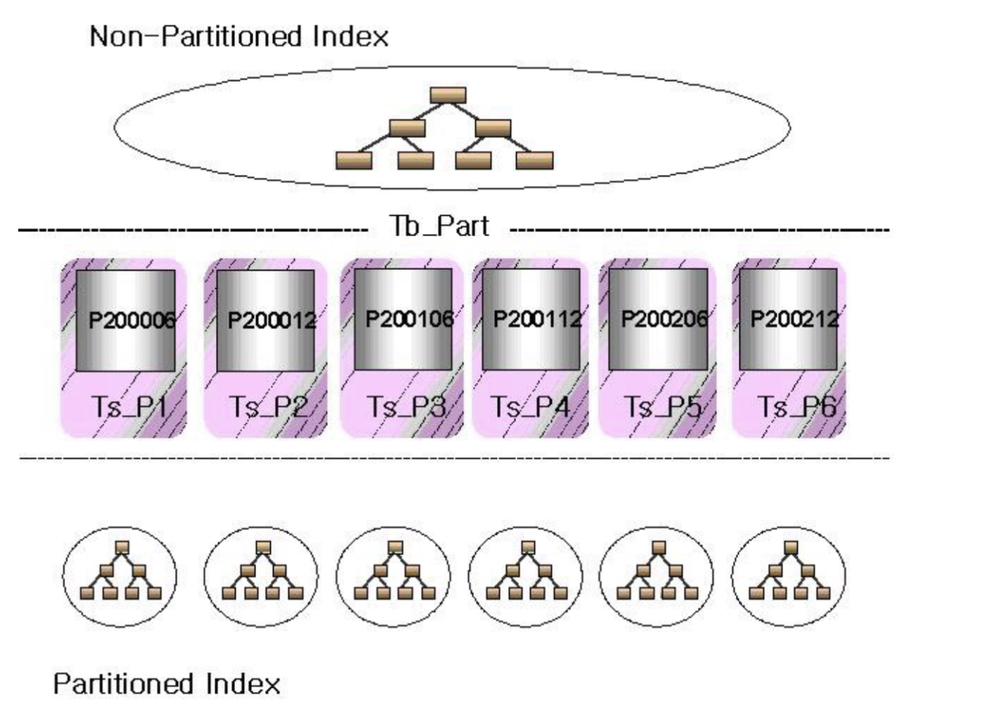
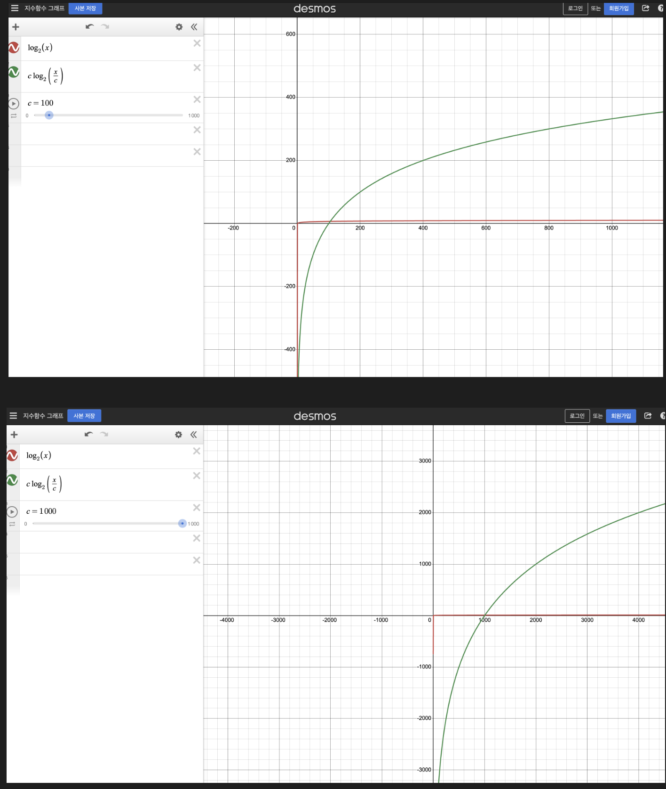
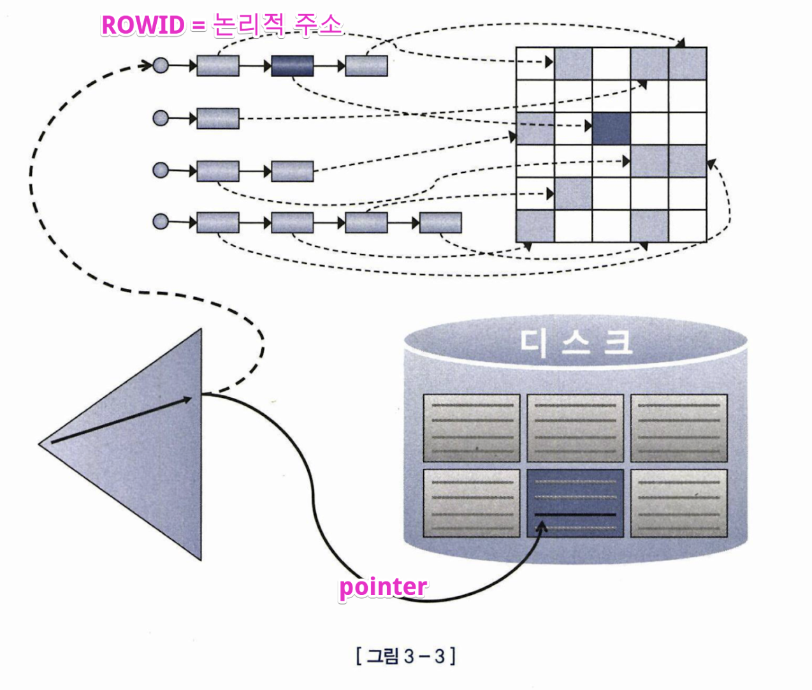

# 2장 인덱스 - 인덱스 VS 파티셔닝, 부분범위 처리

## Q. 인덱스로 검색해도 빠른데 왜 굳이 파티셔닝을 할까?

테이블을 쪼개면 인덱스 자체의 크기도 작아지니까? 인덱스 타는것도 더 빨라지지 않을까?



=> 파티션 테이블의 인덱스(로컬 파티션 인덱스)보다, 파티셔닝 하지 않은 인덱스가 더 빠르다.   
=> 쿼리 내 검색 조건에 항상 파티션 키가 포함되어야 한다. 아닐 경우 파타션된 여러 작은 인덱스를 다 Look up 해봐야 하기 때문  

시간 복잡도로 생각하면 O(c*log(n/c)) vs O(logn) 의 비교가 아닐까? (n: 전체 인덱스 블록 갯수, c: 파티션 갯수)  


*파티션 갯수(c) 값이 더 커질 수록 시간 복잡도 차이가 더 벌어 짐  


https://blog.naver.com/stbo/221228980870
https://bysql.net/index.php?document_srl=15146&mid=w201101

```
[GPT4]
  
로컬 파티션 인덱스가 파티션되지 않은 테이블의 인덱스보다 온라인 쿼리 성능이 떨어질 수 있는 이유는 여러 가지가 있습니다. 이는 사용 시나리오, 쿼리 유형, 데이터 분포, 그리고 인덱스 및 데이터베이스의 설계에 따라 달라질 수 있습니다. 아래는 로컬 파티션 인덱스가 상대적으로 성능이 떨어질 수 있는 몇 가지 이유를 설명합니다:

1. **접근 패턴**: 쿼리가 여러 파티션에 걸쳐 있는 데이터를 자주 접근하는 경우, 각각의 로컬 인덱스를 검색해야 하므로 오버헤드가 증가할 수 있습니다. 반면, 파티션되지 않은 테이블에서는 하나의 인덱스를 통해 데이터에 접근할 수 있어, 이러한 오버헤드가 발생하지 않습니다.
    
2. **인덱스 관리**: 각 파티션에 대한 로컬 인덱스가 독립적으로 존재하기 때문에, 인덱스 관리 작업(예: 리빌드, 리밸런스)이 더 자주 필요할 수 있습니다. 이러한 관리 작업은 전체 시스템 성능에 영향을 줄 수 있습니다.
    
3. **파티션 키 선택**: 로컬 파티션 인덱스의 성능은 파티션 키의 선택에 크게 의존합니다. 만약 파티션 키가 쿼리 패턴과 잘 맞지 않는 경우, 쿼리 성능이 저하될 수 있습니다. 예를 들어, 자주 접근하는 데이터가 특정 파티션에 집중되어 있지 않다면, 불필요하게 많은 파티션을 검색해야 할 수 있습니다.
    
4. **데이터 분포**: 로컬 인덱스는 각 파티션 내의 데이터만을 인덱싱하므로, 데이터가 특정 파티션에 치우친 분포를 보일 경우, 해당 파티션의 로컬 인덱스 성능이 저하될 수 있습니다. 일부 파티션은 데이터 접근이 빈번하게 발생하는 반면, 다른 파티션은 거의 사용되지 않을 수 있으며, 이는 리소스의 비효율적인 사용을 초래할 수 있습니다.
    
5. **쿼리 최적화**: 데이터베이스의 쿼리 최적화 엔진은 로컬 파티션 인덱스를 활용하여 쿼리를 최적화할 때, 추가적인 계산을 수행해야 할 수 있습니다. 이는 쿼리의 실행 계획 생성 시간을 증가시키고, 실행 시간에도 영향을 미칠 수 있습니다.
```


| 👉파티셔닝은 결국 테이블 "풀스캔"을 빠르게 하기 위해 테이블을 쪼개는것! -> 목적 자체가 다르다.  


## Q. 디스크기반 DBMS에서 메모리에 다 캐싱해두면, 메모리 기반 DBMS를 굳이 안써도 되는것 아닌가?

메모리 기반 DB = 메모리 상의 실제 주소값으로 값을 바로 읽음
디스크 기반 DB = 디스크 상의 실제 주소값이 아닌 ROWID 라는 논리적 주소를 통해 접근,

논리적 주소를 통해 실제 데이터를 접근 하는 과정에서 해싱, 래치 획득의 과정 발생




## Q. 테이블의 Clustering Factor 가 좋으면 어떤 점이 좋나?

Clustering Factor = 같은 값을 같는 데이터가 서로 모여있는 정도

테이블 엑세스량에 비해 블록 I/O가 적게 발생함


* Clustering Factor 를 좋게 하기 위해 테이블을 Reorg 가능하지만, 최후의 수단으로 써야지 일상적인 쿼리 튜닝의 기법으로 남용 하면 안됨.

	### Data Reorg (데이터 재구성)
	
	- **목적**: 데이터 파편화를 제거하고, 데이터 저장 공간을 효율적으로 재배치하여 데이터 접근 속도와 데이터베이스 성능을 향상시킵니다.
	- **작업 내용**: 테이블의 데이터를 새로운 위치로 이동시키거나, 테이블의 스토리지 속성을 변경합니다. 이 과정은 종종 테이블을 새로운 테이블스페이스로 이동시키거나, 테이블 파티셔닝을 적용하는 것을 포함할 수 있습니다.
	- **결과**: 데이터베이스 내의 데이터가 더 연속적으로 저장되어, I/O 성능이 개선됩니다.
	
	### Index Rebuild (인덱스 재구성)
	
	- **목적**: 인덱스 파편화를 제거하고, 인덱스를 효율적으로 재구성하여 검색 성능을 개선합니다.
	- **작업 내용**: 기존 인덱스를 드롭하고 다시 생성하거나, `ALTER INDEX ... REBUILD` 명령을 사용하여 인덱스를 최적화된 상태로 재구성합니다.
	- **결과**: 인덱스의 클러스터링 팩터가 개선되고, 인덱스를 통한 데이터 접근 속도가 빨라집니다.
	
	https://sarc.io/index.php/oracledatabase/177-2014-05-27-04-27-50  

## OLTP VS OLAP

OLTP : 작은 결과 집합의 데이터 빠르게 읽기 및 갱신 / 인덱스, NL 조인  
OLAP : 대량의 데이터 주로 읽기 만 / 풀스캔, 해시 조인  

*인덱스는 대량의 결과를 읽을때 비효율적이다. Random Access I/O 때문  

## 실제 운영 환경에서 인덱스 변경 이슈

실제 운영 환경에서 인덱스 순서를 바꾸면 안되는 이유 : 그 인덱스를 사용하는 쿼리가 있을 수 있다.  

기존 인덱스 뒤에 새로운 컬럼 추가 할수 있다면 best 아니면 새로운 인덱스 생성  


## covered 인덱스는 테이블 엑세스가 없어서 효과는 좋지만, 실제 운영환경에서 covered 인덱스를 사용하기 곤란한 이유

실제 운영환경에서는 사용하는 쿼리도 많고 조건들도 많을 수 있기 때문,  
조건절에서 사용하는 컬럼을 전부 복합 인덱스 컬럼으로 포함 시키기에는 공간적, 관리적 부분에서 한계가 있을 수 도 있을 것 같다.


## OLTP 서비스인데 대용량 데이터 조회 해야하는 경우 : 부분범위 처리 고려

부분 범위 처리 : Limit 으로 일부분만 짤라서 요청 한다는 것이 아니라, 읽으면서 읽는   족족 바로 리턴  

cf. MySQL 의 스트리밍 방식 VS 버퍼링 방식  
https://github.com/wjdrbs96/Today-I-Learn/blob/master/MySQL/MySQL%20%EC%8A%A4%ED%8A%B8%EB%A6%AC%EB%B0%8D%20%EB%B0%A9%EC%8B%9D%EA%B3%BC%20%EB%B2%84%ED%8D%BC%EB%A7%81%20%EB%B0%A9%EC%8B%9D.md

