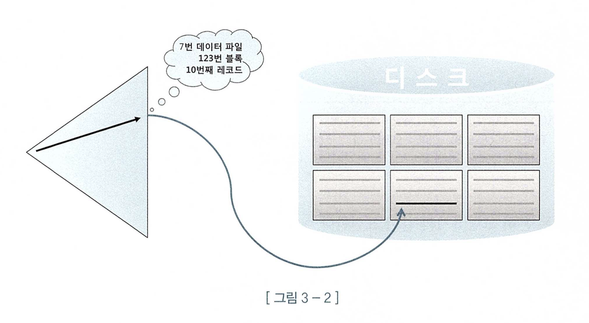
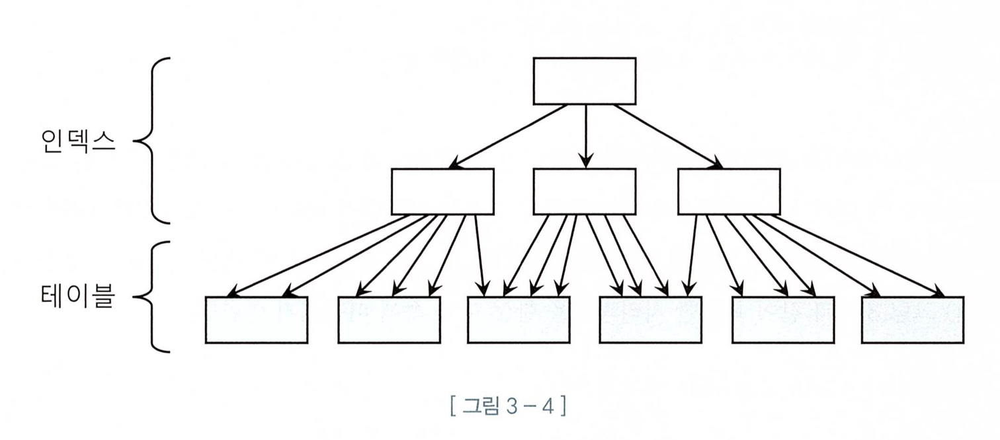
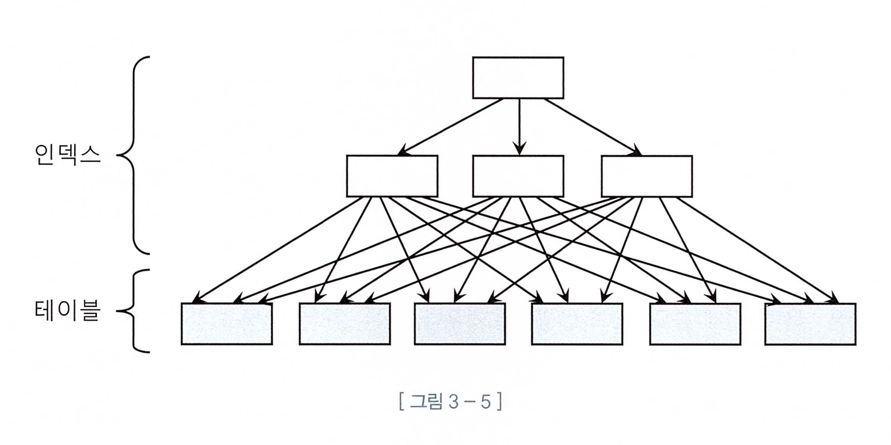
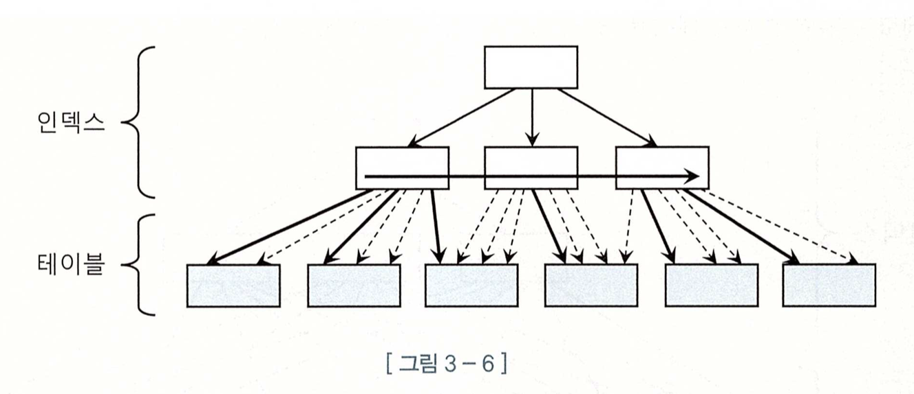
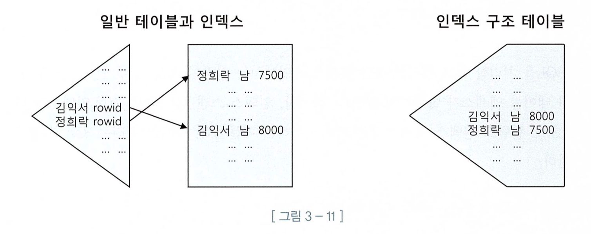
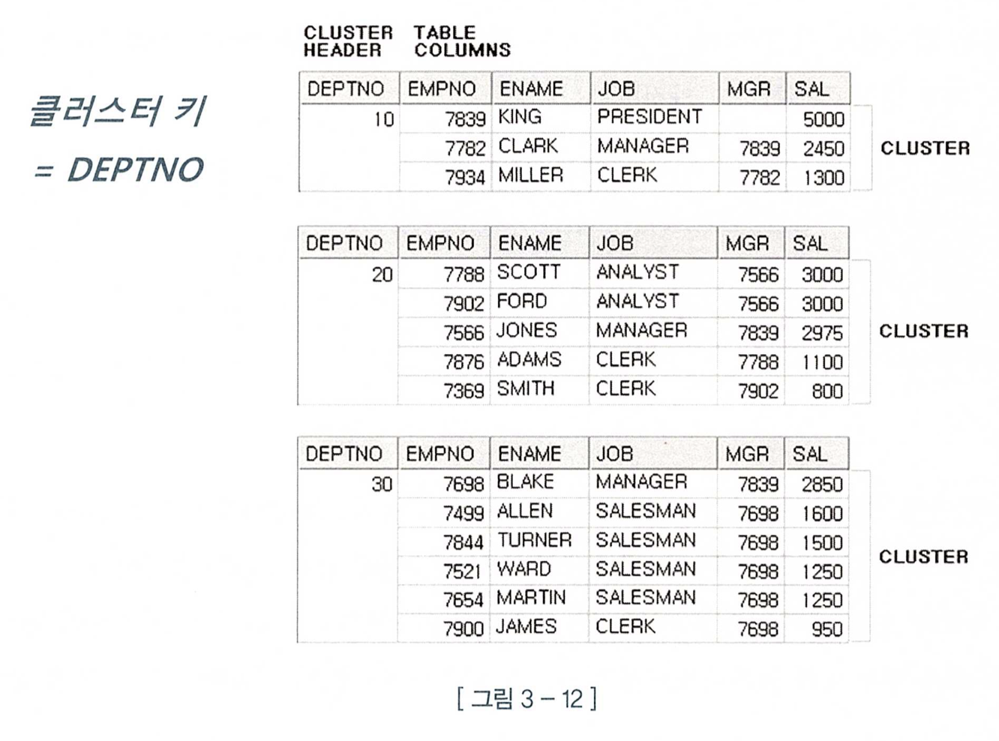
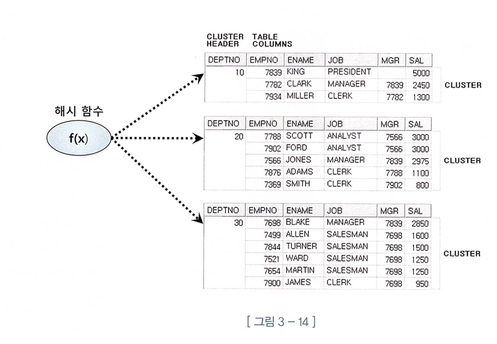

# 📌 서론

<aside>
✏️ 인덱스의 기본적인 아웃라인과 사용법과 동작에 대해 이해하고 이를 확장하는 기능을 살펴 본다.

</aside>

# 테이블 액세스 최소화

## 아웃라인

- 결국 SQL 튜닝은 랜덤 I/O와 전쟁이다.
- 인덱스를 이용하더라도 I/O에서 자유로울 수 없다.
- 결국 대량의 데이터를 조회함에 있어서 인덱스 한계점이 있을것이다.
- 해당 챕터는 그러한 노하우를 전달할거라 예상 된다.

## 랜덤 액세스

<aside>
💡 대량의 데이터를 조회할 때 인덱스는 풀스캔할때 보다 훨씬 느리다!

</aside>

인덱스는 대량의 데이터에서 좁은 범위의 데이터를 스캔할때 힘을 발휘한다. 이전 챕터에서도 계속 이야기한 내용이다.

## ROWID

> 인덱스를 스캔하는 주된 이유는 소량의 데이터를 빠르게 찾고 테이블 레코드를 찾아가기 위한 ROWID를 획득하는데 있다.
>

ROWID는 아래와 같이 구성되어 있어 물리적 주소로 생각할 수 있지만 논리적 주소에 더 가깝다.

- 데이터파일 번호
- 오브젝트 번호
- 블록 번호

논리적 주소에 가까운 이유는 물리적으로 직접 연결되어 있기 보다는 레코드를 찾아가기 위해 논리적으로 주소 정보를 가지고 있기 때문.

어떻게 보면 약간 말장난 같기도 아래표를 보면 좀 더 이해가 빠르다.

결국은 인덱스도 디스크 상에서 블록을 찾기 위한 ROWID를 찾는 과정이고 디스크 접근은 I/O를 발생시킨다.

그러므로 결국은 이 IO를 줄이는 것이 가장큰 핵심이며 여기서는 `버퍼 캐시`를 활용과 `클러스터링 팩터`에 대해서 이야기 한다.

## 버퍼 캐시

결국 실제 디스크에서 조회하기 전에 버퍼캐시에 존재한다면 이 I/O를 줄일 수 있다.

버퍼 캐시에 대해서는 1장에서 학습 하였다.

다만 이것도 만능이 아니다.

- 버퍼 캐시에 캐싱이 되어 있더라도 매번 DBA해싱과 래치획득 과정을 반복해야 됨.
- 동시 액세스할 경우 경합이 발생할 수 있음.
- 캐시버퍼 체인 래치, 버퍼 Lock

## 클러스터링 팩터(Clustering Factor)

> 사전적 의미로는 군집성 계수로 번역할 수 있고 특정 컬럼 기준으로 같은 값을 같는 데이터가 서로 모여있는 정도를 의미 함.
>

데이터를 조회할때 물리적으로 떨어져 있는 것 보다 같이 있는 것이 효율이 좋다.

아래 그림을 참조 하자.

3-4의 경우 매우 좋은 CF를 가진 이상적인 그림이고 3-5는 매우 현실적인 CF모습이다.

CF를 간단하게 설명하면 위에서 언급한 것과 같이 `ROWID로 테이블에 접근하는 것은 비용이 높다.` 그래서 CF는 ROWID로 `데이터블록에 대한 포인터를 바로 해제 하지 않고` 일단 유지 하는데 이것을 `버퍼 pinning` 이라 한다.

이 상태에서 다음 레코드를 읽었는데 동일한 데이터블록을 가르킨다면 바로 데이터 블록을 읽어 올 수 있는데 즉 `논리적 블록 I/O를 생략`할 수 있다.

테이블로 접근하는 굵은 실선만 실제 `블록 I/O`가 발생한다.

이론적으로는 무슨 내용인지는 다들 공감하겠지만 저런 상황을 만드는게 쉬울까라는 고민이 든다. 어쨌든 알고 있는 것과 모르는 것은 천지 차이 이므로 난중에 실무를 한다면 정말 IO때문에 답이 없다면 CF까지 고려해야 겠다는 생각이 든다.

그렇다고 CF가 무조건 답이냐 그렇지도 않다 데이터 양이 많아지면 결국은 풀스캔 방식이 더 빠를 수 있다.

의도적으로 데이터 블록위치까지 고려해서 설계한게 아니라면 데이터 적을 수록 데이터가 동일한 블록에 모여있을 확율이 높고 버퍼 캐시의 경우에도 결국은 용량의 한계가 있기 때문이다.

## 배치 시스템

OLTP시스템과 다르게 배치 시스템은 대량의 데이터를 읽고 갱신하거나 삭제 하는 등의 작업이 이루어 진다.

대량의 데이터를 빠르게 처리하기 위해서는 결국 인덱스로는 한계가 있다. 그래서 `대량의 데이터`를 가진 테이블과 조인할때는 인덱스와 NL 방식 보다 `풀스캔 해시조인이 더 유리`하다.

### 파티션

결국 데이터량이 풀스캔으로 처리할 수 없는 영역까지 가게 되면 파티션도 고려해야 한다.

- 파티션을 사용하는 주된 이유는 풀스캔을 빠르게 하기 위함이다.
- 파티션과 + 병렬처리까지 된다면 금상 첨화.

## 인덱스 구조 테이블

> 오라클에서는 IOT(Index-Organized Table) 라 부르며 테이블 블록에 있어야 할 `데이터를 인덱스 리프 블록에 모두 저장`
>

좀 무식한 인덱스인데 극단적인 IO 성능이 필요할때는 적절하게 사용할 수 있을 듯 하다.

결국은 테이블 엑세스를 하지 않게 하기 위해 나온 기능인듯 하다.

## 클러스터 테이블

인덱스 클러스터와 해시 클러스터 두개가 존재 한다.

### 인덱스 클러스터

클러스터 키 값이 같은 레코드를 한 블록에 모아서 저장 함. 만약 값이 너무 많다면 새로운 블록을 생성하고 클러스터 체인으로 연결 함.

장점은 위에서 언급한 CF로 인해 클러스터 키로 인덱스 조회시 불필요한 IO가 발생하지 않는다. 데이터가 모여 있으므로 그래서 넓은 범위를 읽더라도 비효율이 없다. 다만 저장시에는 아마도 데이터 블록 위치를 클러스터 키별로 위치를 찾아야 하므로 비용이 높을 수 있겠다.

### 해시 클러스터

대부분의 매커니즘은 동일하고 해시키로 클러스터를 찾아간다는 점만 다르다.

음 어떤 부분에서 활용할 수 있을지 고민이 필요해 보인다.

# 🚀 결론

- 인덱스는 만능이 아닌 것은 알았지만 인덱스를 극복할 수 있는 다양한 방법에 대해서 알 수 있었다.
- 특히 ROWID를 통한 테이블 접근 비용이 높은것과 이를 줄이기 위한 다양한 방법들이 많아서 놀랐다.
- 결국에는 상황에 맞게 잘 사용하는 능력이 필요한 것 같다. 책에서 많은 예제들을 알려주고 있지만 결국은 얼마나 이 기술들은 깊이 있게 이해하고 있고 본인의 도메인에서 어떻게 활용할지는 결국 담당자의 몫인것 같다.

# 📎 Reference

- [오라클 래치와 락 (Latch & Lock) (tistory.com)](https://simpledb.tistory.com/3)