# 인덱스 스캔 효율성

인덱스 선행 컬럼이 조건절에 없거나 '=' 조건이 아니면 인덱스 스캔 과정에 비효율이 발생한다.


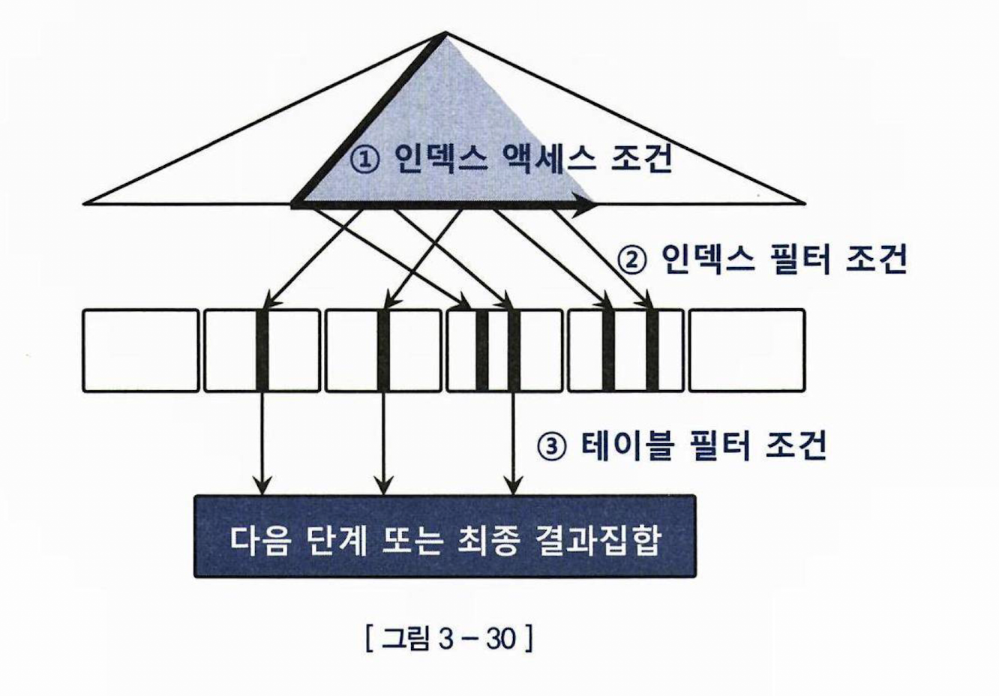

1. 인덱스 엑세스 조건
- 인덱스 스캔 과정에서 사용되는 조건절
- 인덱스 스캔의 범위를 결정
- 수직 탐색으로 시작점을 찾고, 리프 블록의 수평 탐색 길이를 결정

2. 인덱스 필터 조건
- 인덱스 스캔 과정에서 사용되는 조건절
- 테이블로 엑세스 할지 말지 정하는 조건

3. 테이블 필터 조건
- 인덱스를 사용하던, 풀스캔을 하던 테이블 액세스 단계에서 처리 되는 조건절


## 비교연산자 종류와 컬럼 순서에 따른 군집성

(C1, C2, C3, C4) 순서로 인덱스가 있을 경우


```SQL
WHERE C1 = '1'
AND C2 = 'A'
AND C3 = '나'
AND C4 = 'a'

(C1, C2, C3, C4)

 *   *    *   *   
 => 모두 '=' 조건 
 => 인덱스 레코드가 모두 모여있다.

```

```SQL
WHERE C1 = '1'
AND C2 = 'B'
AND C3 BETWEEN '가' AND '다'
AND C4 = 'a'

(C1, C2, C3, C4)

 *   *    -   *   
 => C1, C2, C3 까지만 모여있고 C4 는 흩어져있다.

```

=> 선행컬럼이 모두 = 조건일 때, 처음 나타나는 범위 검색 조건 까지만 모여있다.  
=> 그리고 그 범위 검색 조건이 인덱스 스캔의 범위를 결정한다.

```SQL
WHERE C1 = '1' => 인덱스 엑세스 조건
AND C2 = 'B' => 인덱스 엑세스 조건
AND C3 BETWEEN '가' AND '다' => 인덱스 엑세스 조건(범위 결정 조건)
AND C4 = 'a' => 인덱스 필터 조건

(C1, C2, C3, C4)

 *   *    -   *   
 => C1, C2, C3 까지만 모여있고 C4 는 흩어져있다.

```


## BETWEEN 을 IN-List 로 전환

인덱스 순서가
(인터넷매물 + 아파트시세코드 + 평형 + 평형타입) 순으로 구성 되어있을 경우,

```SQL

SELECT 해당층, 평당가, 입력일, 해당동, 매물구분, 연사용일수, 중개업소코드
FROM 매물아파트매매
WHERE 아파트시세코드 = 'A0101'
AND 평형 = '59'
AND 평형타입 = 'A'
AND 인터넷매물 BETWEEN '1' AND '3'
ORDER BY 입력일 DESC
;

(인터넷매물 + 아파트시세코드 + 평형 + 평형타입)
      -           *              *        *


선두 컬럼부터 범위 결정 조건 😥

```

선두 컬럼 부터 범위 결정 조건이 나오는 경우, 인덱스 순서를 바꿔야 할까?  
=> 운영 환경에서는 인덱스 순서를 바꾸는게 쉽지 않다.  
=> 바꾸기 전 인덱스를 어디선가 사용하고 있을 수 있기 때문에!  


```SQL

SELECT 해당층, 평당가, 입력일, 해당동, 매물구분, 연사용일수, 중개업소코드
FROM 매물아파트매매
WHERE 아파트시세코드 = 'A0101'
AND 평형 = '59'
AND 평형타입 = 'A'
AND 인터넷매물 IN ('1', '2', '3')
ORDER BY 입력일 DESC
;

(인터넷매물 + 아파트시세코드 + 평형 + 평형타입)
      *           *              *        *

(인터넷매물 + 아파트시세코드 + 평형 + 평형타입)
      *           *              *        *

(인터넷매물 + 아파트시세코드 + 평형 + 평형타입)
      *           *              *        *

```

=> 선행 컬럼의 BETWEEN 조건절을 WHERE IN 으로 바꾸면 인덱스 탐색을 3번하는 걸로 바꿀 수 있다.  
=> Q. 만약 BETWEEN 범위가 엄청 넓으면???  
=> A. IN안의 값들을 쿼리로 구성 할 수 있다면 서브쿼리나, NL 조인을 활용하자

## BETWEEN 을 IN-List 로 전환시 주의 사항

1. IN 안에 값이 너무 많을 경우 비효율적이다.
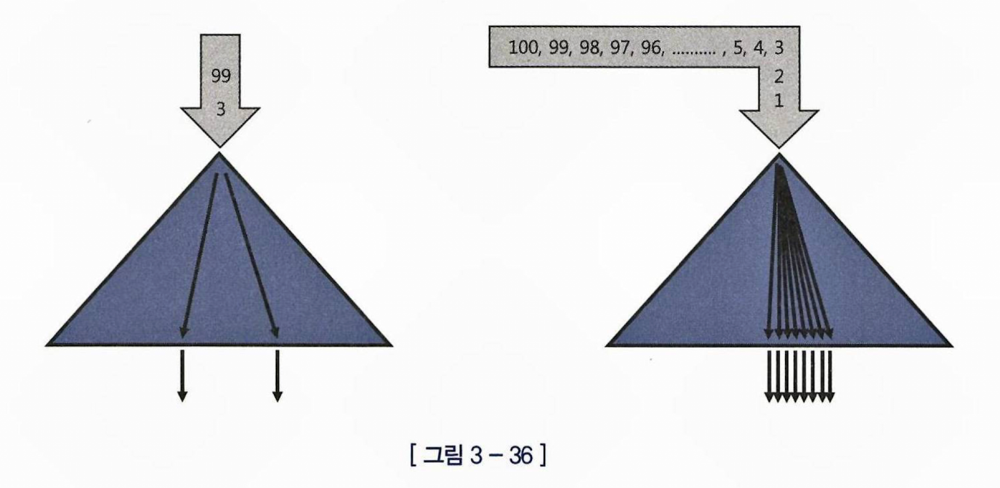
2. 조건을 만족하는 레코드가 서로 가까이 있을 경우,
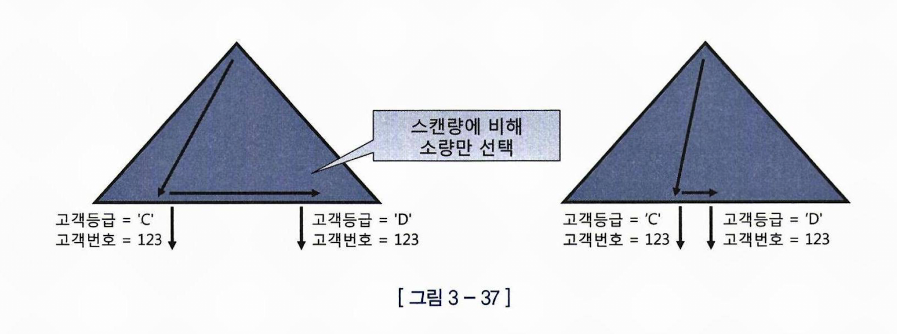
해당 기법으로 튜닝시 수직탐색 n번으로 늘어나는 것이 오히려 더 오버헤드 일 수 있다.

## BETWEEN 을 IN-List 로 전환 대신 Index Skip Scan 활용

```SQL

CREATE INDEX 월별고객별판매집계_IDX2 ON (판매구분, 판매월);
CREATE INDEX 월별고객별판매집계_IDX2 ON (판매월, 판매구분);

SELECT /*+ INDEX_SS(t 월별고객별판매집계_IDX2) */ COUNT(*)
FROM 월별고객별판매집계 t
WHERE 판매구분 = 'A'
AND 판매월 BETWEEN '201801' AND '201812'
;

IDX1
(판매구분, 판매월)
   *        -

IDX2 => 선두 컬럼이 바로 범위 결정 조건 ㅠㅠ
(판매월, 판매구분)
   -        * 

```
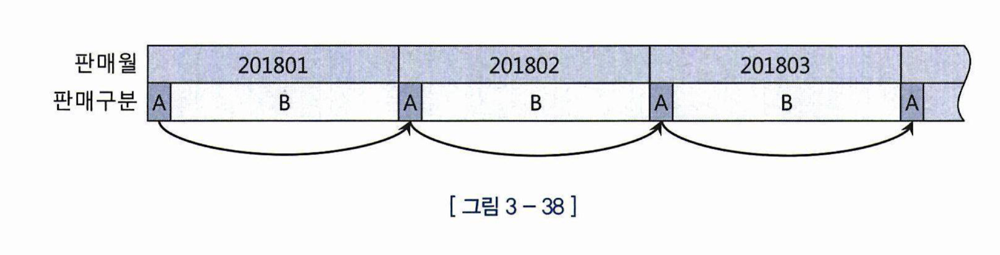
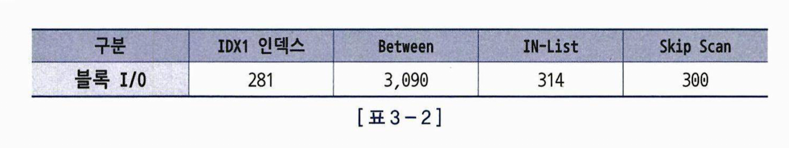

선두컬럼이 바로 범위 결정 조건이고, 나머지 검색 조건을 만족하는 데이터들이 멀리 떨어져 있다면 Index Skip Scan의 위력이 나타난다.


## IN 조건이 무조건 =  조건일까?

IN-List 조건으로 풀려야 = 조건이다.  
그런데 무조건 IN-List 조건으로 푸는게 좋지많은 않다.  
=> 상황에 따라 불필요한 수직 탐색이 반복 되므로, 차라리 필터 조건으로 남겨두는게 좋을 수도있다.  

=> num_index_keys 힌트를 활용 (인덱스 컬럼중 지정한 숫자까지의 컬럼만 액세스 조건으로 사용, 나머지는 필터조건으로)  
=> 아니면 인덱스 컬럼을 가공해서 인덱스 강제로 못타게하기


## LIKE = '2019%' 보다 BETWEEN '201901' AND '201912' 이 낫다.

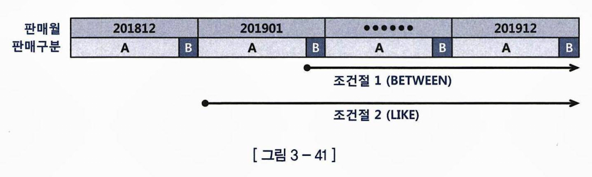
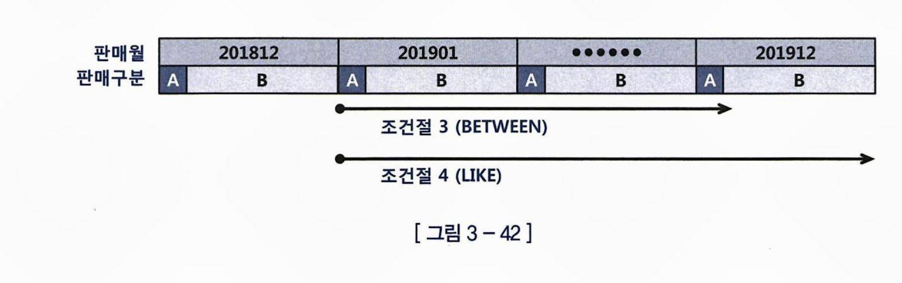

LIKE 는 시작 과 끝이 모호하기 때문에 끝까지 다 읽는다.  
*201900 이 있을 수도있고 201913이 있을 수도 있으니까 다 찾아봐야한다.

## 범위검색 조건을 남용하지 말자
=> SQL 여러개를 하나로 퉁치려고, 모든 조건을 LIKE나, BETWEEN 으로 처리 하는 경우도 있는데, 이런 경우 스캔이 비효율적이다.

=> ORM 쓰면서 동적으로 쿼리를 구성해주기 때문에 이 이슈는 많이 없지 않을까?  
=> 쿼리 빌더?  

## 바인드 변수로 옵션 조건 처리하기

옵션 조건 처리 : 바인드 변수로 들어오는 값이 없으면 전체, 있으면 그것만 찾고싶다.  

### 1. OR로 옵션조건 처리

```SQL

WHERE (:v is null or ID = :v)

```

[단점]
- 저 조건절은 인덱스 엑세스 조건, 필터 조건으로 사용 불가(or expansion이 기본적으로 작동하지 않기때문) 테이블 필터 조건으로 밖에 못씀
/ 그래서 비추

[유일 한 장점]
- nullable 컬럼의 경우 결과 집합 제대로 출력됨.


### 2. LIKE/BETEWEEN 으로 옵션조건 처리

```SQL

WHERE ID like :v || '%'

```
[단점]
- 저 조건의 컬럼이 인덱스 선두 컬럼이면 비추
- nullable 컬럼의 경우 결과 집합에서 null 인 애들 은 빠지기 때문에 주의
- 숫자형 컬럼일 경우 자동 형변환때문에 인덱스 못탐
- 가변 길이 컬럼일 경우, 다른 값도 섞여나옴 (ex 김훈 찾고 싶은데 김훈식도 나옴)

[장점]
- 저 컬럼이 선두 컬럼이 아니기만 하면, 옵션 조건으로 사용되고, 그것 또한 충분히 좋은 성능 낼 수 있다.

### 3. UNION ALL 로 옵션조건 처리

```SQL
~
WHERE :v IS NULL
~
UNION ALL
~
WHERE :v IS NOT NULL
AND ID = :v
~
```

[장점]
- LIKE/BETEWEEN 에서는 기껏해야 옵션 조건으로 쓰는 정도 인데, 이 방식은 해당 컬럼이 인덱스 액세스 조건으로 까지 사용될 수 있다.

[유일한 단점]
- 코딩량이 길어진다.

### 4. NVL/DECODE 함수로 옵션조건 처리

NVL 이란?  

```
SELECT NVL(salary, 0) FROM employees; 
```
  
위 쿼리는 employees 테이블에서 salary가 NULL인 경우 0으로 대체하여 반환합니다.

DECODE 란 ?   
  

```
SELECT DECODE(job_id, 'IT_PROG', 'IT Department', 'SA_MAN', 'Sales Department', 'Other') FROM employees;
```

job_id가 'IT_PROG'이면 'IT Department'를, 'SA_MAN'이면 'Sales Department'를, 그 외의 경우에는 'Other'를 반환합니다.

```SQL

WHERE ID = NVL(:v, ID)

=> :v 가 null 인 경우

WHERE ID = ID => NULL 제외 전체 집합

=> :v 가 123 인 경우

WHERE ID = 123

```

[장점]
- 이 방식은 or expansion이 일어나기 때문에 UNION ALL과 동일한 성능을 낸다.

[단점]
- Nullable 컬럼의 경우, 바인드 변수로 null을 넣어도 결과 집합에서 null이 제외 된다.


## PL/SQL 사용자 정의 함수는 느리다.

[GPT4] PL/SQL이 뭐야?

PL/SQL(Procedural Language/Structured Query Language) 사용자 정의 함수는 사용자가 직접 정의하여 작성한 PL/SQL 코드 블록입니다. 이 함수들은 데이터베이스에서 실행되며, 자주 사용되는 작업을 수행하거나 복잡한 계산을 처리하는 데 사용됩니다.

```SQL
-- add_numbers 함수를 생성합니다.
CREATE OR REPLACE FUNCTION add_numbers
  (num1 NUMBER, num2 NUMBER)
RETURN NUMBER IS
  result NUMBER;
BEGIN
  result := num1 + num2;
  RETURN result;
END;
/

-- 함수를 호출하여 두 숫자를 더합니다.
DECLARE
  x NUMBER := 10;
  y NUMBER := 20;
  z NUMBER;
BEGIN
  -- add_numbers 함수를 호출하여 두 숫자를 더한 결과를 변수 z에 저장합니다.
  z := add_numbers(x, y);
  -- 결과를 출력합니다.
  DBMS_OUTPUT.PUT_LINE('두 숫자의 합: ' || z);
END;
/

```

PL/SQL 사용자 정의 함수가 느린 이유

- 가상 머신 상에서 실행 되는 인터프리터 언어 (225.p ??? JAVA가 인터프리터언어였던가?)
- 호출시마다 컨텍스트 스위칭 발생
- 함수안에 SQL이 있으면 함수 호출 될때 마다 그 SQL이 반복적으로 실행 => Recursive Call 발생(가장 결정적 요소)

=> 조건절을 추가하고, 인덱스도 추가해서 함수 호출 횟수 자체를 줄이는 방식으로 최적화 수행


# 인덱스 설계

## 인덱스 설계가 어려운 이유
좋다고 무한정 새로운 인덱스를 만들 수 없기 때문,  
  
인덱스가 많으면?
- DML 성능 저하 = TPS 저하
- DB 크기 증가 = 관리 및 운용 비용 상승

## 인덱스 설계시 가장 중요한 2가지 규칙 : 스캔 효율성만 보았을때

1. 조건절에 항상 또는 자주 사용하는 컬럼들을 인덱스 컬럼으로 선정
2. 그 중 '=' 조건으로 사용되는 컬럼을 앞쪽에 두자

## 스캔 효율성이외의 판단 기준

- 수행 빈도(!이게 제일 중요!)

    수행빈도가 높을수록 최적의 인덱스를 구성해주어야 한다.  
    (ex NL 조인에서 이너테이블)

- 업무상 중요도
- 클러스터링 팩터
- 데이터량  

    데이터 량이 적으면 Full Scan도 빠르다.  
    대용량 테이블의 경우, DML 느려지기 때문에 인덱스 생성에 신중해야한다.
- DML 부하
- 저장 공간
- 인덱스 관리 비용 등


## 조건절 패턴이 10개 있을때 인덱스 10개 만들어야 될까?

10개중 핵심적인 엑세스 경로 한두개를 전략적으로 선택할 줄 알아야한다.
비즈니스 상황을 이해아고 나름의 판단 기준을 세워야 한다.

-> 이게 제일 어려울것 같다.

## ORDER BY 절에서 sort 생략도 중요하다.

중요도 순서

1. '=' 연산자로 사용한 컬럼 선정
2. order by 절에 기술한 컬럼 추가
3. '=' 연산자가 아닌 조건절 컬럼은 데이터 분포를 고려해 추가 여부 결정

```SQL

...
WHERE 취급지점ID =
AND 청약일자 BETWEEN
AND 입력일자 >=
AND 계약상태코드 IN
ORDER BY 청약일자, 입력자ID

```

조건절 '=' 연산자 컬럼 : 취급지점 ID  
order by 절에 기술한 컬럼 : 청약일자, 입력자ID  
  
최종 인덱스 : 취급지점 ID, 청약일자, 입력자ID, +a

=> IN 조건의 경우, IN List Iterator 방식으로 UNION ALL로 펼쳐져서 인덱스를 타게 되면 sort 생략이 불가능하다. 따라서 sort 생략이 더 중요하기 때문에 계약상태코드는 IN List Iterator 방식으로 펼쳐지지 않도록 인덱스 뒤에 붙여야 한다.


## '=' 조건 컬럼들 중, 선택도가 낮은게 앞에 올 필요는 없다.

선택도는 인덱스를 생성할거냐 아니냐에 고려할 부분
  
모두 '=' 조건이라면 그들간의 순서는 의미 없다.

## 인덱스 중복제거 및 재설계

### Q1. 중복제거 실습 1

거래일자, 결제일자는 항상 범위 조건(BETWEEN, 부등호)으로 조회 한다.

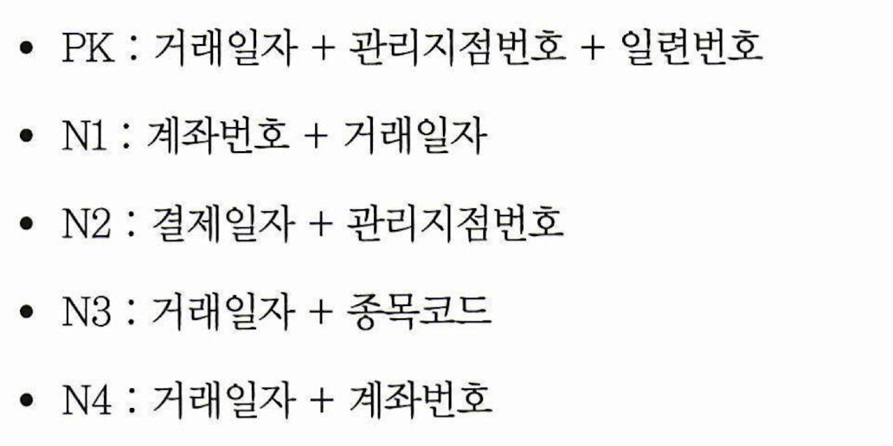
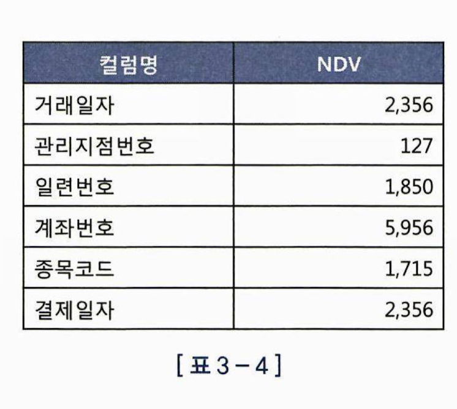


### sol1)

N3 와 N4 둘다 인덱스 엑세스 조건으로 사용되는 컬럼은 거래일자 뿐,
어차피 나머지는 인덱스 필터 조건!
  
두 인덱스르 합칠 수 있다.

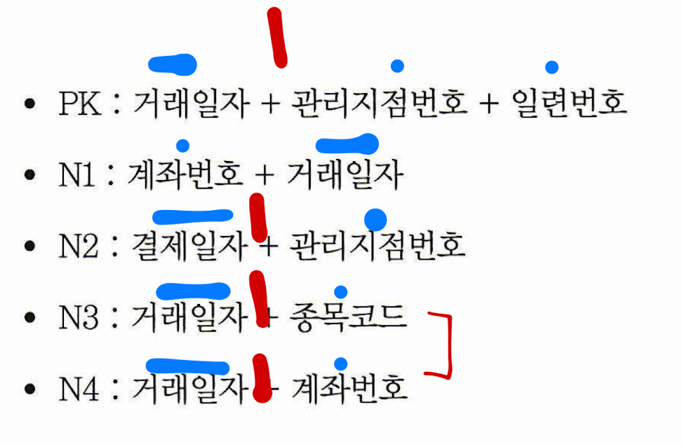

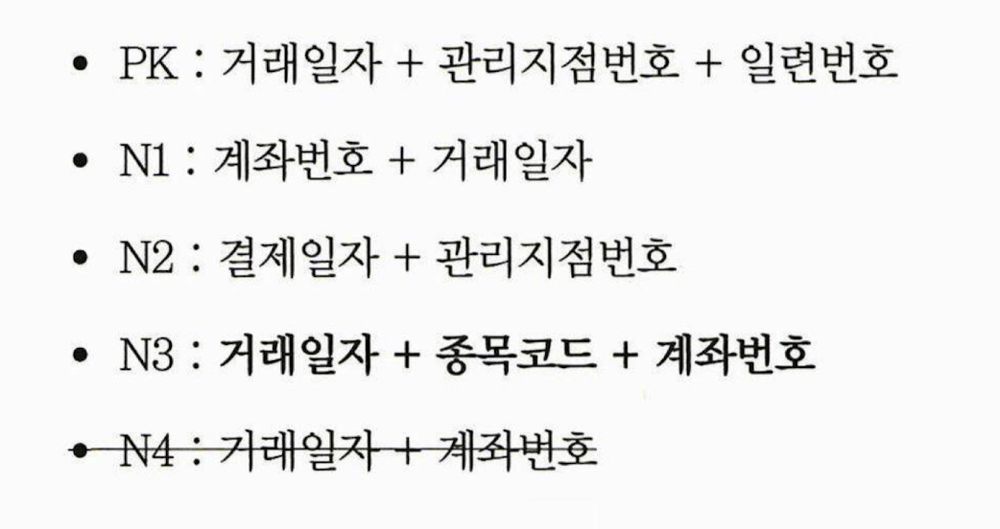


### sol2)

아니면 N3, N4는 어차피 필터 조건들만 다른거니까 아예 N4를 없애 버리자, 그리고 관리지점 번호가 '=' 조건 이니까 PK 순서를 변경하자

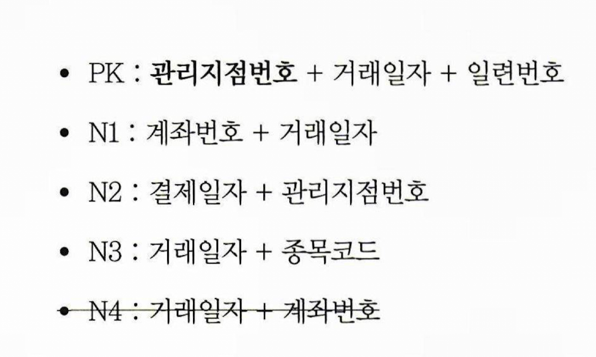


### Q1. 중복제거 실습 2

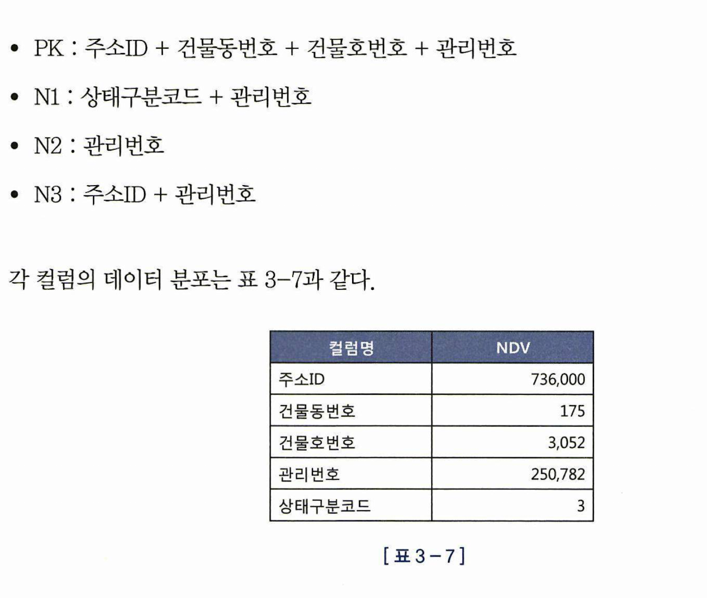

## sol1)
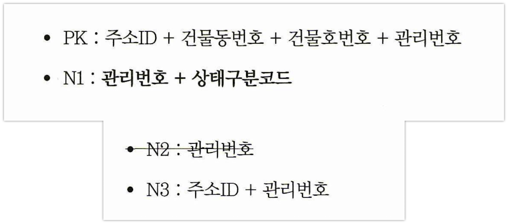

N2는 관리번호로만 조회 했을때를 위한 것 같다. => 사용 case가 낮음, 합쳐버리고 싶다.   
N1은 상태구분코드로만 조회했을때 선택도가 높아서 어차피 인덱스 안타고 full scan 할 거 같다.  
  
=> N1 인덱스 순서를 바꾸면 N2를 없앨 수 있다.
(주의! 상태구분코드는 NDV가 3이지만, 그 중 특정 값은 변별력이 높을 수 있다. 
ex. 1 1 1 1 1 1 1 1 1 2 1 1 1 1 1 1 3 3 3 3 3 3 3 3 3 3 1 1 1 1 1 1 3 3 
=> NDV는 3이지만, 2 는 변별력이 좋다.
)
