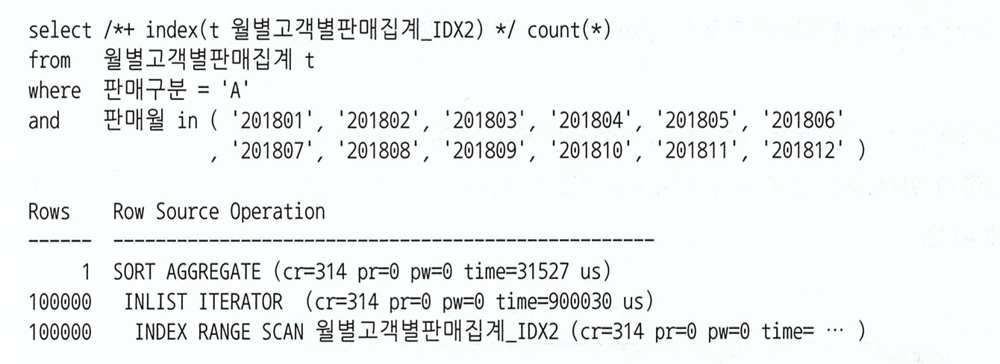

# 📌 서론

<aside>
✏️ 인덱스의 스캔 시 처리 방법과 효율적인 스캔방법에 대해서 알아보고 어떻게 설계를 해야 효율적으로 스캔할 수 있을지 설계에 대해서 알아본다.

</aside>

# 🔥 인덱스 스캔 효율화

일단 책에서는 12개의 부 주제로 다룰 만큼 많은 내용이 있다.  어쨌든 내용을 봤을 땐 불필요하게 스캔하는 상황과 이를 해결할 수 있는 가이드를 제공할거라 예상된다.

## 인덱스 탐색

[2장에서 배운 수직적 탐색과 수평적 탐색](https://df-henry.vercel.app/study-db-easier2)을 통해서 한번 다뤘지만 인덱스 과정을 좀 더 깊이 있게 알아야 한다.

가장 왼쪽에 있는 블록은 `LMC레코드`이며 `C1 = A, C2 = 3보다 작거나 같은 값`을 같는 레코드가 저장되어 있다.


### 조건절과 스캔 지점

```sql
Where C1 = 'B'
```


C1에서 B블록을 찾고 3번째 리프블록으로 내려가면 안된다. `C1 = B`의 경우 위에서 LMC에서도 언급한 것을 이해하면 해당 루트블록에 저장된 값보다 `같거나 높은 값이 저장`되므로 `이전 블록인 'A' 레코드가 저장된 2번째 리프블록 부터 탐색` 해야 한다.

따라서 2번째 블록에서 `'B'를 찾아서 수평적 스캔을 하다가 'C'를 만나는 순간 스캔을 종료` 한다.

```sql
Where C1 = 'B' AND C2 = 3
```


이번에 C2에 3이라는 조건이 추가되었다. 스캔 시작점은 그림 3-20과 동일하나 C2 = 4레코드를 만나는 순간 스캔을 멈춘다.  `=` 일 경우에는 `스캔의 시작, 끝 지점을 결정`하는데 `중요한 역활`을 하는 것을 알 수 있다.

위에서도 언급하였지만 C1 = B, C2=3인 3번째 레코드를 찾았다고 3번째 블록으로 내려가면 안된다. 2번째 블록에 `같거나 작은 데이터가 존재`할 수 있기 때문인데 여기서 `같거나가 중요`하다.

<aside>
❓ 만약 인덱스가 `유니크`로 구성되어 있다면 3번재 리프로 내려가는 것일까?

</aside>

```sql
Where C1 = 'B' AND C2 >= 3
```


`C2 >= 3`  조건으로 스캔 시작점을 결정할 수 있었다.  그리고 `C1 조건으로 C1이 C를 만나는 순간 스캔이 종료` 된다.

```sql
Where C1 = 'B' AND C2 <= 3
```


위와는 반대인데 C2조건절이 시작점에서는 관여하지 못했고 `끝 지점에서는 관여`를 하였다. C2가 4를 만나면서 스캔이 종료되었기 때문.

```sql
Where C1 = 'B' AND C2 BETWEEN 2 AND 3
```


`C2의 조건이 BETWEEN` 이므로 시작점 2와 끝 지점 3이 있으므로 `시작점 끝지점 동시에 관여`하였다.

```sql
Where C1 BETWEEN 'A' AND 'C' 
AND C2 BETWEEN 2 AND 3
```


`C1의 경우 스캔을 시작과 끝 지점을 결정하는데 중요한 역활`을 하였지만 `C2의` 경우 `A지점의 시작점`,  `C구간의 끝지점`을 찾는데에만 역활을 함.

- 조건절에서 =은 시작점과 끝지점을 결정하는 것에 중요한 역활을 한다.
- `크거나 같음(>=)` 일 경우에는 `시작점`에 영향을 주고 `작거나 같음(<=)`은 `끝 지점`에 영향을 준다는 것을 알수 있다.
- `선행절이 범위 조건`일 경우 그 이후에 오는 조건절은 스캔에서 역활을 거의 못하는 것을 확인할 수 있다. → 조건절 6

## 인덱스 스캔 효율성

요약 : 인덱스에 선행 컬럼이 없다면 스캔 효율성이 떨어진다

아래 그림은 c1,c2,c3,c4 순으로 인덱스가 구성되어 있다.

선행 컬럼이 모두존재 할 경우에는 아래 그림처럼 3개만 읽고 2개를 리턴할 수 있지만

```sql
where c1 = '성'
and c2 = '능'
and c3 = '검'
```

c4의 선행 컬럼인 c3이 조건절에 없다면 c1,c2에 맞는 모든 레코드를 조회해야 한다.

```sql
where c1 = '성'
and c2 = '능'
and c4 = '선'
```


### 효율성 측정

SQL 트레이스를 통해 쉽게 알 수 있다.

아래 트레이스는 7,463개의 블록을 읽고 10개의 인덱스를 리턴함. 효율설이 매우 나쁘다.


## 액세스 조건과 필터 조건

액세스 조건(1) - 인덱스 스캔범위를 결정하는 조건절

- 인덱스 수직적 탐색을 통해 스캔 `시작점, 끝지점`을 결정하는 데 영향을 미치는 조건절

필터 조건 (2)- 테이블로 액세스 할지 결정하는 조건절

- 테이블로 엑세스 하여 조건이 맞는지 확인하는 조건절 (테이블로 엑세스 하므로 I/O가 발생할 듯?)


위에 필터 조건의 연장 선상인데 인덱스를 이용한 테이블 액세스 비용은 아래와 같다고 한다.

일일히 계산하진 않았지만 비용이 싼것 같지는 않다.


## 🚀 비교 연산자 종류와 컬럼 순서에 따른 군집성

> 인덱스에는 `같은 값`을 갖는 레코드들이 서로 군집해 있다, `같은 값(=) 조건이 아닌 연산자로 조회` 하면 조건절을 만족하는 레코드가 `서로 흩어진` 상태가 된다.
>

예를 들어 조건절 1과 같이 `같은 값으로만 조건 비교`할 경우 레코드 (5~7번)들이 모두 연속해서 모여 있다.

조건절 1

```sql
where C1 = 1
and C2 = 'A'
and C3 = '나'
and C4 = 'a'
```

조건절 2의 경우에 선행절이 범위 조건이 될 경우 레코드가 흩어진다. (2,3,5,6,7,11)

조건절 2

```sql
where C1 = 1
and C2 = 'A'
and C3 between '가' AND '다'
and C4 = 'a'
```


> 선행 컬럼이 모두 `같은 값 =` 조건인 상태에서 첫 번째 범위검색 조건 까지만 만족하는 `인덱스 레코드는 모두 연속해서 모여` 있지만, 그 이하 조건을 만족하는 레코드는 `연산자 종류에 상관없이 흩어진다`.
>

<aside>
❗ 결국에는 선행절에서 같은 값 조건을 최대한 잘 사용하고 `첫 번째 범위 조건`을 잘 사용해야 스캔 범위를 줄일 수 있는 것 같다.

</aside>

오라클 실행계획을 통해서 액세스 조건과 필터 조건을 확인 할 수 있고 이를 통해 우리는 액세스 조건 이하에 필터 조건절은 스캔 범위를 줄이는 데 큰 역활을 하지 못한다.


## 🚀 인덱스 선행 컬럼이 등치(=) 조건이 아닐 때 생기는 비효율

내용이 계속 이어지지만 결국에는 등치 조건일 경우 효율이 가장 좋고 선행 컬럼에서 범위 검색 조건이 생기면 비효율이 생기기 시작 한다.

인덱스 구성이 `아파트시세코드 + 평형 + 평형타입 + 인터넷매물` 로 되어 있고 아래와 같이 쿼리를 작성했을 때  3건을 찾기 위해 4건을 읽었으므로 비효율이 거의 없다.

```sql
select 해당층, 평당가, 입력일, 해당동, 매물구분, 연사용일수, 중개업소코드 
from 매물아파트매매 
where 아파트시세코드＝'A01011350900056' 
and 평형 == '59' 
and 평형타입 = 'A' 
and 인터넷매물 between '1' and '3' 
order by 입력일 desc
```


하지만 `인터넷매물, 아파트시세코드 + 평형 + 평형타입` 으로 변경하는 순간 비효율이 높아 진다. 선행 컬럼이 범위가 조건이 되었기 때문이다.  다만 여기서 스캔하는 스캔 범위를 보면 알겠지만 인터넷매물 스캔 `시작 지점과 끝지점`은 `조건절 영향`을 받는다는 점을 알 수 있고 중간값인 `인터넷 매물2번의 경우에는 전체 레코드`를 읽어야 한다.


<aside>
❗ 근데 업무를 하다 보면 이런 저런 서비스가 생기고 없어질 것인데 그러다 보면 선행 컬럼에 범위 검색도 들어가고 없어지고 할것인데, 인덱스를 생성하고 삭제하는 비용은 매우 부담 스럽다.

</aside>

## 🚀 BETWEEN을 IN-List로 전환

[2장](https://df-henry.vercel.app/study-db-easier2#eef52775694c4a51a2f1f14dd065537c)에서 배운 내용을 응용한 내용이긴 한데

BETWEEN 조건을 IN-List 로 변경하면 큰 효과를 얻는 경우가 있다.

```sql
select 해당층, 평당가, 입력일, 해당동, 매물구분, 연사용일수, 중개업소코드 
from 매물아파트매매 
where 인터넷매물 between '1' and '3' -> 인터넷매물 in ('1', '2', '3')
and 아파트시세코드＝'A01011350900056' 
and 평형 == '59' 
and 평형타입 = 'A' 
order by 입력일 desc

-- In-List 옵티마이저가 변경할 경우 아래와 같이 변경 된다.
select 해당층, 평당가, 입력일, 해당동, 매물구분, 연사용일수, 중개업소코드 
from 매물아파트매매 
where 인터넷매물 = '1'
and 아파트시세코드＝'A01011350900056' 
and 평형 == '59' 
and 평형타입 = 'A' 
order by 입력일 desc
union all
select 해당층, 평당가, 입력일, 해당동, 매물구분, 연사용일수, 중개업소코드 
from 매물아파트매매 
where 인터넷매물 = '2'
and 아파트시세코드＝'A01011350900056' 
and 평형 == '59' 
and 평형타입 = 'A' 
order by 입력일 desc
union all 
select 해당층, 평당가, 입력일, 해당동, 매물구분, 연사용일수, 중개업소코드 
from 매물아파트매매 
where 인터넷매물 = '3'
and 아파트시세코드＝'A01011350900056' 
and 평형 == '59' 
and 평형타입 = 'A' 
order by 입력일 desc
```

그림 3-33과 비교해보면 확실히 차이나는 것을 알 수 있다.


위에서 계속 언급한것과 같이 `선행 조건이 등위 조건으로 변경`되어 `스캔효율이 매우 좋아졌음`을 알 수 있다.

다만 이 경우 `between 범위가 매우 넓다면` IN-List 전환 방식을 사용하기 곤란해진다.

이 경우 수직적 탐색이 많이 발생하게 되고 배보다 배꼽이 더 큰 상황이 생길수도 있다.

리프 블록을 많이 스캔 vs 브랜치 블록을 반복 탐색 비용 어느 것이 더 효율이 안좋을지는 테스트가 필요해 보인다.

따라서 `NL 방식`의 조인문이나 `서브쿼리로 해결`해야 한다.  다만 이것도 제약이 있는 것이 `In-List 값을 코드 테이블로 관리`하고 있어야 가능하다.

```sql
select /*+ ordered use_nl(b) */
	b.해당층, b.평당가, b.입력일, b.해당동, b.매물구분, b.연사용일수, b.중개업소코드 
from 통합코드 a, 매물아파트매매 b
where a.코드구분 = 'CD064' -- 인터넷 매물 구분
and a.코드 between '1' and '3'
and b.인터넷매물 = a.코드
and b.아파트시세코드＝'A01011350900056' 
and b.평형 == '59' 
and b.평형타입 = 'A' 
order by b.입력일 desc
```

범위 검색시 레코드 거리와 In-List 변환

아래 그림을 해석해 보면 결국 고객 등급 C와 D간 거리가 멀다면 In-List 변환이 효과적이고 만약 가까이 존재 한다면 범위 스캔도 나쁘지 않다는 의미 이다.


결론은 범위 검색이더라도 상황에 따라서 좋을 수 있다. 결국엔 정답은 없으며 상황과 현재 데이터 구조에 맞게 사용해야 한다.

## Index Skip Scan 활용

[2장에서 배운 Index Skip Scan](https://df-henry.vercel.app/study-db-easier2#63ea29fbc0c849cf8b854373fc3fdb82)을 활용하면 In-List 조건으로 바꾸지 않고도 같은 효과를 낼수 있다.

Index Skip Scan은 직접 사용해 본적이 없기에 아직 매커니즘은 헷갈리지만 논리적으로 스킵할 수 있는 리프는 Skip 하는게 포인트 이다. 판매 구문의 경우 A, B 논리적으로 구분이 되어 있고 A보다 큰 B값은 대부분 Skip 할 수 있을 거라 생각 된다.


기존 인덱스 스캔의 경우 3090개 블록의 I/O가 발생.


IN-List 로 변경할 경우 성능이 10배 이상 좋아 졌지만 변환 작업이 쉽지 않으므로



Index Skip Scan 을 고려할 수 있는데 해당 케이스에서는 300블록만 읽고 스캔을 마쳤다.

해당 결과를 내기 위해서는 `선두 컬럼이 범위 검색`이고 나머지 `조건을 만족`하는 데이터가 `멀리 떨어져` 있을 때 고려해볼만한 전략이다.


## BETWEEN과 Like 스캔 범위 비교

둘다 범위 검색이라 비슷한 퍼포먼스를 기대할거라 생각하고 나 역시 그렇게 생각했지만 `결론은 Between을 쓰라고 권장`한다.

아래와 같은 쿼리를 작성했을 때 상황을 비교해보자.

인덱스는 `판매월 + 판매구분`으로 구성

```sql
where 판매월 between '201901' and '201912'
and 판매구분 = 'B'

where 판매월 like '2019%'
and 판매구분 = 'B'
```

아래 그림처럼 `like 조건의 경우 201900` 이 저장되어 있을수도 있기에 B지점으로 바로 내려갈 수 없다.


판매 구분 조건절이 A로 변경되더라도 like의 경우 비효율이 발생한다.

혹시라도 `201913이 저장`되어 있을 수도 있기에 끝까지 스캔해야 한다.


between 은 어떻게 보면 시작과 끝 지점에 정확한 데이터 값을 지정하는 느낌이고 like는 정규표현식과 같이 패턴 조회 하는 느낌이라 기계에게는 정확하게 디렉션 해주는게 성능적으로 좋구나라고 느꼈다.

## 다양한 옵션 조건 처리 방식의 장단점 비교

**OR조건**

선두 컬럼에 or를 사용할 경우 `옵티마이저에 의한 or expansion 처리가 되지 않고` 인덱스를 구성하여도 사용할 수 없다.

쿼리를 보고든 생각은 개발자가 편하자고 짜놓은 쿼리라는 생각이 든다. 다이나믹 쿼리등을 이용하면 얼마든지 회피할 수 있는 방식이다.

```sql
select * from 거래
where (:cust_id is null or 고객id = :cust_id)
and 거래일자 between :dt1 and :dt2
```

**Like/Between 패턴 사용시 점검해야 하는 4가지**

1. 인덱스 선두 컬럼
    1. Like, Between 연산자로 처리 하는 것은 금물
        1. 변별력이 좋다면 빠르게 조회하겠지만 어쨋든 비효율이 발생하거나 값을 입력하지 않았을 경우에 모든 거래 데이터를 스캔하는 불상사가 생길 수 있다.  → validation 으로 일부 막을 수는 있을 듯.
2. Null 허용 컬럼
    1. 집합의 오류가 발생
    2. like 연산 시 null 허용 컬럼이라면 결과 집합에서 누락된다.
3. 숫자형 컬럼
    1. 숫자형일 경우에는 like 방식을 사용하면 안된다.  → 형변환 발생 → 좌변이 가공됨으로써 인덱스 사용 불가
4. 가변 길이 컬럼
    1. `김훈`을 찾기 위해 like 사용시 `김훈남`을 조회 할 수 있으므로 `변수 값 길이가 같은 레코드만 조회`되도록 조건절을 추가. → 위에서 이야기한거와 마찬가지로 `다이나믹 쿼리등으로 해결`할 수 있을 것 같다.

        ```sql
        where 고객명 like :cust_nm || '%' -- :cust_nm = '김훈'
        
        where 고객명 like :cust_nm || '%' -- :cust_nm = '김훈'
        and length(고객명) = length(nvl(:cust_nm, 고객명)) -- 길이 맞추기.
        ```


**Union ALL 활용**

변수 입력값에 따라 위아래 SQL중 하나만 실행하게 하는 방식인데 보통 application 레벨에서 처리가 가능하기 때문에 잘 사용하지 않을 것 같다.

아래는 예제인데 :cust_id null 여부에 따라서 위 아래 SQL중 하나만 실행하게 하는 방식

```sql
select * from 거래
where :cust_id is null
and 거래일자 between :dt1 and :dt2
uinon all
select * from 거래
where :cust_id is not null
and 거래일자 between :dt1 and :dt2
```

아래와 같이 인덱스를 최적으로 사용할 수 있게 된다.


# 인덱스 설계

> 인덱스를 마구잡이로 생성할 경우 관리비용 및 시스템 부하를 증가시키는 요인이 된다. 따라서 `핵심 트랜잭션`에서 `데이터를 추가, 삭제, 변경하는 테이블`은 고도의 기술력을 가진 `전문가를 통해 정교하게 설계` 해야 한다.
>

인덱스가 많을 경우 생기는 문제들

- DML 성능 저하 (TPS 저하)
- 데이터 베이스 사이즈 증가 (디스크 공간 낭비)
- 데이터베이스 관리 및 운영 비용 상승

아래와 같이 테이블에 삽입이 발생할 경우 해당하는 인덱스에 모두 추가

삽입 하는 간단한 스텝을 살펴 보면 아래와 같다.

1. 수직적 탐색을 통해 입력할 블록을 탐색
    1. 인덱스는 정렬상태를 유지해야 하므로 아무 블록에나 값을 입력할 수 없다.
2. 만약 블록에 여유 공간이 없다면 인덱스 분할 시도
    1. 만약 5번 리프 블록에 값을 넣어야 하는데 꽉 차 있다면 5, 6번 사이에 블록을 넣는다.
    2. 5번 블록에 저장된 데이터 중 뒤쪽 절반을 6번 블록으로 옮기고 값을 입력


## 인덱스 설계 기준

앞에서 학습을 잘 하였다면 당연한 이야기이지만 어쨌든 다시 정리를 해보자.

1. 조건절에 항상 또는 자주 사용되는 컬럼
2. `= 조건`을 자주 조회하는 경우 앞쪽에 배치

위에 언급한 기준 외에 고려해야할 판단 기준이 있다.

- `수행 빈도`
    - 자주 사용한다면 최적의 인덱스를 구성이 필요
- 업무상 중요도
- 클러스터링 팩터
- 데이터 량
- DML 부하
- 저장 공간
- 인덱스 관리 비용 등

## 수행빈도 - NL 조인

> 어느 쪽에서 자주 액세스 되는지도 중요한 판단 기준이 된다.
>

아래와 같이 1번(outer) 에서 액세스 하는 인덱스는 스캔과정에서 비효율이 있더라도 큰 문제가 아닐 수 있지만 2번(Inner) 스캔과정에서 비효율이 있다면 큰 문제를 야기 할 수 있다. → 반복적으로 스캔하기 때문에 인덱스 설계를 잘해야 한다는 의미인듯.


NL 조인의 경우 Inner쪽 인덱스는 `= 조건 컬럼`을 선두에 두는 것이 중요하고 `될 수 있으면 테이블 액세스 없이 인덱스에서 필터링`을 마치도록 구성해야 한다.

## 공식을 초월한 전략전 설계

> 조건절 패턴이 열개 있을 때, 패턴마다 인덱스를 하나씩 만들 수는 없다.
>

보험사 업무중 가계약 목록 조회 시 아래와 같이 다양한 방식으로 조회 함.


이런 상황에서 인덱스 효율을 위해 = 조건과 Between 조건 컬럼을 뒤에 두려면 24개의 인덱스가 필요하다.

따라서 도메인과 실제 업무 베이스를 토대로 아래와 같이 인덱스를 설계 함.

책에서는 여러가지 이유로 설계한 이유를 나열하지만 여기서는 나열하지 않겠음. 237p 참조


여기는 어쨌든 도메인에 대한 이해를 하고 `최고의 효율`이나 `퍼포먼스`만을 위해 인덱스를 생성할 수는 없으니 `최선의 퍼포먼스를 낼 수 있는 인덱스 설계`인듯 하다.

다만 아쉬운 부분은 무언가 `인간의 직감`으로 설계를 하는 느낌이 들어 `먼가 미묘한 감정`이 들었다.

도메인과 업무 방식이 다양한 만큼 컨설팅하는 입장에서 한계가 분명 있을거라 생각이 든다.

다만 내가 든 생각은 어쨌든 `도메인을 단순하게 관리`하는 것이 필요해 보이고 `업무 수행하는 방법이나 개선 포인트에 참여`해야겠다는 생각이 들었다.

## 소트 연산을 생략하기 위한 컬럼 추가

아래와 같은 쿼리가 있을 경우 소트 연산을 제거하기 위해 어떻게 인덱스를 구성해야 할까?

```sql
select 계약ID, 청약일자, 입력자ID, 계약상태코드, 보험시작일자, 보험종료일자 
from 계약
where 취급지점ID = :trt_brch_id 
and 청약일자 between :sbcp_dt1 and :sbcp_dt2 
and 입력일자 >= trunc(sysdate - 3) 
and 계약상태코드 in (:ctr_stat_cd1, : ctr_stat_cd2, : ctr_stat_cd3)
order by 청약일자, 입력자ID
```

성능을 고려하지 않는다면  order by 절 순서대로 구성하면 된다.  → `청약일자 + 입려자ID`

여기서 다른 컬럼을 인덱스 구성에 포함하려면 아래와 같이 두가지를 기억해야 함.

- = 조건은 Order by 절에 없더라도 인덱스 구성에 포함할 수 있다.
- 범위 조건절 컬럼은 Order by 컬럼 보다 뒤쪽에 두어야 한다.

따라서 `청약일자 + 취급지점ID + 입력자ID` 순으로 구성해도 소트 연산을 생략 가능하다.

여기에 IO를 최소화 하면서도 소트 연산을 생략하려면 아래와 같이 인덱스를 구성하자.

1. = 연산자로 사용한 조건절 컬럼 선정
2. Order by 절에 기술한 컬럼 추가
3. 그 외 범위 조건절 컬럼은 데이터 분포를 고려해 추가 여부 결정

따라서 위 공식에 따라 다시 인덱스를 구성한다면 `취급지점ID + 청약일자 + 입력자ID` 로 구성하는 것이 위보다 좋은 효율을 내면서 소트 연산도 제거 할 수 있다.

아래 케이스도 한번 살펴 보자

`거주 지역 + 혈액형 + 연령` 순으로 인덱스가 구성되어 있다.

앞서 계속 배웠지만 in 조건이 = 되어서 `In-List iterator` 방식으로 풀리면 해결 될 것 처럼 보이지만

쿼리를 수행해 보면 `A형 고객`이 O형 고객 보다 `연령이 전부 다 낮을 수`는 없기 때문에 `소트 연산을 생략할 수 없다.`

```sql
select 고객번호, 고객명, 거주지역, 혈액형, 연령 
from 고객 
where 거주지역 = '서울'
and 혈액형 in ('A' , 'O') 
order by 연령

-- In-List iterator로 변경
select 고객번호, 고객명, 거주지역, 혈액형, 연령 
from 고객 
where 거주지역 = '서울'
and 혈액형 = 'A'
union all
select 고객번호, 고객명, 거주지역, 혈액형, 연령 
from 고객 
where 거주지역 = '서울'
and 혈액형 = 'O'
order by 연령

```

따라서 위에서 배운것과 같이 in 절은 = 가 아니므로 order by로 정렬되는 연령보다 인덱스 구성 시 낮은 위치에 있어야 한다.

따라서 인덱스 구성은 `거주 지역 + 연령 + 혈액형` 으로 해야 하고 혈액형은 필터 조건으로 사용하는 것이 적절하다.

## 결합 인덱스 선택도

> 인덱스 생성 여부를 결정할 때는 선택도가 충분히 낮은지가 중요한 판단기준이다.
>

### 선택도?

전체 레코드 중에서 `조건절에 의해 선택되는 레코드 비율`을 말하며 **선택도에 총 레코드 수를 곱해서** `카디널리티`를 구한다.

- 인덱스 모두 `=` 조회할 때 평균적으로 선택되는 비율을 의미한다.
- 선택도가 높다면 인덱스 효용가치가 별로 없다.
    - 인덱스는 많은 데이터를 좁은 범위로 찾을때 힘을 발휘한다고 수차례 언급하였다.
- 따라서 인덱스 생성시에는 `선택도`, `카디널리티를` 확인해야 한다.
- 결합 인덱스 생성시 선택도가 낮은 컬럼이 앞에 두는 것은 스캔 효율에는 차이가 없다.
    - 필수 조건여부, 연산자 형태가 더 중요한 판단 기준이 된다.

# 🚀 결론

- 인덱스 스캔 효율의 경우 1~2장의 리바이벌 + 경험치 내용인데 각각의 도메인마다 문제점과 상황이 다르므로 해결방안에 대해서 참조를 할 수 있어 좋았다.
- 책에 나온 상황과 읽는 독자에 따라 조금 이질감이 느껴질 부분도 있었지만 어쨌든 결국은 본인이 수용하는 부분과 수용하지 않을 부분도 잘 가려서 보면 좋겠다.
- 인덱스 생성의 경우에도 인덱스의 구조와 원리를 잘 이해한다면 적어도 중복된 인덱스 생성은 하지 않을거라 생각이 들고 추가로 결국은 디비 퍼포먼스에 너무 의존하면 안되겠다라는 생각을 많이 하게 되었다.
- 도메인을 단순화하여 설계하고 단순화된 로직으로 관리하는 것이 기업이 경쟁력이 될거라는 생각이 많이 드는 챕터 였다.