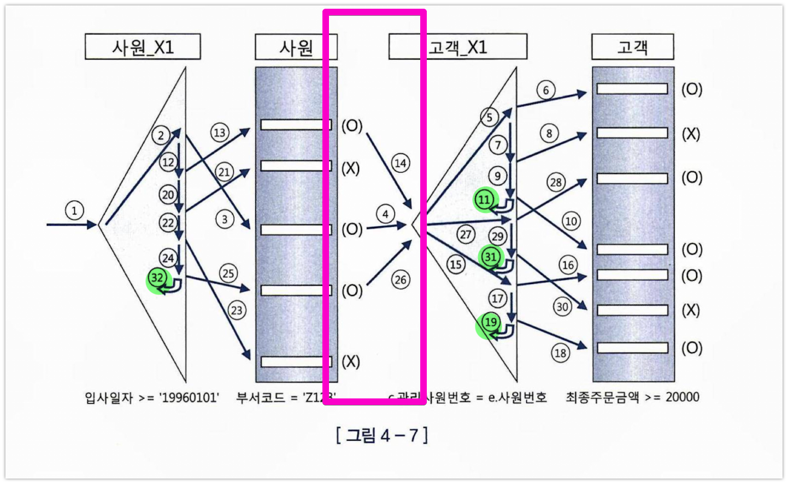

# 4.1 NL 조인

조인 메소드

[동영상](https://www.google.com/search?newwindow=1&sca_esv=f42f57a008774f06&rlz=1C5CHFA_enKR994KR994&q=nested+loop+join&tbm=vid&source=lnms&prmd=ivsnmbz&sa=X&ved=2ahUKEwifpcCKroOGAxUas1YBHTvcB38Q0pQJegQIDhAB&biw=1280&bih=1142&dpr=2#fpstate=ive&vld=cid:5fc4fa7a,vid:pJWCwfv983Q,st:0)

## 1. Nested Loop Join  
중첩 루프 조인, NL 조인  
NL 조인은 Outer와 Inner 양쪽 테이블 모두 인덱스를 이용한다.  

두 테이블 모두 인덱스를 활용할 수 있는 경우 -> NL 조인

### NL 조인 튜닝 포인트 1

드라이빙 테이블 엑세스하는 부분 줄이기  
드라이빙 테이블의 필터링 조건에 의해 필터링 되는 비율이 높다면 그 조건을 인덱스 컬럼으로 포함하자!

### NL 조인 튜닝 포인트 2

드리븐 테이블 인덱스 탐색 횟수 최소화  
= 드라이빙(또는 Outer) 테이블의 필터링한 결과 건수에 따라 결정

### NL 조인 튜닝 포인트 3

드리븐테이블 엑세스 줄이기  
마찬가지로 드리블 테이블의 필터링 조건에 의해 필터링 되는 비율이 높다면 그 조건을 인덱스 컬럼으로 포함하자!

### 조인 튜닝시 NL 조인은 우선 고려사항!

OLTP 시스템에서 튜닝할때는 일차적으로 NL조인 부터 고려한다.

위의 3가지 포인트에서 과도한 랜덤 엑세스 발생지점을 파악 -> 조인순서를 변경 하거나 인덱스 추가 또는 구성 변경
-> 그래도 안되면 소트머지 조인이나 해시조인을 검토

### NL 조인의 특징

1. 랜덤 액세스 위주의 조인방식
2. 한 레코드씩 순차적으로 진행 된다.
  - 장점 : 부분 범위 처리가 가능하다 => 큰 테이블에서 작은 조인 결과를 낼때 빠르다
  - 단점 : 대량 조인 결과 낼때 치명적이다.
3. 인덱스 구성 전략이 특히 중요하다.

결론 : 소량의 데이터를 처리하거나, 부분범위 처리가 가능한 OLTP 시스템에 적합한 조인 방식!

272.p 문제

# 소트 머지 조인

'일괄적으로 한번에 읽어서' 미리 정렬 후 머지한다

양쪽 테이블을 미리 정렬 ? 어디서 ? -> PGA Sort Area에서(메모리)
-> 만약 메모리가 넘치면 ? -> Temp 테이블스페이스에서

일괄적으로 한번에 읽기 때문에 건건이 읽는 NL 조인에 비해 대용량의 조인에 유리하다

해시조인 나오면서 사라짐
(MySQL 에서는 block NL 조인, bached key access 조인과 비슷 ? )
https://hoing.io/archives/24491#4_Batched_Key_Access_Joins