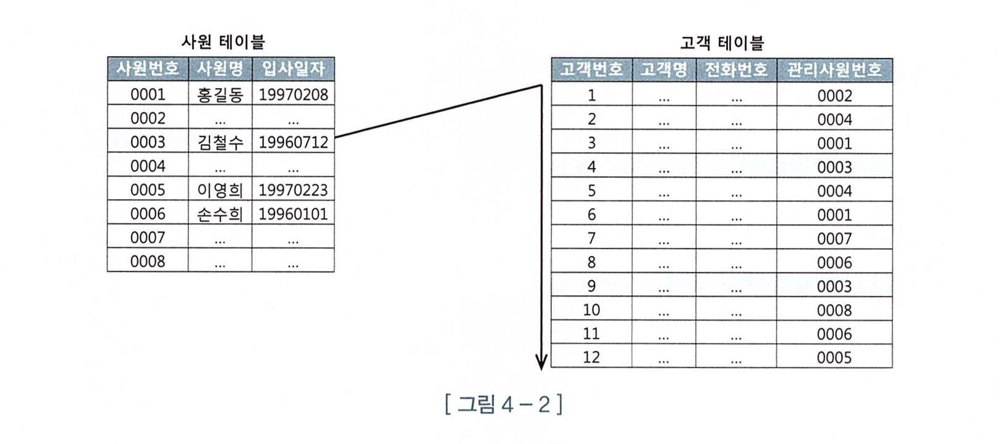
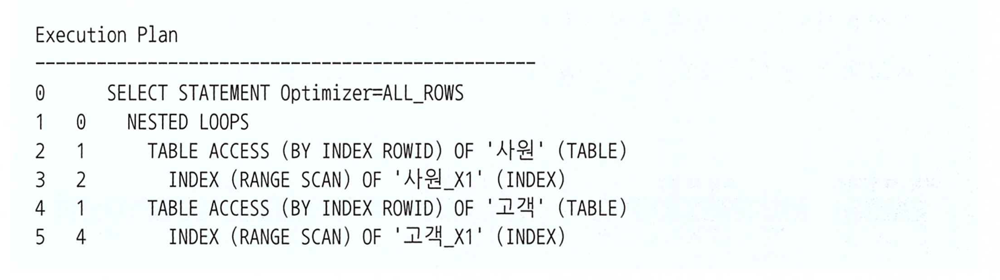
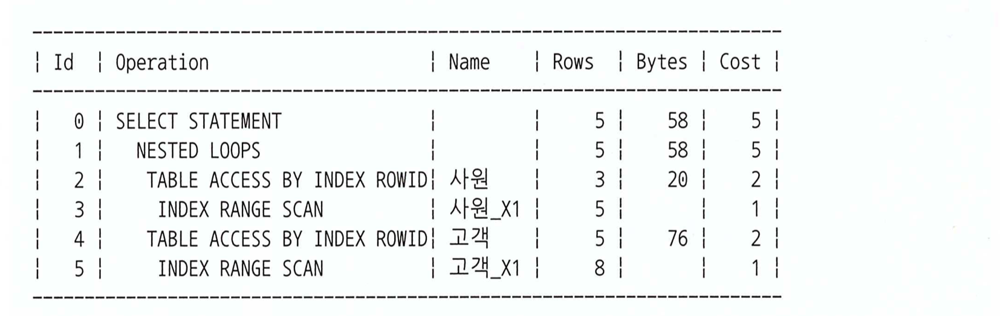
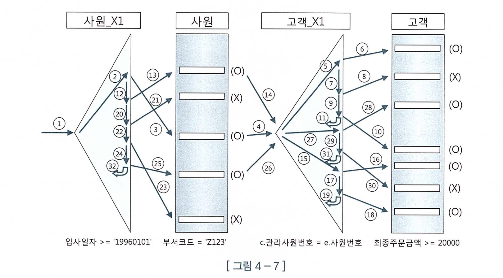
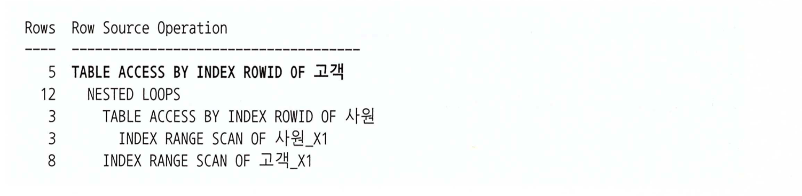
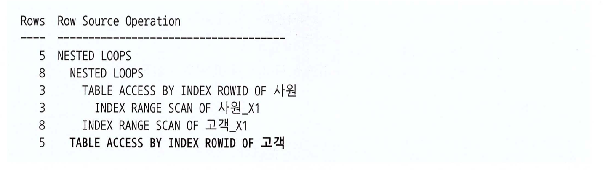
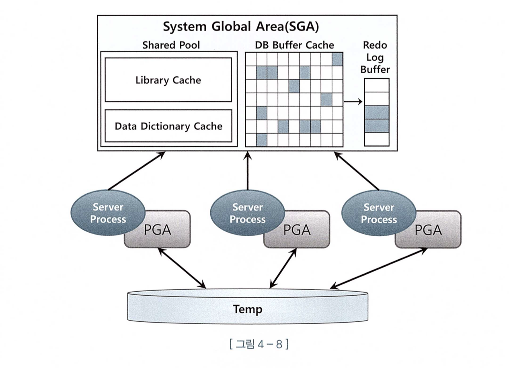
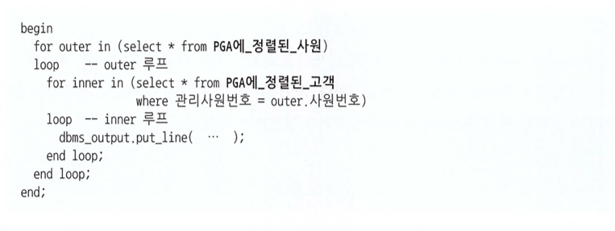
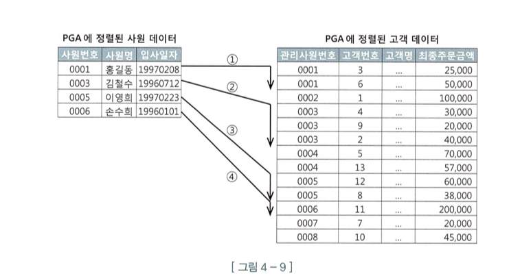
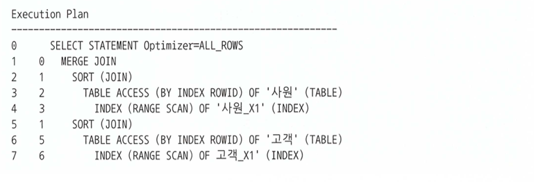

# 📌 서론

<aside>
✏️ DB 의 대표 조인인 `NL 조인`과 `소트머지` 조인, `해시 조인`, `서브쿼리` 조인등을 학습해보자.

</aside>

# 🔥 NL 조인

> 가장 기본적인 조인 방식이며 주로 인덱스 이용한 조인이므로 2~3장에서 배운 내용에서 배운 튜닝 원리도 그대로 적용할 수 있다.
>
- 기본적으로 Outer 와 Inner 양쪽 테이블 모두 인덱스를 이용하지만 **Outer 테이블이 사이즈가 크지 않으면 인덱스를 이용하지 않을 수**도 있다.
- Outer 의 경우에 Table Full Scan 을 하더라도 `한 번만 스캔`하면 되기 때문
- Inner는 기본적으로 인덱스를 사용해야 한다.
- Outer 에서 읽은 건수만큼 스캔을 반복 하기 때문

- 


## 인덱스를 이용한 조인 방식

아래 그림은 사원 테이블과 고객테이블에서 인덱스를 이용하여 조인하는 방식을 그림으로 표현한 것이다.

사원 테이블에서 스캔되는 양 만큼 아래 절차를 반복 한다.

- 

1. 사원_X1 인덱스에서 입사일자 >= `'19960101'` 인 첫 번째 레코드를 찾는다.
2. 인덱스에서 읽은 ROWID로 사원 테이블을 찾아가 `사원번호`를 읽는다.
3. 고객_X1인덱스에서 `2번에서 읽은 사원번호`를 탐색한다.
4. 고객_X1 인덱스에서 읽은 ROWID로 고객 테이블을 찾아간다.

고객 테이블에 고객X_1 인덱스를 보면 알겠지만 1:N 구조이므로 사원 테이블에 `사원번호 0006`의 경우 `2건을 스캔`하고 007레코드를 읽고 다음 레코드로 내려간다.

## 조인 실행 계획

아래 NL 조인 실행 계획을 설명하면

- 위쪽 사원 테이블 기준으로 아래쪽 고객 테이블과 NL 조인한다고 해석하면 된다.

- 

### 수행과정 분석

아래와 같은 쿼리가 있다고 해보자.

```sql
select /*+ ordered use_nl(c) index(e) index(c) */
e.사원번호, e.사원명, e.입사일자,
c.고객번호, c.고객명, c.전화번호, c.최종주문금액
from 사원 e, 고객 c
where c.관리사원번호 = e.사원번호 // (3)
and e.입사일자 > '19960101' // (1)
and e.부서코드 = 'Z123' // (2)
and c.최종주문금액 >= 20000 // (4)
```

인덱스 구성은 아래와 같다.

- 사원PK : 사원번호
- `사원_X1 : 입사일자`
- 고객 PK : 고객번호
- `고객_X1 : 관리사원번호`
- 고객_X2 : 최종주문금액

옵티마이저는 아래와 같이 실행계획을 생성하였다.

- 

1. 일단 입사일자가 >= `'19960101'` 조건으로 사원_X1 인덱스를 Range 스캔한다.  → (1)
2. X1_인덱스에서 획득한 ROWID로 사원 테이블에서 `부서코드 'Z123' 필터 조건`을 수행한다. → (2)
3. 필터 조건에 만족하는 `사원번호 값`으로 `고객 테에블의 관리사원번호` (고객_X1)를 스캔한다. → (3)
4. 고객_X1에서 획득한 ROWID로 고객테이블의 `최종주문금액이 >= 20000 이상인 필터 조건` 을 수행한다.

그림으로 보면 아래와 같다.

인덱스 동작원리와 완벽하게 일치 한다. 다만 기존엔 `1뎁스 루프`였다가 `2뎁스 루프로 변경된 점`만 상기 하면 되겠다.

- 

11, 19, 31, 32는 스캔할 데이터 더 있는지 확인하는 스캔을 표시

20~21번, 22~23번의 경우 사원테이블에서 `부서코드 필터 조건`으로 고객 테이블과 조인이 안된 것을 의미 한다.

마찬가지로 7~8번, 29~30번 역시 고객 테이블 필터 조건으로 조인이 안된 것을 의미 한다.

## $ NL 조인 튜닝 포인트

1. 만약 사원 테이블에 아주 `많은 양의 랜덤 액세스가 발생`하였고 `부서코드로 인한 필터링 비율이 높다면` 사원_X1 인덱스에 `부서코드 컬럼을 추가`하는 방안을 고려해야 한다.
1. 필터로 인한 랜덤 액세스양를 줄일 수 있다.
2. 사원 테이블에 많은 양의 랜덤 액세스가 발생했다는 것은 `인덱스 스캔 범위도 넓다는 것을 의미` 한다.
2. 고객_X1 인덱스 탐색 하는 횟수가 많을 수록 성능이 느려진다.
1. 이건 outer loop 횟수가 물리적으로 많은 경우인데 많아져서 느려지는 것은 당연한 것인데 어떻게 할 수가 있나.???
1. 책에서도 별다른 솔루션은 없고 많을수록 느리다고 만 되어 있다.
3. 고객_X1 인덱스를 읽고 고객 테이블을 액세스 하는 부분인데 만약 `최종주문금액에서 필터링 되는 비율이 높다`면 1번과 마찬가지로 `인덱스를 추가하는 방안도 고려`해야 한다.
1. 1번과 마찬가지로 랜덤 액세스를 줄일 수 있다.


### $$ 올바른 조인메소드 선택

> 일차적으로 NL 조인부터 고려하는 것이 올바른 순서.
>
1. `과도한 랜덤 액세스`가 발생하는 지점을 파악
2. `조인 순서를 변경`해서 랜덤 액세스 발생량을 줄일 수 있는지, 더 효과적인 인덱스가 있는지 검토
3. 인덱스 `추가 또는 구성 변경`도 고려
4. NL 조인으로 `성능을 내기 힘들다고 판단`되면 `소트, 머지, 해시 조인등도 검토`해 본다.

## $ NL 조인 특징

> `소량 데이터`를 주로 처리하거나 `부분범위` 처리가 가능한 `OLTP 시스템`에 적합한 조인 방식
>
1. 랜덤 액세스 위주의 조인 방식
1. 레코드 하나를 읽으려고 블록 통째로 읽는 방식인 랜덤 액세스는 메모리 버퍼에서 읽더라도 비효율이 발생
2. 대량의 데이터를 조인할 때 NL 조인이 불리한 이유 - 랜덤 액세스가 발생하므로
2. 조인을 한 레코드씩 순차적으로 진행
1. 싱글 스레드로 순차적으로 진행이 됨 - 상황에 따라서 빠르게 처리 할 수 있음.
1. 그 상황이라는 것이 부분 범위 처리가 가능한 상황
3. 인덱스 구성 전략이 중요하다.
1. 조인 컬럼에 대한 인덱스 여부나 필터 조건에 의해 효율이 달라짐.

## NL 조인 확장 메커니즘

> 오라클 버전에만 적용되는 내용이 많으니 참고
>

오라클 버전이 올라가면서 NL 조인 성능을 높이기 위해 테이블 prefetch, 배치 IO 기능을 도입 함.

### 테이블 Prefetch

- 인덱스를 이용해 테이블을 액세스 하다가 `디스크 IO가 필요`해지면 `곧 읽게 될 블록까지 미리 읽어서 버퍼캐시`에 적재하는 기능

`오라클 9i` 에서 실행 계획 시 아래와 같이 나타남.

아래에서 알 수 있는 것은 `Inner 쪽 테이블`에 대한 디스크 IO 과정에 테이블 prefetch 기능이 작동.

- 

### 배치 IO

- 디스크 IO Call을 미뤘다가 읽을 블록이 일정량 쌓이면 한꺼번에 처리

`오라클 11g` 부터 아래와 같은 표현 방식도 나타남.

Inner 쪽 테이블에 대한 디스크 IO 과정에서 배치 IO 기능이 작동할 수 있음을 표시.

- 

두가지 기능 모두 건건이 IO Call 발생시키는 비효율을 줄이기 위해 고안 됨.

다만 Inner 쪽 테이블 블록 `모두 버퍼캐시에서 읽는다면` 성능 차이는 없다. → 그게 쉬울리가..

<aside>
❗ 다만 `오라클 12c`에 도입된 `일반 배치IO` 가 데이터 `정렬 순서를 보장하지 않음`.
`11g` 부터 `NL 조인 Inner 쪽 테이블`에 작동하는 배치 IO 기능도 결과 집합의 정렬 순서를 보장하지 않음.

</aside>

사실 이렇게 같은 문법에 버전별로 차이 나는 것에 좀 극혐하긴 하는데 소프트웨어를 개발하다 보면 어쩔 수 없는 부분도 있다고 생각한다. 어쨌든 퍼포먼스를 위한 선택이었고 사실 11g 이하는 사실상 거의 사용하질 않으니 신규 버전 위주로 기억을 해야 될 것 같다. → 사실 오라클도 요즘 많이 외면 받고 있긴 하다.

```sql
select /*+ ordered use_nl(b) */
a.등록일시, a.번호, a.제목, b.회원명, a.게시판유형, a.질문유형
from (
select A.*, ROWNUM no
from (
-- 여기서 정렬이 되지만 배치 IO가 동작할 경우
select 등록일시, 번호, 제목, 작성자번호, 게시판유형, 질문유형
from 게시판
where 게시판유형 = :TYPE
order by 등록일시 desc -- 인덱스 구성 : 게시판유형 + 등록일시
) A
where ROWNUM <= (:page * 10)
) A, 회원 B
where A.NO >= (:page-1) * 10 + 1
and b.회원번호 = A.작성자번호
ORDER by a.등록일시 DESC -- 11g 부터는 여기에 order by 명시해야 정렬이 보장.
```

11g 이상 부터는 배치 IO 기능이 작동할 수 있으므로 order by절에 정렬 기준을 명시 해야 한다.

<aside>
❓  안쪽은 Top N 을 위한 정렬이고 바깥쪽 order by의 경우에는 Top N으로 페치된 row가 배치 IO를 통해 정렬이 보장이 안됨으로 인해 명시적으로 정렬을 명시 해야 되는 것 같은데 확인이 필요.

</aside>

### NL 조인 쿼리 작성 권장

NL 조인 메커니즘을 이해하고 있다면 조인문을 아래와 같이 inner 테이블 alias를 왼쪽에 기술하는 습관을 가지자.

<aside>
❓ 왼쪽에 기술하는게 어쨌든 inner table 조인 컬럼 인덱스 컬럼이므로 즉 좌변을 가공하지 않는다 그런 법칙? 때문에 그런거 같음.

</aside>

```sql
select * from HST_STC a, ODM_TRMS b
where a.sale_org_id = :sale_org_id
**and a.strd_sale_grp_id = b.strd_sale_grp_id
and a.strd_id = b.strd_id**
order by a.stc_dt desc

-- 변경
select * from HST_STC a, ODM_TRMS b -- inner table -> ODM_TRMS b
where a.sale_org_id = :sale_org_id
**and b.strd_sale_grp_id = a.strd_sale_grp_id
and b.strd_id = a.strd_id**
order by a.stc_dt desc
```

# 🔥 소트 머지 조인

> 대량 데이터 조인일 경우 `NL 조인으로 한계`가 있거나 `해시 조인을 사용할 수 없는` 상황이라면 소트 머지 조인을 유용하게 사용할 수 있다.
>

## $ 메모리 영역의 이해

SGA(System Global Area) - 공유 메모리 영역

- SGA에 캐시된 데이터는 여러 프로세스가 공유할 수 있지만 동시에 액세스 할 수는 없다.
- 동시에 액세스 할 수 없으므로 `액세스를 직렬화` 하기 위한 `래치`(lock 매커니즘) 이 존재 함.
- 데이터 블록과 인덱스 블록을 캐싱하는 DB 버퍼 캐시는 SGA 의 가장 핵심적인 구성 요소.
- 여기서 데이터를 읽기 위해 위에서 언급한 Lock이 필요함.

PGA(Private Global Area) - 각 오라클 서버 프로세스에 할당된 메모리 영역

- 프로세스에 종속적인 고유 데이터를 저장하는 용도
- PGA 공간이 작아 데이터를 저장할 수 없다면 Temp 테이블 스페이스를 이용한다.
- 독립적인 공간이므로 래치와 같은 락 매커니즘이 불필요 하다.

- 

## $ 기본 매커니즘

소트 머지 조인은 아래의 두단계로 진행된다.

1. 소트 단계 - 양쪽 집합을 조인 컬럼 기준으로 정렬함.
2. 머지 단계 - 정렬한 양쪽 집합을 서로 머지 함.

## $ 소트 머지 조인 용도

해시 조인이 대부분의 상황에서 더 빠르므로 예전보다 활용도는 떨어졌지만 아래와 같은 상황일때 사용될 수 있다.

용도를 보았을 땐 자주 사용하진 않을 것 같다…. 아니 오히려 저런 상황을 기피해야 되는것 아닌가..

1. 조인 조건식이 등치(=) 조건이 아닌 대량 데이터 조인
2. 조인 조건식이 아예 없는 조인 (Cross Join, 카테시안 곱)

## $ 소트 머지 과정

NL 조인에서 사용했던 SQL로 소트 머지 과정을 설명

```sql
select /*+ ordered use_merge(c) */
e.사원번호, e.사원명, e.입사일자,
c.고객번호, c.고객명, c.전화번호, c.최종주문금액
from 사원 e, 고객 c
where c.관리사원번호 = e.사원번호
and e.입사일자 > '19960101'
and e.부서코드 = 'Z123'
and c.최종주문금액 >= 20000
```

1. 아래 조건으로 사원데이터를 읽어 `사원번호순으로 정렬`한다. 정렬한 `결과 집합은 PGA 영역에 할당된 Sort Area에 저장`한다. 정렬한 결과집합이 **PGA에 담을 수 없을 정도로 크면**, 위에서 설명한 것과 같이 `Temp 테이블 스페이스 저장`한다.

```sql
select 사원번호, 사원명, 입사일자
from 사원
and 입사일자 > '19960101'
and 부서코드 = 'Z123'
order by 사원번호
```

1. 아래 조건으로 고객 데이터를 읽어 `조인컬럼인 관리사원번호 순으로 정렬`한다. 정렬한 결과집합은 `PGA 영역에 할당된 Sort Area에 저장`한다. 마찬가지로 용량이 초과되면 Temp 테이블스페이스에 저장한다.

```sql
select 고객번호, 고객명, 전화번호, 최종주문금액, 관리사원번호
from 고객 c
where 최종주문금액 >= 20000
order by 관리사원번호
```

1. PGA에 저장한 사원 데이터를 스캔하면서 PGA 또는 Temp 테이블스페이스) 고객 데이터와 조인한다.

로직을 보면 NL 로직과 다르지 않다.

- 

위 로직을 그림으로 보면 아래와 같다.

- 

실행 계획은 아래와 같다.

쿼리에서 사용한 `ordered use_merge(c)힌트`는 양쪽 테이블을 `조인 컬럼 순으로 정렬`한 후 `사원 → 고객과 조인`하라는 의미

- 

## $ 결론

결국 소트 머지의 경우 인덱스가 없어도 `인덱스 조인과 같은 효과`를 낼 수 있는 조인이다. 한마디로 실시간으로 인덱스를 생성하는 효과를 가진다.

NL 조인은 단적으로 인덱스를 이용하여 조인을 하는데 이 과정에서 `랜덤 액세스 방식으로 건건이 DB 버퍼캐시`를 경유해서 읽는데 이때 `데이터 블록을 읽기` 위해 `래치 획득` 및 `캐시버퍼 체인 스캔` 과정을 거침.

소트 머지의 경우 대상 `집합을 일괄적`으로 읽어 `PGA에 저장한 후 조인` 하므로 `불필요한 래치 획득 과정이 없다.` 다만 PGA에 저장하기 전 `양쪽 테이블에 데이터를 읽을 때`는 `DB버퍼캐시를 경유`한다. 이 부분에서 발생하는 `랜덤 액세스 부하는 피할 수 없다.`

따라서 대상 테이블의 첫 번째 단계인 소트하는 부하만 감수한다면 위와 같은 이유로 소트머지가 더 빠른 속도를 보장한다.

특정 업무에 인덱스 구성이 되어 있지 않은 테이블끼리 조인이 필요하다면 인덱스 구성도 고려해야 겠지만 소트머지 조인도 훌륭한 대안이 될수도 있겠다.

# 🚀 결론

- 기초적인 내용이다. NL 조인의 경우 인덱스 튜닝의 확장판 같은 느낌이었다.
- PGA라는 공간에 대해서 알게 되었는데 SGA와는 다르게 공유자원에 접근하는 락이 불필요하게 발생할 필요가 없어 오버헤드를 줄여주고 인덱스가 없어도 빠르게 조인할 수 있다는 점을 알게 됨.
- 역시나 좁은 범위의 조인일 경우에는 NL 조인이 효과적일 것 같고 1회성 의 대용량 조인일 경우에는 소트머지나 뒤에서 배울 해시 조인이 유용할 것 같다.