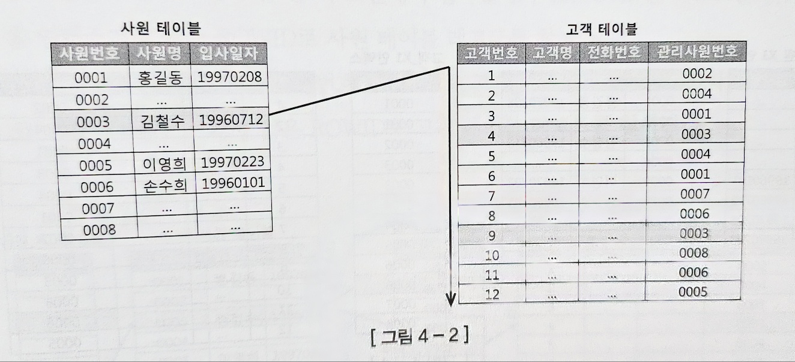
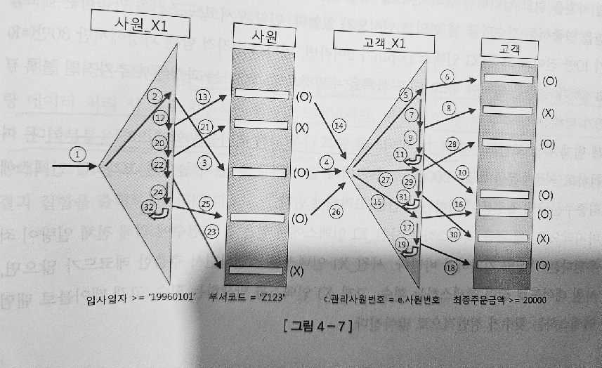

# 4. 조인 튜닝

## 4.1 NL 조인

NL 조인은 인덱스를 이용한 조인이다.

NL 조인은 중첩 루프문과 같은 수행구조를 가진다.

아래와 같은 SQL문이 있다고 가정하자

```sql
select e.employee_name, c.customer_name, c.phone_nm 
from employee e, customer c 
where e.created > '19990101' 
and c.cust_emp_id = e.employee_id
```

그렇다면 아래와 비슷한 루프문을 돌 것이다.

```sql

begin
    for outer in (select employee_id, employee_name, from employee where created >= '19990101' )
    loop --outer loop
        for inner in (select customer_name, phone_nm from customer
                        where cust_emp_id = outer.employee_id)
    loop --inner loop
        dbms_outputs.put_line(
            outer.employee_nm || ' : ' || inner.customer_name || ' : ' || inner phone_nm
        );
        end loop;
    end loop;
end;

```

여기서 inner loop에서는 인덱스를 반드시 사용해야 한다.
안 그러면 outer loop에서의 값 개수만큼 table full scan을 해야 하기 때문이다. 



### NL 조인 실행계획 제어

NL 조인을 제어할 때는 use_nl 힌트를 사용한다.

```sql

select /*+ orderded use_nl(c) */
    e.사원명, c.고객명, c.전화번호
from 사원 e, 고객 c
...

```

ordered 힌트는 FROM 절에서 기술한 순서대로 조인하라고 옵티마이저에게 지시할 때 사용한다. 
use_nl 힌트는 NL 방식으로 조인하라 지시할 때 사용한다. 
위에서는 사원 테이블(outer) 기준으로 고객테이블(inner)과 nl 방식으로 조인하라는 뜻이다.


### NL 조인 수행 과정 분석

아래와 같은 조건절이 있다고 가정하자

```sql
select /*+ ordered use_nl(c) index(e) index(c) */ 
    e.사원번호, e.사원명, e.입사일자 c.고객번호, c.고객명, c.전화번호, c.최종주문금액 
from 사원 e, 고객 c 
where c.관리사원번호 = e.사원번호 ...1 
and e.입사일자 >= '19960101' ...2
and e.부서코드 = 'Z123' ...3
and c.최종주문금액 >= 20000 ...4
```

인덱스는 아래와 같다
```
* 사원 PK : 사원번호 
* 사원_X1 : 입사일자 
* 고객_PK : 고객번호
* 고객_X1 : 관리사원번호 
* 고객 X2 : 최종주문금액
```

이 조건절은 2 -> 3 -> 1 -> 4 순으로 진행된다.

1. (...2) : 입사일자 >= '19960101" 조건을 만족하는 레코드를 찾으려고 사원_X1 인덱스를 Range 스캔한다.
2. (...3) : 사원_X1 인덱스에서 읽은 ROWID로 사원 테이블을 액세스해서 부서코드 ='Z123' 필터 조건을 만족하는지 확인한다.
3. (...1) : 사원 테이블에서 읽은 사원번호 값으로 조인 조건(c.관리사원번호 = e.사원번호)을 만족하는 고객 쪽 레코드를 찾으려고 고객_X1 인텍스를 Range 스캔한다. 
4. (...4) : 고객_X1 인덱스에서 읽은 ROWID로 고객 테이블을 액세스해서 최종주문금액 >= 20000 필터 조건을 만족하는지 확인한다.

이때 각 단계를 모두 완료하고 넘어가는 것이 아닌, 한 레코드 씩 이를 진행한다는 것이다. 



### NL 조인 튜닝 포인트

각 단계에 수행 일량을 확인한 후, 과도한 랜덤 액서스가 발생하는 지점을 먼저 파악한다.

조인 순서를 변경해서 랜덤 액서스를 줄이거나, 더 효과적인 인덱스가 있는지 검토한다.

NL 조인으로 결코 좋은 성능을 내지 못하면 소트머지 조인이나 해시 조인을 고려한다. 

### NL 조인 특징

1. 랜덤 액서스 위주의 조인 방식이다.
2. 조인을 한 레코드씩 순차적으로 진행한다. 이로 인해 대량 데이터 치명적인 한계를 드러내나, 큰 테이블을 조인하더라도 매우 빠른 응답속도를 낼 수 있다


### NL 조인 확장 매커니즘

NL 조인 성능을 올리기 위해 테이블 Prefetch, 배치 I/O 기능을 도입하였다. 

#### 테이블 Prefetch

인덱스를 이용하여 테이블을 액서스 하다가 디스크 I/O 가 필요해지면 이어서 곧 읽게 될 블록까지 미리 읽어서 버퍼 캐시에 적재하는 기능이다. 

#### 배치 I/O 기능

디스트 I/O call을 미뤘다가 읽을 블록 량이 일정 이상 쌓이면 한꺼번에 처리하는 기능이다. 


```sql

--일반
NESTED LOOPS 
    TABLE ACCESS BY INDEX ROWID OF 사원
        INDEX RANGE SCAN OF 사원_X1 
    TABLE ACCESS BY INDEX ROWID OF 고객
        INDEX RANGE SCAN OF 고객_X1

--테이블 Prefetch
TABLE ACCESS BY INDEX ROWID OF 고객
    NESTED LOOPS
    TABLE ACCESS BY INDEX ROWID OF 사원
        INDEX RANGE SCAN OF 사원_X1
    INDEX RANGE SCAN OF 고객_1

--배치 I/O
NESTED LOOPS
    NESTED LOOPS
        TABLE ACCESS BY INDEX ROWID OF 사원
            INDEX RANGE SCAN OF 사원 _X1
        INDEX RANGE SCAN OF 고객_X1
    TABLE ACCESS BY INDEX ROWID OF 고객

```

## 4.2 소트 머지 조인


### SGA vs PGA

SGA에 캐시된 데이터를 읽으려면 버퍼 Lock를 얻어야 한다. 

반면에 PGA는 다른 프로세스와 공유하지 않는 독립적인 메모리 공간이므로 Latch 메커니즘이 불필요하다. 

따라서 같은 양의 데이터를 읽더라도 훨씬 빠르다.


### 기본 매커니즘

1. 소트 단계 : 양쪽 집합을 조인 컬럼 기준으로 정렬한다.
2. 머지 단계 : 정렬한 양쪽 집합을 서로 머지한다. 

아래와 같은 SQL 문이 있다고 가정하자

```sql
select /*+ ordered use_merge(c) */ 
    e.사원번호, e.사원명, e.입사일자 , c.고객번호, c.고객명, c.전화번호, c.최종주문금액 
from 사원 e, 고객 c 
where c.관리사원번호 = e.사원번호 
and e.입사일자 >'19960101' 
and e. 부서코드 = 'Z123' 
and c. 최종주문금액 >= 20000

```

위의 과정은 아래와 같이 진행된다.

1. 아래 조건에 해당되는 사원 데이터를 읽어 조인 컬럼인 사원번호 순으로 정렬한다. 

정렬한 결과는 PGA에 할당된 Sort Area에 저장하고

만약 정렬한 결과가 크면 Temp Table Space에 저장한다

```sql
select 사원번호, 사원명, 입사일자 
from 사원 
where 입사일자 >= '19960101' 
and 부서코드 ='Z123' 
order by 사원번호
```

2. 아래 조건하는 고객 데이터를 읽어 조인 컬럼인 관리사원번호 순으로 조인한다.

정렬한 결과는 PGA에 할당된 Sort Area에 저장하고

만약 정렬한 결과가 크면 Temp Table Space에 저장한다

```sql
select 고객번호, 고객명 전화번호, 최종주문금액, 관리사원번호 
from 고객 c 
Where 최종주문금액 >= 20000 
order by 관리사원번호
```

3. PGA에 저장된 사원 데이터를 스캔하면서 PGA에 저장된 고객 데이터와 조인한다. 

위의 과정을 통해 사원 데이터를 기준으로 고객 데이터를 Full Scan 하지 않아도 된다는 것이다. 

### 소트 머지 조인이 빠른 이유

얼핏 보면 NL 조인과 매커니즘이 비슷하나 소트 머지 조인이 훨씬 빠르다.

이유는 NL 조인은 건건히 DB 버퍼 캐시를 조인하나

소트 머지 조인은 양쪽 테이블로부터 조인 대상 집합을 일괄적으로 읽어 PGA에 저장한 후 조인하기 때문이다. 

### 소트 머지 조인의 주 용도

1. 조인 조건식이 = 조건이 아닌 대량 데이터 조인
2. 조인 조건식이 아예없는 Cross Join

### 소트 머지 조인 특징 요약

1. PGA 영역에 저장한 데이터를 이용하기 때문에 빠르다, 즉 소트 부하만 견디면 NL 조인보다 빠르다
2. 스캔위주의 액서스 방식을 사용한다. (조인대상 레코드를 찾을 때 인덱스를 사용한다면 랜덤 액서스가 발생)