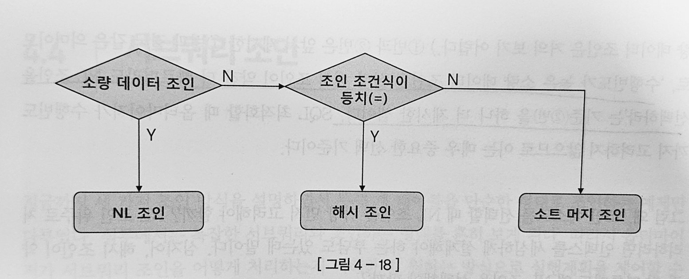

# 4.3 해시 조인

### 진행단계

1. Buiild 단계 : 작은 쪽 테이블을 읽어 해시 테이블을 생성
2. Probe 단계 : 큰 쪽 테이블을 읽어 해시 테이블을 탐색하면서 조인

```sql
select /*+ ordered use_hash(c) */ 
	e.사원번호, e.사원명, e.입사일자, 
	c.고객번호, c.고객명, c.전화번호, c.최종주문금액 
from 사원 e, 고객 c 
where c.관리사원번호 = e.사원번호 
and e.입사일자 > '19960101' 
and e. 부서코드 ='Z123' 
and c. 최종주문금액 >= 20000
```

### 1. Build 단계

```sql
select 사원번호, 사원명, 입사일자 
from 사원
where 입사일자 >= '19960101' 
and 부서코드 = 'Z123'
```

위의 조건에 해당하는 사원 데이터를 읽어 해시 테이블을 생성한다. 

이때 조인 컬럼인 사원번호를 해시 테이블 키 값으로 사용한다. 

해시 테이블은 PGA 영역에 할당된 Hash Area에 저장하고 PGA에 담을 수 없다면 Temp 테이블 스페이스에 저장한다.

### 2. Probe 단계

```sql
select 고객번호, 고객명, 전화번호, 최종주문금액, 관리사원번호 
from 고객
where 최종주문금액 >= 20000
```

위의 조건에 해당하는 고객  데이터를 하나씩 읽어 앞서 생성한 해시 테이블을 탐색한다. 

관리 사원번호를 해시 함수에 입력하여 반환된 값으로 해시 체인을 찾고 그 해시 체인을 스캔하여 값이 같은 사원번호를 찾는다.

### 해시 조인이 빠른 이유

프로세싱 자체는 NL 조인이랑 같으나 속도가 빠른 이유는 해시 테이블을 PGA 영역에 할당하기 떄문이다. 

또한 소트머지조인은 양쪽 테이블을 모두 정렬하여 PGA에 담아야 하나 해시조인은 한 쪽만 해시 맵을 만들면 되므로 Temp 테이블(디스크)에 작업이 일어나지 않는다.

그러므로 NL 조인에서 나타나는 랜덤 액서스 부하가 없고, 소트 머지 조인에서의 양쪽 집합을 미리 정렬하는 부하가 없다.

## 대용량 Build input 처리

대용량 테이블의 경우 한번에 인메모리 해시 조인이 불가능하다

이를 해결하기 위해 분할/정복 방식을 활용한다. 

1. 파티션 단계 : 조인하는 양쪽 집합의 조인 컬럼에 해시 함수를 적용하고, 반환된 해시 값에 따라 동적으로 파티셔닝 한다. 
2. 조인 단계 : 파티션 단계가 완료되면 각 파티션 짝에 대해 하나씩 해시 조인을 수행한다.

### 조인 메서드 선택 기준



1. 소량 데이터를 조인할 때 : NL 조인
2. 대량 데이터를 조인할 때 : 해시 조인
3. 대량 데이터 조인인데 해시 조인으로 처리 불가능 할 때(조인 조건식이 동치 조건이 아닐 경우)

**수행 빈도가 높은 쿼리**

1. NL 조인과 해시 조인 성능이 같다면 NL 조인
2. 해시 조인이 약간 더 빨라도 NL 조인
3. 해시 조인이 훨씬 빠르다면 해시 조인

NL 조인에서 사용하는 인덱스는 영구적으로 유지하면서 다양한 쿼리를 위해 공유 및 재사용하는 자료구조이나, 해시 조인 같은 경우는 단 하나의 쿼리를 위해 생성되고 조인이 끝나면 곧바로 소멸하는 자료구조이다.

**결론**

해시 조인은 아래와 같은 조건에서 사용한다.

1. 수행 빈도가 낮고
2. 쿼리 수행 시간이 오래 걸리고
3. 대량 데이터 조인할 때

# 4.4 서브 쿼리 조인

### 서브 쿼리 종류

1. 인라인 뷰 : From 절에서 사용한 서브쿼리

```sql
select * from customer c, (select avg(price) from product) p;
```

1. 중첩된 서브쿼리 : 결과 집합을 한정하기 위해 WHERE 절에 사용하는 서브쿼리, 서브 쿼리가 메인 쿼리 컬럼을 참조하는 형태를 `상관관계있는 서브쿼리`라고 한다.

```sql
select * from customer where exists (select 'x' from employee e where e.code = "X" );
```

1. 스칼라 서브쿼리 : 한 레코드 당 정확히 하나의 값을 반환하는 서브 쿼리이다. 

```sql
select c.고객번호, (select 고객분류명 from 고객분류 where 고객분류코드 = c.고객분류코드) 
from customer c;
```

이들 서브 쿼리를 참조하는 메인 쿼리도 하나의 쿼리 블록이며, 옵티마이저는 쿼리 블록 단위로 최적화를 수행한다. 

```sql
<원본 쿼리>
select c.고객번호, c.고객명 
from 고객 c
where C.가입일시 >= trunc(add_months(sysdate, -1), 'mm')
and exists ( select 'x' 
	from 거래 
	where 고객번호 = c.고객번호 
	and 거래일시 >= trunc(sysdate, 'mm') )
	
<쿼리 블록 1> 

select c.고객번호, c.고객명 
from 고객 
where c.가입일시 >= trunc(add_months(sysdate, -1), 'mm')

<쿼리 블록 2> 

select 'x' 
from 거래 
where 고객번호 = :cust_no
and 거래일시 >= trunc(sysdate, 'mm')
```

쿼리 블록 단위로 최적화를 하면 쿼리가 전체적으로 최적화되었다고 말하기 어렵다. 이를 위해 서브 쿼리를 먼저 풀어내야 한다.

### 서브 쿼리와 조인

메인쿼리와 서브쿼리 간에는 부모와 자식이라는 종속적이고 계층적인 관계가 존재한다. 

서브 쿼리는 메인쿼리에 종속되므로 단독으로 실행할 수 없다. 메인쿼리 건수만큼 값을 받아 반복적으로 필터링하는 방식으로 실행해야 한다. 

**필터 오퍼레이션**

서브 쿼리를 필터 방식으로 처리하기 위해 un_nest 힌트를 사용한다. 

```sql
select c.고객번호, C.고객명 
from 고객 c 
where c.가입일시 >= trunc(add. months(sysdate -), 'mm')
and exists ( select /*+ no_unnest /* 'x' 
	from 거래 
	where 고객번호 = c.고객번호 
	and 거래일시 >= trunc(sysdate, 'mm'))
	
-- Execution Plan

SELECT STATEMENT Optimizer=ALL_ROWS (Cost=289 Card=1 Bytes=39)
	FILTER
		TABLE ACCESS (BY INDEX ROWID) OF '고객' (TABLE) (Cost=4 Card=190 ...)
			INDEX (RANGE SCAN) OF '고객_X01' (INDEX) (Cost=2 Card=190)
		INDEX (RANGE SCAN) OF '거래_X01' (INDEX) (Cost=3 Card=4K Bytes=92K)
```

필터 오퍼레이션은 NL 조인과 처리 루틴이 비슷하다. 

메인쿼리의 한 로우가 서브 쿼리의 한 로우와 조인에 성공하는 순간 진행을 멈추고 메인쿼리의 다음 로우를 계속 처리하는 방식으로 진행된다. 

위와 같은 방식으로 메인쿼리 결과 집합이 서브쿼리쪽 집합 수준으로 확장 되는 것을 막을 수 있다.(중복 방지)

또한 필터 캐싱 기능을 가질 수 있다. 

**unnesting**

```sql
select c.고객번호, C.고객명 
from 고객 c 
where c.가입일시 >= trunc(add. months(sysdate -), 'mm')
and exists ( select /*+ unnest nl_sj */ 'x' 
	from 거래 
	where 고객번호 = c.고객번호 
	and 거래일시 >= trunc(sysdate, 'mm'))
	
-- Execution Plan
SELECT STATEMENT Optimizer=ALL_ROWS (Cost=384 Card=190 Bytes=11K)
	NESTED LOOP(SEMI) (Cost=384 Card=190 Bytes=11K)
		TABLE ACCESS (BY INDEX ROWID) OF '고객' (TABLE) (Cost=4 Card=190 ...)
			INDEX (RANGE SCAN) OF '고객_X01' (INDEX) (Cost=2 Card=190)
		INDEX (RANGE SCAN) OF '거래_X01' (INDEX) (Cost=2 Card=427K Bytes=9M)
```

unnesting은 중첩된 상태를 푼다는 뜻이다. unnesting은 메인과 서브쿼리 간의 계층 관계를 풀어 서로 같은 레벨로 만들어 준다.

unnesting을 통해 일반 조인문처럼 다양한 최적화 방식을 사용할 수 있다. 위의 쿼리는 NL 세미 조인의 방식을 사용한 것이다. 

NL 세미조인은 NL 조인과 거의 비슷하나 조인에 성공하는 순간 진행을 멈추고 메인 쿼리의 다음 로우를 계속 처리한다는 점만 다르다.

**서브쿼리 Pushing**

서브쿼리  필터링을 가능한 한 앞 단계에서 처리하도록 강제하는 기능이다. 서브 쿼리 필터링을 먼저 실행하여 조인으로 넘어가는 로우 수를 줄이는 방법이다. 

이 기능은 Unnesting 되지 않은 서브쿼리에만 작동된다. 

### 뷰 조인

최적화 단위가 쿼리 불록이므로 옵티마이저가 뷰 쿼리를 변환하지 않으면 뷰 쿼리 블록을 독립적으로 최적화한다. 

머지 힌트를 통해 뷰를 메인 쿼리와 머징 시킬 수 있다.

```sql
select c.고객번호, c.고객명, t.평균거래, t.최소거래, t.최대거래
from 고객 c
	, (select /*+ merge */ 고객번호, avg(거래금액) 평균거래, 
	min(거래금액) 최소거래, max(거래금액) 최대거래
	from 거래
	where 거래일시 >= trunc(sysdate, 'mm') 
	group by 고객번호) t 
where c.가입일시 >= trunc(add_months(sysdate, -1), 'mm')
and t.고객번호 = c.고객번호
```

위의 경우 아래와 같이 실행계획이 변환된다. 

```sql
select c.고객번호, c.고객명,
	avg(t.거래금액) 평균거래, min(t.거래금액) 최소거래, max(t.거래금액) 최대거래
from 고객 c, 거래 t 
where c.가입일시 >= trunc(add_months(sysdate, -1), 'mm') 
and t.고객번호 = c.고객번호 
and t.거래일시 >= trunc(sysdate,"mm") 
group by c.고객번호, c.고객명
```

**조인조건 Pushdown**

메인 쿼리를 실행하면서 조인 조건절 값을 건건히 뷰 안으로 밀어 넣는 기능이다. 이를 통해 부분범위 처리가 가능해지고 뷰를 머징할 때처럼 조인에 성공한 전체 집합을 group by 하지 않아도 된다.

### 스칼라 서브 쿼리

**스칼라 서비쿼리 캐싱 효과**

스칼라 서브 쿼리로 조인하면 오라클은 조인 횟수를 최소화하려고 입력값과 출력값을 내부 캐시에 저장해둔다. 조인할 때마다 일단 캐시에서 입력 값을 찾아보고 찾으면 저장된 출력값을 반환한다. 캐시에서 찾지 못할 경우에만 조인을 수행하고 결과는 캐시에 저장해둔다.

**스칼라 서브쿼리 캐싱 부작용**

스칼라 서브쿼리 캐싱 효과는 입력값의 종류가 소수여서 해시 충돌 가능성이 작을 때 효과가 있다. 

또한 메인 쿼리 집합이 매우 작은 경우에도 스칼라 서브쿼리 캐싱이 도움이 되지 않는다. 

**스칼라 서브쿼리 Unnesting**

스칼라 서브쿼리도 Unnesting 을 통해 일반 조인문처럼 변환이 가능하다.

```sql
select c.고객번호, c.고객명 
	(select /*+ unnest */ round(avg(거래금액),2) 평균거래금액 
	from 거래 
	where 거래일시 > trunc(sysdate, 'mm') 
	and 고객번호 =c.고객번호) 
from 고객 c 
where c.가입일시 > trunc(add_months(sysdate, -1), 'mm')
```