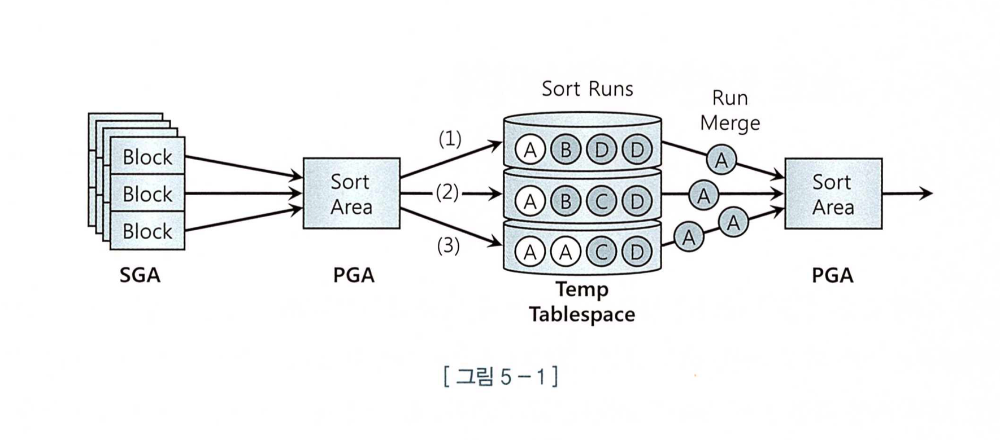
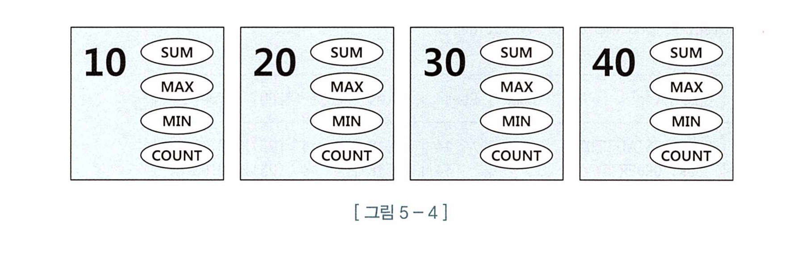
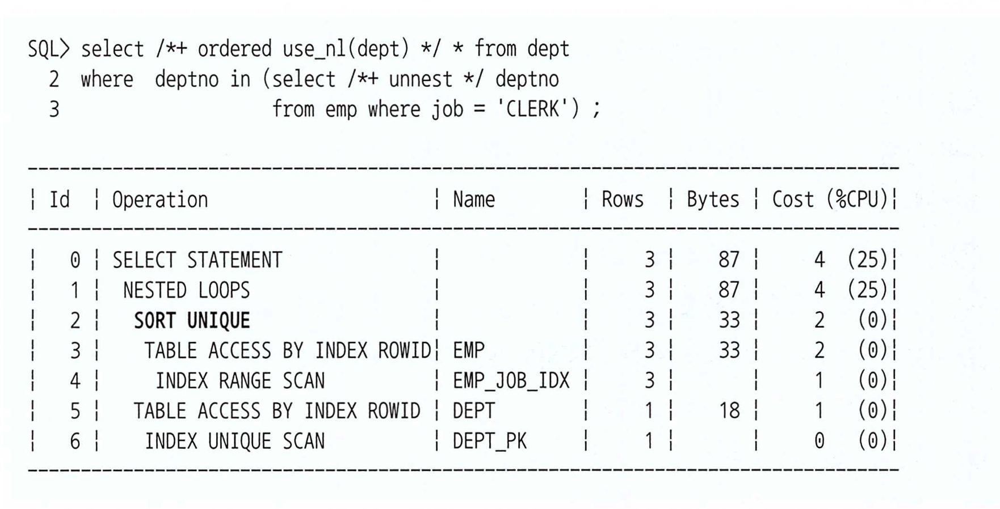
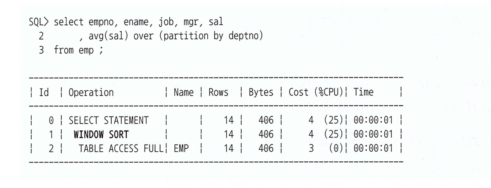
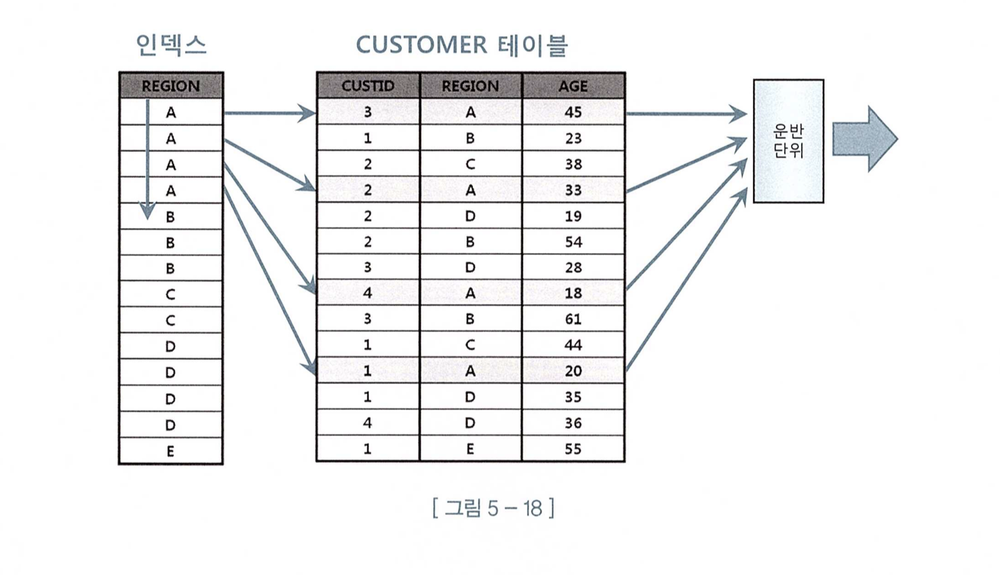
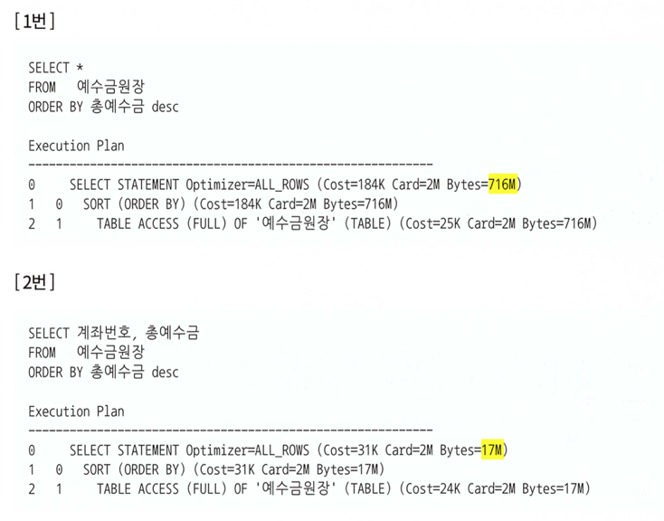
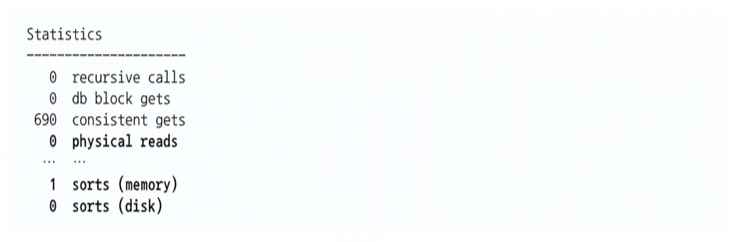
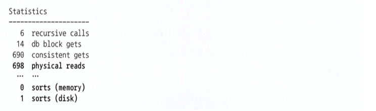

# 📌 서론

<aside>
✏️ 소트 즉 정렬되는 연산에서 알아야 될 튜닝 포인트에 대해서 알아 보자.

</aside>

# 🔥 소트 연산에 대한 이해

> 소트 또는 그룹핑할 때에도 PGA의 Sort Area, Temp 테이블 스페이스를 이용하여 처리 하는데 소트 수행과정과 소트 오퍼레이션 종류에 대해 알아보자.
>

## 소트 수행 과정

1. 메모리 소트(In-Memory-Sort, Internal Sort) - 전체 데이터 정렬 작업을 메모리 내에서 완료.
2. 디스크 소트(To-Disk-Sort, External Sort) - Sort Area 내에서 정렬을 완료하지 못하여 디스크 공간까지 사용된 경우

그림으로 표현하면 아래와 같다.



1. 소트 대상 집합을 SGA 버퍼캐시를 통해 읽는다.
2. Sort Area 에서 정렬을 시도한다. → 여기서 완료되는 것이 최적.
3. 만약 소트할 양이 많아 중간 집합을 Temp 테이블 스페이스 임시 세그먼트를 생성하여 저장. → 여기를 Sort Runs라 부름.
4. 3번 과정을 거쳤다면 최종 결과를 얻기 위해 다시 머지를 수행해야 됨.

<aside>
❕ 4번에서 다시 머지 하는 부분이 좀 이해가 안되는데 정렬이 되어 있는 상태에서 오름 차순일 경우 A 값부터 순서대로 읽어서 그룹핑 또는 집계를 하는 건가.? 그럼 모든 데이터가 Sort run에 저장되어 있다는 의미인건가????

</aside>

소트 연산은 기본적으로 `소트 대상이 되는 데이터를 모두 읽고` 소팅 및 그룹핑 작업이 들어가므로 일단 메모리 및 CPU사용율이 높을수 밖에 없다. 추가로 메모리 내에서 처리하지 못할경우 `디스크 IO까지 발생`하므로 비용이 매우 높다고 할 수 있다.  따라서 불가피하게 소팅연산이 발생할 수 있지만 `메모리내에서 수행이 완료`될 수 있도록 권장한다.

## 소트 오퍼레이션

1. Sort Aggregate
    1. 데이터를 정렬하지 않고 집계를 수행할 때 사용.
2. Sort Order By
    1. 데이터를 정렬할때 사용한다.
    2. 직접 명시적으로 `order by` 를 사용
3. Sort Group By
    1. 소팅 알고리즘을 사용하여 그룹별 집계를 수행
    2. 아래와 같은 쿼리를 수행한다고 하면 deptno 별로 공간을 만들어 각각의 집계 데이터를 저장한다.

        ```sql
        select deptno, sum(sal), max(sal), min(sal), avg(sal)
        from emp
        group by deptno
        order by deptno ;
        ```

       

    3. 만약 부서가 많지 않다면 Temp 테이블 스페이스 없이 메모리(Sort Area)에서 처리가 가능하다.
    4. 만약 group by 뒤에 order by를 명시하지 않으면 `Hash Group By` 방식으로 처리 한다.
        1. 차이점은 Group by 컬럼의 해시값으로 버킷을 찾아 간다.
        2. order by를 명시하지 않으면 정렬이 보장되지 않는다.
4. Sort Unique
    1. 서브쿼리를 풀어 일반 조인문으로 변경하고 메인쿼리와 조인하기전에 중복 레코드를 제거해야 하는데 이때 사용됨.

       

    2. 만약 PK/Unique 제약 또는 Unique 인덱스를 통해 유일성이 보장이 된다면 생략할 수 있음.
5. Sort Join
    1. 소트 머지 조인을 수행할때 사용
6. Window Sort
    1. 윈도우 함수를 수행할때 사용.

   


# 🔥 소트가 발생하지 않도록 SQL 작성

> 소트 연산이 어쩔수 발생할 경우에는 당연히 수행해야겠지만 `불필요하게 수행`할 경우에는 `튜닝이 필요`하다. 대표적으로 `Union, Minus, Distinct` 연산자는 `중복레코드 제거`를 위해 소트 연산이 발생되므로 주의가 필요 하다.
>

- Union 과 Union All에 대해서 명확하게 이해할 필요가 있다. Union All의 경우 단순히 `두집합을 결합`하므로 소트 작업을 수행하지 않는다. 따라서 단순히 두 집합을 결합하는 결과가 필요하다면 Union이 아니라 Union All 을 사용해야 한다.
- Distinct, Minus 연산의 경우 대부분은 Exists 서브쿼리로 변환이 가능하다.
    - 실제로 Minus 는 거의 사용해본적이 없었던것 같고 Distinct는 왕왕 썻던 것 같은데 Exists로 해결할 수 있음을 기억하자.

# 🔥 인덱스를 이용한 소트 연산 생략

> 인덱스는 항상 키 `컬럼 순으로 정렬을 유지`하고 있으므로 이를 이용하면 Order by, Group by 절이 있어도 `소트를 생략`할 수 있다. 또한 여기에 `Top N 쿼리 특성을 결합하면 OLTP환경에서 매우빠른 응답속도`를 낼 수 있다.
>

<aside>
❕ 앞에 인덱스 튜닝에서 배웠던 내용의 복습 과정과 심화과정 - 열심히 공부 했다면 복습처럼 느껴질 것 같다.

</aside>

결국 `인덱스는 정렬이 된 상태`를 가지고 있고 이를 잘 이용하면 굳이 `소트 연산 없이 정렬된 효과`를 볼 수 있다.

Top N 쿼리는 결국 `페이징 처리` (부분 범위 처리) 하는 기능이며 앞에서 설명한 것과 같이 일단 선행 조건은 `인덱스 처리를 통해 sort 연산을 하지 않아야 하며 RowNum을 이용하여 페이징 처리` 하는 것을 말한다.

아래는 오라클에서 사용하는 페이징 처리의 예제

```sql
select * from (
	select rownum no, a.* from (
		/* SQL Body */
		selct 
		...
	) a
	where rownum <= (:page * 10)
)
where no >= (:page-1) * 10 + 1;
```

추가적으로 MAX, MIN 연산의 경우에도 인덱스 스캔을 할경우 좌측(MIN), 우측(MAX) 값으로 저장되므로 이 부분을 잘 알고 있다면 불필요한 소트 연산을 하지 않아도 된다.

Group By 절의 경우에도 인덱스를 이용하면 부분범위 처리가 가능하다.

아래와 같이 region 별 평균 나이와, 카운트를 조회한다고 하면

아래 그림과 같이 region이 인덱스로 구성되어 있다면 정렬이 되어 있으므로 A값, B값, C값 별로 순차대로 데이터를 뽑을 수 있다. 이를 통해 전체 스캔이 아니라 부분 처리가 가능해진다.

```sql
select region, avg(age), count(*) 
From customer 
group by region
```



# 🔥 Sort Area를 적게 사용하도록 SQL 작성

> 소트 연산이 불가피 하다면 메모리 내에서 처리를 완료할 수 있도록 노력해야 한다. Sort Area를 늘리는 방법도 있지만 기본적으로 Sort Area를 적게 사용하는 방법부터 찾는 것이 순서다.
>

```sql
-- (1)
select lpad（상품번호, 30) || lpad（상품명, 30) || lpad （고객ID, 10)
			|| lpad （고객명, 20) || to_char（주문일시, ' yyyymmdd hh24:mi:ss')
from 주문상품
where 주문일시 between :start and :end
order by 상품번호

-- (2)
select lpad（상품번호, 30) || lpad（상품명, 30) || lpad （고객ID, 10)
			|| lpad （고객명, 20) || to_char（주문일시, ' yyyymmdd hh24:mi:ss')
from (
	select 상품번호, 상품명, 고객ID, 고객명, 주문일시
	from 주문상품
	where 주문일시 between :start and :end
	order by 상품번호
)

```

1번의 경우 `레코드당 107 바이트`로 가공한 결과집합을 Sort Area에 저장한다.

2번의 경우 가공하지 않은 상태로 정렬하고 `최종 출력시 가공` 한다.

→ 2번 SQL이 더 적게 사용 한다.

<aside>
❔ 쿼리 작성할때 저렇게 작성할 일이 있을까 싶지만, 어쨌든 지식을 전달하기 위한 예제이니 매커니즘만 기억하면 될것 같다.

</aside>

이거는 예상했던 결과인데 당연히 무분별하게 와일드(*) 를 사용하면 안된다.

아래 예제는 좀 극단적인 상황이긴 함.



## Top N 쿼리 소트 부하 경감원리

> 인덱스로 소트 연산을 생략할 수 있다면 베스트 이겠지만 만약 그렇지 않을때 어떻게 작동 하는지 알아보자.
>

1000명의 학생이 있더라도 상위 10명의 학생만 조회한다고 가정하면

- 메모리 공간은 상위 10개의 학생을 저장할 사이즈만 있으면 됨.
- 1000명을 조회하여 10명의 사용자와 비교하여 연산.
    - 소트 연산을 줄일 수 있다.
    - Sort Area 최소화할 수 있다.
        - Top N 사이즈 만큼의 공간만 필요하므로


오라클의 경우 Physical Read,Write 를 확인할 수 있는데 아래와 같다.



반대로 Top N 소트가 아닐 경우 아래와 같다.

위의 경우 메모리내에서 정렬이 완료되었지만 아래의 경우 디스크까지 사용하여 정렬을 하였다.



# 🚀 결론

- 인덱스의 연장선의 내용이라고 생각이 들었다.
- 잘 설계된 인덱스는 소트 연산을 생략할 수 있게 해준다.
- group by시 정렬이 필요할 경우 order by를 명시적으로 적어 주는것이 좋다.
- 일부 명령어의 경우 소트 연산을 하지 않고 쿼리로 풀어낼 수 있다. minus 와 distinct는 사용하기전에 고민해보자.
- 부득이 하게 소트 연산을 생략할 수 없다면 메모리 사용량을 최소한으로 사용하여 메모리내에서 정렬할 수 있도록 하자.

# Reference

- [[SQL] 윈도우 함수 (WINDOW FUNCTION) (tistory.com)](https://moonpiechoi.tistory.com/128)