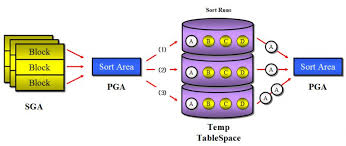

## 소트 튜닝

### 소트 수행 과정

소트는 기본적으로 PGA(sort area) 에서 발생한다

공간 부족시 temp테이블 스페이스 활용

* 메모리 소트 : 전체 데이터 정렬 작업을 메모리에서 진행
* 디스크 소트 : 할당된 sort area에까지 정렬을 완료하지 못해서 디스크 공간까지 활용

#### 디스크 소트 과정



1. 소트 대상집합을 일차적으로 sort area에서 실행
2. 양이 많다면 temp영역에 임시 세그먼트 만들어 저장
3. 이후 이들을 머지한다


소트연산은 cpu집약적이기도 한다. 이로 인해 부분범위 처리 불가능하다 

-> 소트 연산은 가급적 피하고 소트가 불가피하면 메모리 내에서 연산을 끝내야 한다.


### 소트 오퍼레이션

#### 소트 발생시키는 오퍼레이션

1. sort aggregate
2. sort order by
3. sort group by
4. sort unique
5. sort join
6. window sort

### 소트 없이 sql 작성

#### 1. union 대신 union all활용

union사용시 옵티마이저는 중복제거를 위해 소트 작업을 한다

반면 union all은 수행하지 않는다

그러나 데이터 중복을 피할 수 있는 방법을 찾아야 한다


ex ) 

```sql

-- x
select 결제번호, 결제수단코드, 주문번호, 결제금액, 결졔일자, 주문일자,....
from 결제 
where 결제일자 = '20180316'
UNION
select 결제번호, 결제수단코드, 주문번호, 결제금액, 결졔일자, 주문일자,....
from 결제 
where 주문일자 = '20180316'

-- o

select 결제번호, 결제수단코드, 주문번호, 결제금액, 결졔일자, 주문일자,....
from 결제 
where 결제일자 = '20180316'
UNION ALL
select 결제번호, 결제수단코드, 주문번호, 결제금액, 결졔일자, 주문일자,....
from 결제 
where 주문일자 = '20180316'
and 결제일자 <> '20180316'


```

#### 2. exist활용

중복 제거를 위해 distinct사용하면 조건에 해당하는 데이터를 모두 읽어 성능이 좋지 못하다.

exists 서브쿼리는 데이터 존재 여부만 확인하므로 조건절에 만족하는 데이터를 모두 읽지 않는다.

> DA 분에게 물어본 결과 exists가 중복을 처리할 수 있는 경우에만 사용하라고 함, 데이터에 대해 이해도가 낮으면 차라리 group by를 쓰라 조언하심


### 인덱스를 활용한 소트 연산 생략

#### 1. Sort order by 생략 방법

인덱스를 활용하여 Sort order by 가 생략 가능하다

```sql

-- 인덱스 [종목코드, 거래일시]

select 거래일시, 체결건수, 체결수량, 거래대금
from 종목거래
where 종목코드 = 'KR123'
order by 거래일시
```

소트해야 할 대상이 많은 경우 극적인 효과를 볼 수 있다.

#### 2. top N 쿼리

```sql
SELECT *
  FROM ( SELECT 거래일시, 체결건수, 체결수량, 거래대금
           FROM 종목거래
          WHERE 종목코드 = 'KR123456'
            AND 거래일시 >= '20180304'
          ORDER BY 거래일시 )
 WHERE ROWNUM <= 10
```

전체 결과 중 상위 n개만 선택 

인덱스 생성 시 소트 연산 생략하면서 상위 n개만 스캔한다.
-> Top N StopKey 알고리즘

#### 페이징 처리 


1. 부분 범위 처리가 가능한 sql

2. 작성한 sql 문을 페이지 처리 용 표준 패턴 sql 부분에 추가 

#### 페이징 처리 안티 패턴

rownum제거 시 stopkey 작동 안함 -> 전체범위 처리

#### 최소 최대

인덱스 정렬 후 max/min 사용시 Sort Aggregate 가 생략된다.

FirstRowStopKey 알고리즘

혹은 Top N 쿼리를 활용할 수 있다.

범위가 넓은 경우 윈도우 함수 사용

#### Sort Group By 생략

인덱스 활용시 Group by 도 생략 가능하다

아래의 SQL에 REGION이 선두컬럼인 인덱스를 활용하면 Group By를 생략할 수 있다.

```sql
SELECT REGION, AVG(AGE), COUNT(*)
  FROM CUSTOMER
 GROUP BY REGION;
```

### Sort Area 적게 사용하도록 sql 작성

#### 소트 데이터 줄이기

```sql

-- 1번
select lpad(상품번호, 30) || lpad(상품명, 30) || lpad(고객ID, 10)  
    || lpad(고객명, 20) || to_char(주문일시, 'yyyymmdd hh24:mi:ss') 
from 주문상품 
where 주문일시 between :start and :end 
order by 상품번호

--------------

--2번
select lpad(상품번호, 30) || lpad(상품명, 30) || 1pad(고객ID, 10) 
    || lpad(고객명, 20) || to_char(주문일시, 'yymndd hh24:mi:ss') 
from (
    select 상품번호, 상품명, 고객ID, 고객명, 주문일시 
    from 주문상품 
    where 주문일시 between :start and :end 
    order by 상품번호
)
```

1번보다 2번이 Sort Area를 적게 사용한다. 1번은 가공된 결과 집합을 Sort Area에 담는 반면 2번은 가공하지 않은 상태로 정렬을 완료하고 최종 출력할떄 가공한다. 


#### Top N 쿼리의 소트 부하 경감 원리

Top 10 (rownum <= 10)이면, 우선 10개 레코드를 담을 배열을 할당하고 처음 읽은 10개 레코드를 정렬된 상태로 담는다.

이후 읽는 레코드에 대해서는 맨 우측에 있는 값(=가장 큰 값)과 비교해서 그보다 작은 값이 나타날 때만 맨 우측에 있는 값을 버리고 배열 내에서 다시 정렬을 시도한다. 이 방식으로 처리하면 전체 레코드를 정렬하지 않고도 오름차순으로 최소값을 갖는 10개의 레코드를 정확히 찾아낼 수 있다.