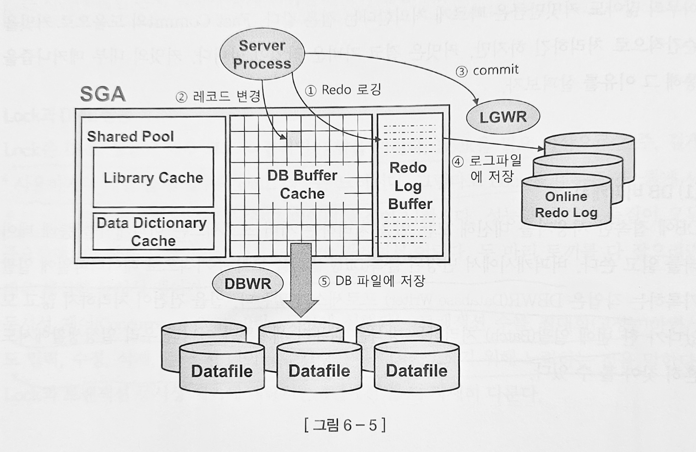

# DML 튜닝

## 6.1 기본 DML 튜닝

#### DML 성능에 영향을 미치는 요소

* 인덱스
* 무결성 제약
* 조건절
* 서브쿼리
* Redo 로깅
* Undo 로깅
* Lock 
* Commit

### 인덱스 사용시 DML 성능

테이블은 FreeList를 통해 입력 받으나 인덱스는 정렬된 자료구조이므로 수직적 탐색을 통해 입력할 블록을 찾아야 한다.

Delete 시에도 인덱스 레코드를 모두 찾아 삭제를 해주어야 한다. 

Update 시에는 변경된 컬럼만 참조하는 인덱스를 찾아서 변경해주어야 하는데 이때 두개의 오퍼레이션(삭제 + 입력) 이 발생한다.

### 무결성 제약과 DML 성능


데이터베이스에 논리적으로 의미 있는 자료만 저장되게 하는 데이터 무결성 규칙은 DML에 영향을 줄 수 있다.

무결정 규칙으로는 아래 4가지가 있다.

* 개체 무결성
* 참조 무결성
* 도메인 무결성
* 사용자 정의 무결성

이러한 무결성 원칙을 지키기 위해서 PK, FK, Check, Not null 등의 제약을 설정하면 조금 더 잘 데이터 무결성을 지킬 수 있다.

그 중 PK, FK 전략은 성능에 더 큰 영향을 미친다. 

### Redo 로깅과 DML 성능

오라클은 데이터파일과 컨트롤 파일에 가해지는 모든 변경사항을 Redo 로그에 저장한다. 

> Redo 로그 : 트랜잭션 데이터가 유실되었을 경우, 트랜잭션을 재현하여 유실 이전 상태로 복구하는데 사용된다.

### Undo 로깅과 DML 성능

Redo는 트랜잭션을 재현하여 과거를 현재로 돌리는 반면, Undo는 트랜잭션을 롤백하여 현재를 과거로 돌리는데 사용된다. 

따라서 Redo에서는 트랜잭션을 재현하는데 필요한 정보들을 로깅하고 Undo에서는 변경된 블록을 이전으로 돌리는데 필요한 정보를 로깅한다. 

~~그렇다고 undo로깅을 안하려고 하지는 말자 아니 어차피 기능 지원을 안해준다.~~

### Lock와 DML 성능

Lock은 DML 성능에 큰 영향을 미친다. Lock를 너무 자주 사용하면 DML 성능은 느려진다. 그렇다고 너무 Lock를 적게, 레벨을 무리해서 낮춰버리면 오히려 데이터 품질이 낮아진다. 

이를 해결하려면 섬세한 동시성 제어가 필요하다.

> 동시성 제어 : 동시에 실행되는 트랜잭션 수를 최대화 하면서, CRUD 시 무결성을 유지하기 위해 노력하는 것을 뜻한다. 

### 커밋과 DML 성능

DML을 끝내려면 커밋을 해야 하므로 서로 밀접하게 관련이 있다. 특히 DML이 Lock에 의해 블로킹 되는 경우 커밋은 DML성능과 직결된다. 

### 커밋의 내부 매커니즘

1. DB 버퍼캐시 : 서버는 버퍼캐시에 변경된 데이터를 모아 주기적으로 데이터파일에 일괄 기록한다(DBWR).

2. Redo 로그 버퍼 : 버퍼 캐시는 휘발성이므로 DBWR이 데이터 블록을 데이터 파일에 반영할 때까지 불안한 상태이다. 이를 위해 Redo 로그에도 기록을 해둔다. 
그러나 Redo는 디스크 I/O로 인해 느리다. 이를 위해 먼저 로그 버퍼에 기록해두고 나중에 LGWR이 Redo 로그 파일에 일괄 저장한다. 

3. 트랜잭션 데이터 저장과정


    1. DML 실행시 Redo 로그 버퍼에 변경사항을 기록한다.
    2. 버퍼블록에 데이터를 변경한다. 물론, 버퍼캐시에서 블록을 찾지 못했다면 데이터 파일에 읽는 작업을 실행한다. 
    3. 커밋
    4. LGWR프로세스가 Redo로그 버퍼 내용을 로그파일에 저장한다.
    5. DBWR프로세스가 변경된 버퍼블록을 데이터파일에 일괄 저장한다. 


### 데이터베이스 Call과 성능

SQL은 아래 세 단계로 나뉘어 실행된다. 

* Parse Call : SQL 파싱과 최적화를 수행하는 단계. SQL과 실행계획을 라이브러리에서 찾으면 패스한다.
* Execute Call : SQL 실행. (DML은 여기서 끝나나 SELECT 의 경우는 다음 단계를 거친다.)
* Fetch Call : 데이터를 읽어 사용자에게 보여주는 작업, 전송할 데이터가 많으면 Fetch Call이 많이 발생한다.


Call이 어디서 발생하느냐에 따라 User Call, Recursive Call로 나뉘어진다. 

User Call : 네트워크를 경유해 DBMS외부로부터 인입되는 Call(WAS 서버)

Recursive Call : DBMS 내부에서 발생하는 Call, SQL 파싱/최적화에서 발생하는 데이터 딕셔너리 조회, PL/SQL 로 작성한 함수 등이 속한다.

보통 User Call이 성능에 영향을 많이 미친다.

### One SQL 중요성

여러번 Call 할거 한번에 Call하여 처리하면 성능 개선에 도움이 된다. 

One SQL에는 아래와 같은 방법이 있다.

* Insert into select
* 수정가능 조인 뷰
* Merge 문

### Array Processing

Array Processing 기능을 활용하면 One SQL로 구현하지 않고도 Call 부하를 획기적으로 줄일 수 있다.

100만 건을 하나씩 수행하는 것이 아닌 만 번에 한번 수행 시 100건을 수행하면 성능 향상을 이끌어낼 수 있다.

### 인덱스 및 제약 해제를 통한 DML 튜닝

배치 프로그램에서는 이들 기능을 해제하여 성능 개선 효과를 볼 수 있다. 

* PK 인덱스 :  PK를 해제하고 인덱스를 드랍 한 후, 커밋을 마치면 PK 제약을 활성화 하면 된다.(PK인덱스인 경우 PK 제약 활성시 자동 생성됨)

    PK 제약 활성화하면서 INVALIDATE를 활성화 하면 시간 단축에 도움이 된다.

* PK제약에 Non Unique 인덱스를 사용하는 경우 : PK 인덱스를 드랍하지 않고 Unusable 상태에서 데이터를 입력하고 싶다면 PK제약에 NonUnique 인덱스를 사용하면 된다. 

### 수정 가능 조인 뷰

조인 뷰는 From 절에 2개 이상 테이블을 가진 뷰를 뜻하며, 수정 가능 조인 뷰는 입력, 수정, 삭제가 허용되는 조인 뷰를 말한다. 단, 1쪽 집합과 조인하는 M쪽 집합에만 입력/수정/삭제가 허용된다. 

### Merge 문 활용

DW에서 가장 흔하게 발생하는 오퍼레이션은 기간계 시스템에서 가져온 신규 트랜잭션 데이터를 반영함으로써 두 시스템 간의 데이터를 동기화 하는 작업이다. 

Target 테이블과 Left Outer 방식으로 조인하여 조인에 성공시 Update, 실패시 Insert 하는 방식으로 작동된다.

> Merge 문 Delete 절은 Merge에서 조인이 성공된 데이터만 삭제가능하다. 조인에 성공한 데이터를 모두 업데이트 하고 결과 값이 Delete Where을 만족하면 삭제되는 기능이다.


## Direct Path I/O 활용

대량 데이터 처리 시 버퍼캐시를 경유하지 않고 곧바로 데이터 블록을 읽고 쓸 수 있는 기능이다. 

보통은 버퍼캐시를 경유한 후, 찾으려는 데이터가 버퍼캐시에 없다면 디스크에 읽는 방식으로 진행되나 대량의 데이터를 Insert 하는 경우 오히려 이는 성능에 방해가 된다. 

이를 위해 버퍼캐시를 경유하지 않고 바로 디스크를 읽는 방식으로 진행되는 방식이 Direct Path I/O인데 아래는 그 기능을 작동하는 방식이다. 

1. 병렬 쿼리로 Full Scan
2. 병렬 DML을 수행하는 경우
3. Direct Path Insert
4. Temp 세그먼트 블록들을 읽고 쓸 때
5. direct 옵션을 지정하고 export 수행시
6. nocache옵션을 지정한 LOB 컬럼


### Direct Path Insert

일반적으로 insert 가 느린 경우

1. 데이터를 입력할 수 있는 블록을 FreeList에서 찾는다. 테이블 HWM 아래쪽에 있는 블록 중 데이터 입력이 가능한 블록을 목록으로 관리하는데 이를 FreeList라 한다.
2. FreeList에서 할당받은 블록들을 버퍼캐시에서 찾는다.
3. 버퍼캐시에 없다면 데이터파일에 읽어 버퍼캐시에 적재한다.
4. Insert 내용을 Undo segment에 기록한다. 
5. insert 내용을 redo에 저장한다. 

Direct Path Insert 하는 방법

* Insert...select 문에 append힌트 사용
* parallel 힌트 이용하여 병렬 insert
* direct 옵션 지정하고 SQL Loader로 데이터 적재
* CTAS 문 수행


위의 방법이 빠른 이유

1. FreeList 참조 안하고 HMW 바깥 영역에서 데이터 순차적 입력
2. 블록을 버퍼캐시에서 탐색 안하고 바로 입력
3. 버퍼캐시에 적재하지 않고 데이터베이스에 바로 기록
4. undo 로깅 안함
5. redo 안하게 설정 가능


Direct Path Insert 주의점

이 방식을 사용하면 성능은 매우 빨라지나 Table 전체에 TM Lock가 걸린다. 

FreeList를 활용 안해서 테이블에 여유 공간이 있어도 재활용하지 않는다

### 병렬 DML 

UPDATE, DELETE는 기본적으로 Direct Path Write가 불가능하다. 유일한 해결방법은 병렬 DML을 수행하는 방법이다. 

```sql
alter session enble parallel dml;

-- dml문에 힌트

insert /*+ parallel(c 4)*/ into 고객 c

update /*+ full(c) parallel(c 4)*/ 고객 c set 고객상태코드 = 'WD' where 최종거래일시 = '20100101'
```

병렬 DML도 TM Lock가 걸린다. 