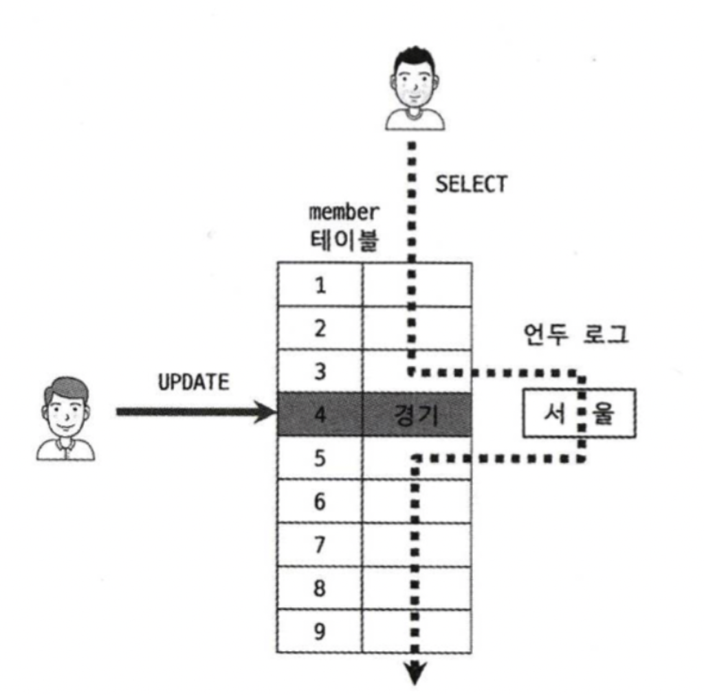
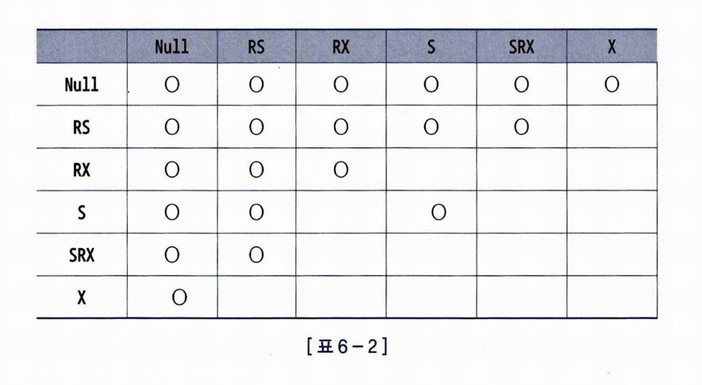
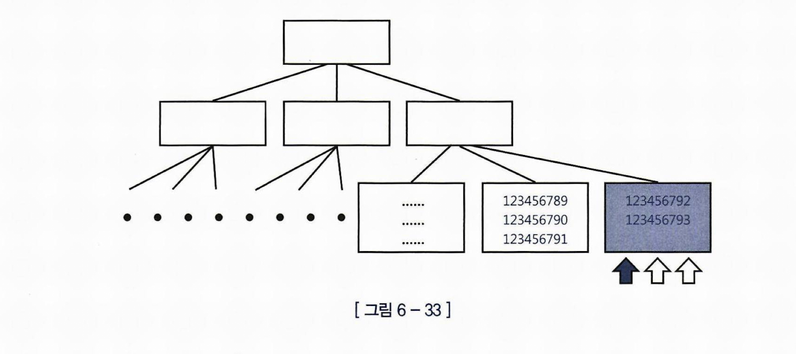

# Lock 과 트랜잭션 동시성 제어

오라클도 MVCC

MVCC = 잠금없는 읽기(select for update 아닌 경우에만) = 동시성 향상



-> 다른 트랜잭션에서 데이터변경 중인 경우, 언두 로그를 읽게 함.

https://www.youtube.com/watch?v=wiVvVanI3p4


오라클도 DML에 로우 Lock, 테이블 Lock, 인덱스 블록 Lock


로우 Lock : 
    같은 레코드의 변경에 대해 발생 
    Insert의 경우에는 중복이슈 때문에 Unique 인덱스가 있을 경우에 만 로우 Lock 발생 

로우 Lock 방지하려면 ?
    데이터 삽입, 변경 요청이 몰리는 주간에는 Lock 을 필요이상으로 걸지 말자, Lock이 오래 걸리지 않도록 SQL을 튜닝하자

DML 테이블락
    테이블락 걸리면 그 테이블 전체에 Lock 걸리는거 아님? -> 상황에 따라서 다르다
    테이블락의 경우 여러가지 모드가 존재하고, 그 모드에 따라 격리수준을 조정함

    


### 블로킹과 데드락

블로킹 : Lock에 의해 대기 중인 상태
데드락 : 서로가 서로를 대기 => 점유와 동시에 순환 대기

블로킹을 푸는 방법은 : 점유하고 있는 쪽에서 커밋을 하거나 롤백을 해주어야 함
오라클에서 데드락을 푸는 방법은 : 먼저 데드락을 인지한 트랜잭션이 커밋을 하거나 롤백, 

### 비동기 , 배치 커밋(COMMIT_WRITE 옵션) 

LGWR ?

LGWR (Log Writer)는 Oracle 데이터베이스에서 중요한 백그라운드 프로세스 중 하나입니다. 
이 프로세스는 redo 로그 버퍼의 내용을 디스크의 redo 로그 파일에 기록하는 역할을 합니다. 
이를 통해 데이터베이스의 신뢰성과 복구 가능성을 보장합니다.

즉 기본적으로는 커밋 시점에 LGWR가 로그를 기록하는 걸 기다려야 한다! 
COMMIT_WRITE=WAIT,IMMEDIATE 가 디폴트 값

WAIT = 동기
IMMEDIATE = no 배치, 실시간

커밋이 너무 빈번하게 수행 된다면? 이 LGWR 부하 때문에 성능이 떨어질 수 있다. => 오라클 10gR2 부터 제공하는 비동기식 커밋과 배치 커밋을 활용 할 수 있다.

비동기식 커밋 : 
    트랜잭션이 커밋될 때, 로그 기록(LGWR) 작업을 비동기적으로 수행하여 성능을 향상
    커밋 시점에서 로그 기록 작업을 기다릴 필요가 없기 때문에 응답 시간이 줄어듭


```
ALTER SESSION SET COMMIT_WRITE='BATCH,NOWAIT';
```

BATCH : 로그기록을 배치로 모아서 처리하겠다.
NOWAIT : 로그기록을 비동기로 수행하겠다.(결과를 기다리지 않음)


### 동시성 제어 방식 : 비관적, 낙관적

비관적 동시성 제어 : 내 트랜잭션 중에 누가 업데이트 할 수 도 있다고 가정

```
select for update 
```

또는

```
for update nowait -> 다른 트랜잭션에 의해 점유 되고 있는 경우 Exception
for update wait 3 -> 다른 트랜잭션에 의해 점유 되고 있는 경우 3초 동안 기다리고 Exception
```

낙관적 동시성 제어 : 내 트랜잭션 중에 아무도 데이터 업데이트 안할거라고 가정, 그래도 읽은 데이터가 fresh한 데이터인지 확인은 필요

```
select a, b, updated_at
from t1
where id = 123

updated_at 기록 해둠

update t1 set a = select로 읽어서 새로 계산값, b = 2
where id = 123
and updated_at = 기록해둔 updated_at
```

또는 아예 동시성 제어 없이 완전 낙관적 프로그래밍

```
select a, b, updated_at
from t1
where id = 123

update t1 set a = select로 읽어서 새로 계산값, b = 2
where id = 123
```

동시성 처리 향상 VS 데이터 품질

select for update가 성능에 최악이고 항상 나쁜건 아니다.
비즈니스 상황에 따라 적절한 방식을 선택하는게 좋을것 같다.

### 인덱스 블록 Lock

트랜잭션이 다른 Row를 수정하는 데도 Lock이 걸릴 수 있다.



일련번호, 입력일시, 변경일시 처럼 순차적으로 증가하는 단일 컬럼 인덱스는 맨 우측 블록에만 데이터가 입력된다.
=> Right Growing 인덱스
=> 입력하는 값이 달라도 같은 인덱스 블록을 바라보게 된다.
=> MAX + 1 방식으로 채번 할 경우에도 자주 발생

인덱스 블록 경합을 해소하는 
가장 좋은 방법은 인덱스를 해시 파티셔닝 => Right Growing 안되고 골고루 뿌려지게

리버스키 인덱스 => 인덱스 키를 반전 시켜서 저장, 범위 스캔은 불가능, 범위 스캔을 포기하고 골고루 뿌려지게


 