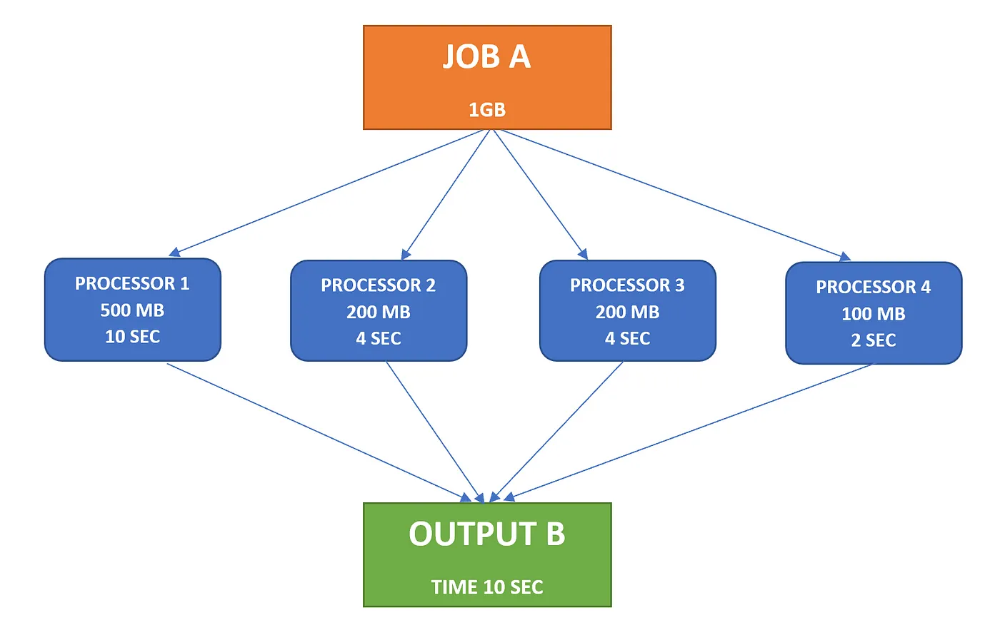
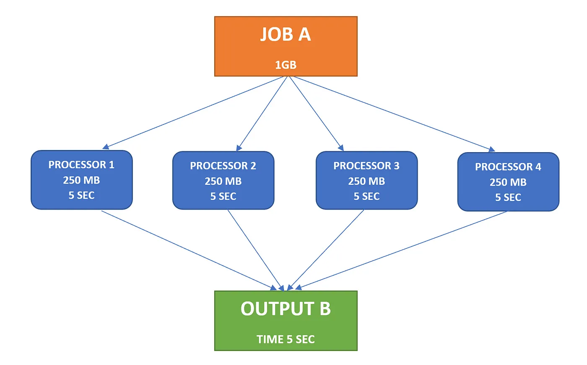
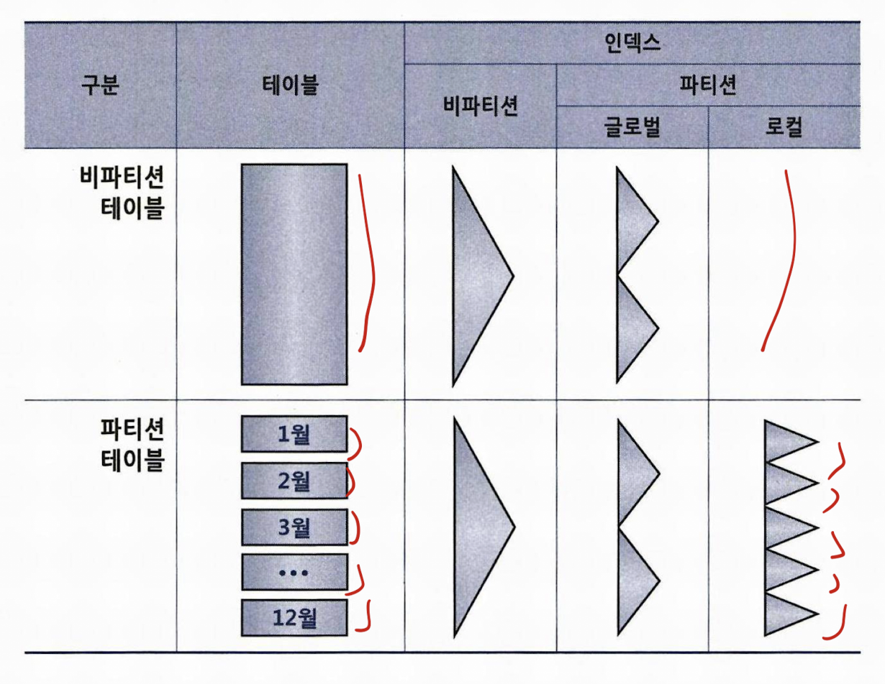
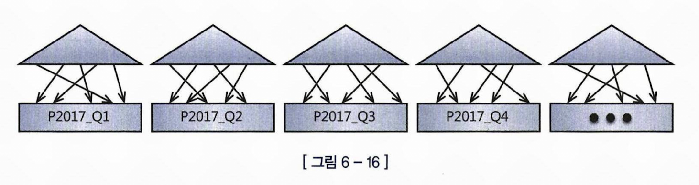
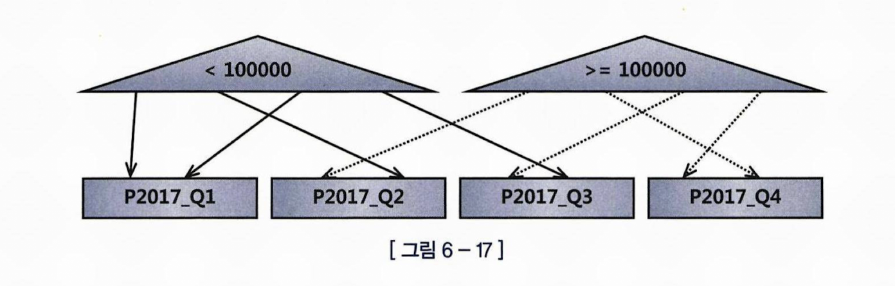
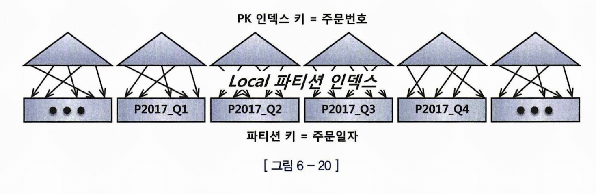
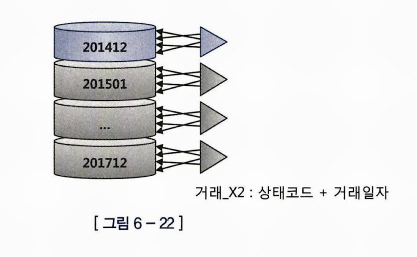

# 파티션을 활용한 SQL 튜닝

## 테이블 파티션과 인덱스 파티션

### 테이블 파티션

파티션의 이점 : 

관리적 측면 : 파티션 단위 백업, 추가, 삭제, 변경 => 가용성 향상
성능적 측면 : 파티션 단위 조회 및 DML, 경합 또는 부하분산

파티션의 종류

파티션 프루닝 : 읽지 않아도 되는 부분을 제외하는 이점

특히 병렬, 분산 처리에서 그 이점이 높음

Range 
    기초적인 방식
    주로 날짜 컬럼 기반

해시 
    파티션 키를 해시
    같은 해시 값을 같는 데이터를 같은 세그먼트에 저장
    분포가 고르게 파티션 키를 정하는것이 중요 -> Data Skew ? => 더블 해시, Skew 된 데이터를 다시 repartition

리스트
    사용자가 정의한 그룹핑에 따라 파티션 분할


Data Skew  





### 인덱스 파티션


로컬 파티션 인덱스(로컬 인덱스) : 테이블 파티션을 따라감



로컬 파티션 인덱스는 관리의 편의성
오라클이 테이블 파티션과 1대1 대응이 되도록 내부적으로 관리
원래는 테이블 파티션을 변경하면 인덱스를 재생성 하거나 바꿔 줘야하지만, 그럴 필요가 없다.

글로벌 파티션 인덱스 : 테이블 파티션과 별개의 파티션 키로 파티셔닝



prefixed 인덱스 파티션 

인덱스 키 컬럼 왼쪽 선두에 위치하는 컬럼으로 파티션 키를 잡은 인덱스 파티션

Noneprefixed 

인덱스 선두 컬럼이 아닌 아예 다른 컬럼으로 파티션키를 잡은 인덱스 파티션


```
Unique 인덱스를 파티셔닝 하려면, 파티션키가 모두 인덱스 구성 컬럼이어야 한다.
``


이 상황에서 주문번호 123456 을 찾는 다면?

### 파티션을 활용한 대량 데이터 변경 : 파티션 Exchange

파티션 Exchange 를 이용한 대량의 데이터 변경
* 로컬 파티션 인덱스 일 경우 BEST

```
alter table 거래
exchange partition p201412 with table 거래_t
including indexes without validation;

```



### 파티션을 활용한 대량 데이터 변경 : 파티션 Drop, Truncate

파티션 Drop VS Truncate

Drop : 삭제 하려는 데이터가 소수일 경우, 그 파티션을 아예 Drop 시킴
Truncate : 삭제 하려는 데이터가 대다수일 경우, 그 파티션의 남길 소수의 데이터를 임시테이블로 복제 후 Truncate 후 다시 복제본으로 백업

=> 파티션 키와 커팅 기준 컬럼이 일치해야 한다. (파티션 키와 커팅 기준 컬럼이 일치 해야한다. : 파티션키는 신청일자 인데 커팅 기준은 업데이트 일시면 x)
=> 파티션 단위와 커팅 주기가 일치 해야 한다. (일, 월 배치로 적재)
=> 모든 인덱스가 로컬 파티션 인덱스여야 한다.


### 파티션을 활용한 대량 데이터 삽입 :

기존 : nologging -> index unusable -> insert -> logging -> index rebuild

로컬 파티셔닝 되어있다면 ? : nologging -> index unusable(해당 파티션만) -> insert -> logging -> index rebuild(해당 파티션만)

Direct Path Insert 방식 ?

데이터 파일에 직접 기록:

일반적인 SQL INSERT 문은 데이터를 테이블의 버퍼 캐시에 기록한 후, 데이터 파일에 기록합니다. Direct Path Insert 방식은 데이터를 버퍼 캐시를 거치지 않고 바로 데이터 파일에 기록합니다.
높은 성능:

데이터 파일에 직접 기록함으로써 I/O 작업이 줄어들고, 더 빠른 데이터 삽입이 가능합니다.
테이블 잠금:

Direct Path Insert는 테이블에 대한 Exclusive Lock을 필요로 합니다. 이는 삽입 작업 동안 다른 사용자나 세션이 테이블에 접근하지 못하도록 합니다.
기존 데이터와의 병합:

Direct Path Insert 방식은 새로운 데이터를 임시 세그먼트에 기록한 후, 삽입이 완료되면 기존 데이터와 병합합니다. 이 과정에서 데이터 파일의 공간을 효율적으로 사용하게 됩니다.