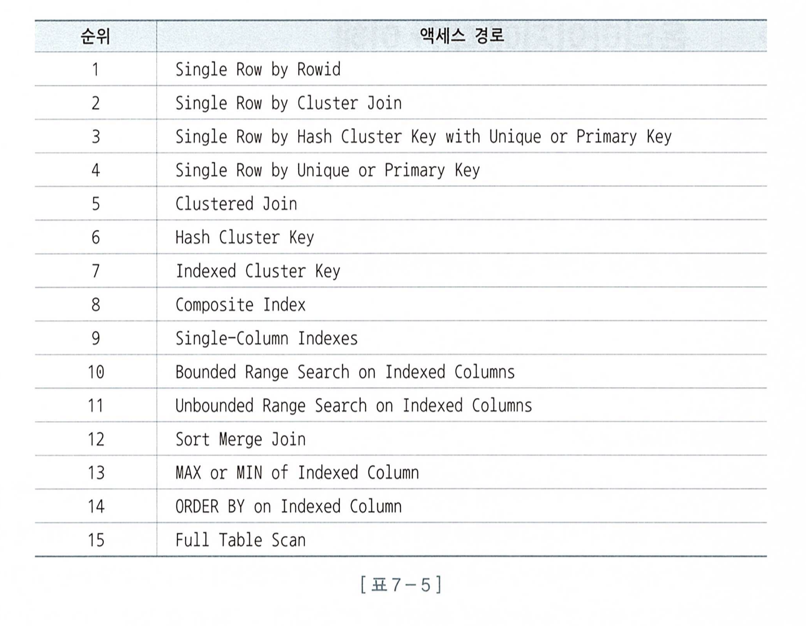

# 📌 서론

<aside>
✏️ 옵티마이저가 통계정보를 어떻게 활용하여 계산하는지 그리고 옵티마이저의 `종류` , `모드`와 `한계` 등 에 대해서도 알아보자.

</aside>

# 🔥 통계정보와 비용계산 원리

## 선택도와 카디널리티

> 선택도(Selectivity)란, 전체 레코드 중에서 조건절에 의해 선택되는 레코드 비율.
카디널리티(Cardinality)란, 전체 레코드 중에서 조건절에 의해 선택되는 레코드 개수
>
- 선택도 = 1 / NDV(Number of Distinct Values)
- 카디널리티 = 총 로우수 X 선택도 = 총 로우수 / NDV

예제

만약 상품 분류 컬럼에 `가전, 의류, 식음료, 생활용품` 네 개의 값이 있다면 `선택도는 25%(1/4)`, 만약 레코드가 10만 건이면 `카디널리티는 2.5만(10만 * 0.25 = 2.5만)`이 된다.

옵티마이저가 이렇게 카디널리티를 구하고 비용을 계산하여 테이블 액세스, 조인순서, 조인 방식등을 결정한다.

계산식을 보아서 알겠지만 `NDV를 사용`하므로 이 값을 정확히 구하는 것이 매우 중요하다.

## 통계 정보

> 옵티마이저는 신이 아니다. 철저히 통계를 기반으로 매우 정직하게 움직인다.
>
- 테이블 정보와 인덱스 정보, 컬럼 통계와, 시스템 통계등을 이용하여 어떻게 검색할지 선택한다.
- 아마 미래의 디비는 학습을 통한 더 최적의 경로를 찾겠지만 가성비로 본다면 통계기반 디비가 좋지 않을까?
- 시스템 통계까지 이용한 디비 시스템은 생각보다 매우 고도화된 소프트웨어라는 생각이 들었다.
    - 소프트웨어도 끊임없이 발전하지만 하드웨어도 마찬가지다.
    - 초창기 1core cpu를 시작으로 지금은 수십개의 core를 가진 cpu도 있다.
    - 디스크기반의 물리적 하드에서 SSD를 거쳐 Nvme 까지 계속해서 진화해 왔다.
    - 소프트웨어를 최적화하기 위해서는 시스템 통계를 반영하는 것이 시대의 흐름이라는 생각이 들었다.
- 어쨌든 통계기반이 매우 정확하지만 통계도 신이 아니기에 결국엔 인간이 개입할 수 있는 힌트 라는 것을 사용해야 하고 이것이 튜닝의 시작이다.
- 생각보다 매우 많은 양의 통계 데이터 이를 활용한 옵티마이저 여러모로 디비시스템에서 배울 것이 많은 것 같다.

# 🔥 옵티마이저대한 이해

위에서 언급한 것과 같이 옵티마이저는 철저히 통계를 기반으로 매우 정직하게 수행된다.

정직하게 수행된다는 것은 옵티마이저에 대한 이해가 바탕에 있어야 알 수 있다.

## 옵티마이저 종류

1. 비용기반 옵티마이저 (CBO)
    1. 사용자 쿼리를 코스트 기반으로 산정하고 가장 낮은 비용의 실행계획을 선택
    2. 사용하는 통계 정보로는 데이터량, 컬럼 값의 수, 컬럼 값 분포, 인덱스 높이, 클러스터링 팩터
2. 규칙기반 옵티마이저 (RBO)
    1. 우선순위 규칙에 따라 실행계획을 만듬.
    2. 통계 정보를 활용하지 않고 규칙에 의존하여 대용량 처리시 문제점 발생

규칙기반은 아무래도 1세대 모델의 느낌이다.

아래 표를 보면 어느정도 합당한 규칙이라는 생각도 들지만 튜닝하면서도 배웠지만 Full Table Scan 이라고 해서 무조건 느린게 아니다.

더 높은 수준의 액세스 경로를 제공하기 위해서는 데이터가 필요했고 이를 구현한 것이 CBO라고 생각이 든다.

결국은 기계든 사람이든 무언가 높은 수준의 선택을 하기 위해서는 데이터가 기반이 되어야 하는 것 같다.

## 옵티마이저에 영향을 미치는 요소

1. SQL과 연산자 형태
    1. 튜닝때 알게 되었지만 In, Like, Between 사용시 옵티마이저가 다르게 동작할 수 있음을 인지 하자.
2. 인덱스, IOT, 클러스터, 파티션, MV 등 옵티마이징 팩터
    1. 디비를 어떻게 구성했는지에 따라서 실행계획과 성능이 달라 질 수 있다.
3. 제약 설정
    1. PK,FK, Check, Not Null 제약은 무결성을 보장해주고 쿼리 성능을 최적화 하는데 중요한 메타 정보로 활용
4. 통계 정보
    1. 조금 재밌었던 내용인데 만약 디비 시스템에 갑자기 문제가 생겼다면 통계 데이터를 확인해보라고 나와 있고 케이스는 아래와 같다.
        1. 특정 테이블 통계 정보를 갑자기 삭제
        2. 대량 데이터를 삭제 → 데이터가 없는 상태에서 통계 수집 → 데이터 입력
        3. 3년간 갱신이 없던 테이블 통계 정보를 갑자기 재수집
        4. 통계 정보없이 관리하던 테이블에 인덱스 재 생성
        5. 테이블이나 인덱스를 재생성하면서 파티션 단위로만 통계정보를 수집.
5. 옵티마이저 힌트
    1. 당연한 이야기이다. 옵티마이저는 강제이행명령과 같다.

4번의 통계 정보는 필요할때 문제 발생시 기억해두면 좋을 것 같다.

그리고 3번의 경우에도 제약 설정에 따른 비용이 있겠지만 장기적으론 쿼리 성능 최적화와 무결성을 보장할 수 있으니 기억해 둬야 겠다.

## 옵티마이저 한계

> DBA가 통계 정보를 잘 수집하고 개발자가 SQL잘 작성해도 실수하기 마련. 같은 DBMS이지만 버전에 따라 실생계획이 다를 수 있다.
>

옵티마이저가 만능이 아니고 정답도 아니다. 따라서 옵티마이저에 너무 의존하지 말아야 한다.  사실 옵티마이저에 의존하지 않을려고 공부하는 것.

## 개발자의 역활

> 불완전한 옵티마이저에 의존할 것이 아니라 개발자 스스로 옵티마이저가 되어야 한다. 능력이 없어 옵티마이저에 맡기는 것이 아니라 바빠서 맡긴다고 생각.
>

이 챕터가 가장 중요한 것 같다. 결국엔 이책의 핵심 내용이 아닐까? 결국엔 알고 쓰는것과 모르고 쓰는 것의 차이

전문 튜너들 처럼 매우 복잡한 튜닝은 힘들겠지만 개발자 스스로 어느정도 본인이 작성한 쿼리가 어떻게 동작하는지는 알아야 하지 않을까?

이 책에서는 여러가지 제안하지만 개인적으로는 지식을 반복해서 습득하고 상황과 요구사항에 맞게 적절하게 지식을 활용한다면 개발자로서의 역활을 어느정도 하지 않을까 생각 한다.

# 🚀 결론

- 거의 마지막 시간으로 옵티마이저에 대해서 알아보았는데 특별할 것도 신기한 것도 없었다.
- 현재 대부분 사용하는 CBO 기반의 옵티마이저는 데이터를 기반하여 실행계획을 도출 한다.
- 옵티마이저는 만능이 아니고 완벽하지 않으므로 불완성에 대해 이해하고 있어야 한다.
- 개발자 스스로 본인이 작성하는 SQL에 대해 어떻게 동작해야 할지 이해하고 있어야 하며 필요시 적절하게 튜닝하는 소양을 갖춰야 한다.