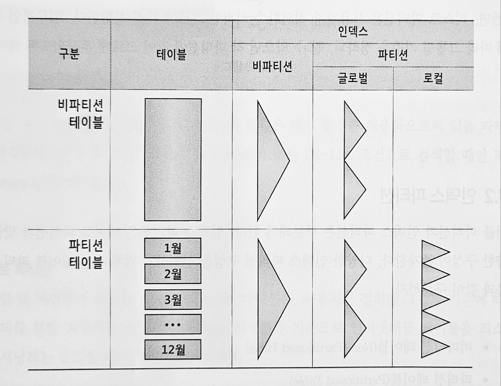
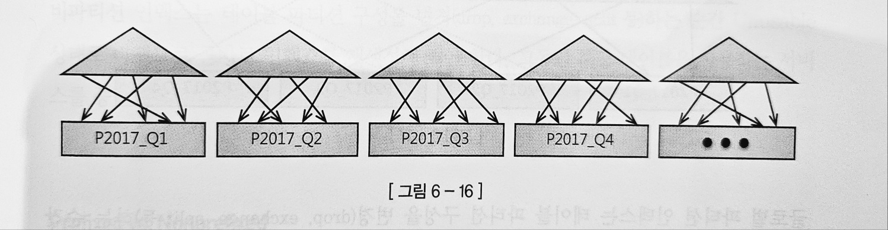
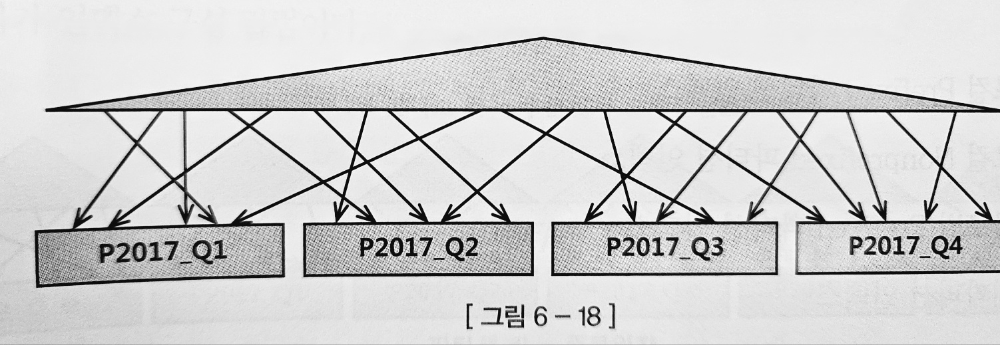

# 파티션을 통한 DML 튜닝

## 테이블 파티션

> 파티셔닝 : 테이블, 인덱스 데이터를 특정 컬럼 값에 따라 별도 세그먼트에 나눠서 저장하는 것
> 

**파티셔닝이 필요한 이유**

- 관리적 측면 : 파티션 단위 백업, 추가, 삭제, 변경 → 가용성 향상
- 성능적 측면 : 파티션 단위 조회 및 DML, 경합 또는 부하 분산

**파티션 종류**

- Range
- Hash
- 리스트

### Range 파티션

```sql
create table 주문 (..., 주문일자 varchar2(8)) 
partition by range(주문일자) (
	partition P2017_Q1 values less than ('20170301')
	,partition P2017_Q2 values less than ('20170601')
	,partition P2017_Q3 values less than ('20170901')
	,partition P2017_Q4 values less than ('20171201')
)
```

위와 같은 파티션 테이블에 값을 입력하면 각 레코드를 파티션 키 값에 따라 분할 저장하고, 읽을 때도 검색 조건에 만족하는 파티션만 골라 읽을 수 있어 Full Scan 시 성능이 좋아진다.

파티션 테이블의 성능 향상 원리는 Pruning 에 있다.

SQL 하드 파싱이나 실행 시점에 조건절을 분석해서 읽지 않아도 되는 파티션 세그먼트를 액서스 대성에서 제거한다. 

### 해시 파티션

해시 파티션은 파티션 키 값을 해시 함수에 입력하여 반환받은 값이 같은 데이터를 같는 세그먼트에 저장하는 방식이다. 

```sql
create table 주문 (..., 고객ID varchar2(8)) 
partition by hash(고객ID) partitions 4;

```

검색 시 조건절 비교 값에 똑같은 해시 함수를 적용하여 읽을 파티션을 결정한다. 해시 알고리즘 특성상 등치 조건 혹은 in list조건으로 검색시에만 파티션 Pruning이 작동한다.

### 리스트 파티션

```sql
create table 주문 (..., 지역분류 varchar2(8)) 
partition by list(지역분류) (
	partition P1 values ('서울')
	,partition P2 values ('경기','인천')
	,partition P3 values ('부산','대구','대전')
	,partition P4 values (DEFAULT)
)
```

Range 파티션에선 값의 순서에 따라 저장할 파티션이 결정되지만, 리스트 파티션에는 순서와 상관없이 불연속적인 값의 목록에 의해 결정된다.

해시 파티션과 비교하면 해시 파티션은 정해진 해시 알고리즘에 따라 분리되나 리스트 파티션은 사용자가 지정한 기준에 따라 분리가 된다.

## 인덱스 파티션

테이블 파티션은 아래와 같이 구분된다.

- 비파티션 테이블
- 파티션 테이블

인덱스 파티션은 아래와 같이 구분된다.

- 로컬 파티션 인덱스
- 글로벌 파티션 인덱스
- 비파티션 인덱스

로컬 파티션 인덱스는 각 테이블 파티션과 인덱스 인덱스 파티션이 서로 1:1대응 관계가 되도록 오라클이 자동으로 관리하는 파티션이다. 

로컬이 아닌 파티션 인덱스는 모두 글로벌 파티 인덱션이다. 



### 로컬 파티션 인덱스

테이블 파티션이 계절별로 옷을 관리하는 서랍장에 비유했다면 로컬 파티션 인덱스는 계절별로 별도 색인을 만든다고 생각하면 된다.

```sql
create index 주문_x01 주문 (주문일자, 주문금액) Local;
```

각 인덱스 파티션은 테이블 파티션 속성을 그대로 상속받는다. 



만약 테이블 파티션 키가 주문일자면 인덱스 파티션 키도 주문일자가 된다.

테이블 파티션 구성을 변경해도 인덱스를 재생성할 필요가 없다.

### 글로벌 파티션 인덱스

파티션 유형이 다르거나, 파티션 키가 다르거나, 비파티션 테이블이거나, 파티션 기준값 정의가 다른 경우에도 사용 가능하다.

글로벌 파티션 인덱스는 테이블 파티션 구성을 변경 하는 순간 Unusable 상태로 변하므로 바로 인덱스 생성을 해주어야 한다.

### 비파티션 인덱스

파티셔닝 하지 않은 인덱스

```sql
create index 주문_x01 on 주문 (고객ID, 배송일자);
```



비파티션 인덱스는 글로벌 비파티션 인덱스라고도 한다. 

비파티션 인덱스는 테이블 파티션 구성을 변경하는 순간 Unusable 상태로 바뀌므로 바로 인덱스를 재 생성해주어야 한다.

### Prefixed vs Nonprefixed

Prefixed : 인덱스 파티션 키 컬럼이 인덱스 키 컬럼 왼쪽 선두에 위치한다.

NonPrefixed : 인덱스 파티션 키 컬럼이 인덱스 키 컬럼 왼쪽 선두에 위치하지 않는다. 파티션 키가 인덱스 컬럼이 아예 속하지 않을 때도 여기에 속한다.

로컬과 글로벌, Prefixed nonprefixed를 조합하면 아래와 같은 조합이 나온다.

- 로컬 Prefixed 파티션 인덱스
- 로컬 Nonprefixed 파티션 인덱스
- 글로벌 Prefixed 파티션 인덱스
- 비파티션 인덱스

### 중요한 인덱스 파티션 전략

> Unique 인덱스를 파티셔닝 할거면 파티션 키가 모두 인덱스 구성 컬럼이어야 한다.
> 
- 파티션 키가 인덱스 컬럼에 포함되어야 하는 조건은 DML 성능 보장을 위해 당연히 있어야 할 제약조건이다.
- 파티션 키 조건 없이 PK 인덱스로 액세스 하는 수많은 쿼리 성능을 위해 필요한 제약조건이다.
- 이 제약으로 인해 PK 인덱스를 로컬 파티셔닝하지 못하면, 파티션 Drop, Truncate, Exchange, Split, Merge 같은 파티션 구조 변경 작업도 쉽지 않음. (Unusable 되기 때문)
- **서비스 중단 없이 파티션 구조를 빠르게 변경하려면 PK를 포함한 모든 인덱스는 로컬 파티션 인덱스여야 한다.**

## 파티션을 활용한 대량 UPDATE 튜닝

인덱스가 DML 성능에 큰 영향을 미치므로 대량 데이터를 입력/수정/삭제할 때는 인덱스를 드랍하거나 unusable상태로 변경해야 한다.

위의 방법은 드랍/unusable 상태로 변경을 하든 하지 않든 상당한 부담을 준다.

### Partition Exchange를 이용한 대량 데이터 변경

만약 테이블이 파티셔닝 되어 있고 로컬 파티션 인덱스라면 수정된 값을 갖는 임시 세그먼트를 만들어 원본 파티션과 바꿔치기 하는 방법을 사용한다.

1. 임시 테이블을 생성, noLogging 모드로 생성

```sql
create table 거래_t
nologging
as
select * from 거래 where 1 = 2;
```

1. 거래 데이터를 읽어 임시 테이블에 입력하면서 상태 코드 값 수정

```sql
insert /*+ append */ into 거래_t
select 고객번호, 거래일자, 거래순번 ... 
	,(case when 상태코드 <> 'ZZZ' then 'ZZZ' else 상태코드 end) 상태코드
from 거래
where 거래일자 < '20150101';
```

1. 임시 테이블에 원본 테이블과 같은 구조로 인덱스 생성, nologging 모드

```sql
create unique index 거래_t_pk_on 거래 t (고객번호, 거래일자, 거래순번) nologging;
create index 거래_t_x1 on 거래_t(거래일자, 고객번호) nologging;
create index 거래_t_x2 on 거래_t(상태코드, 거래일자) nologging;
```

1. 2024년 12월 파티션과 임시 테이블을 Exchange 한다.

```sql
alter table 거래
exchange partition p201412 with table 거래_t
including indexes without validation;
```

1. 임시 테이블을 Drop 한다.

1. 파티션을 nologging 모드로 전환한다.

## 파티션을 활용한 대량 Delete 튜닝

Delete는 update보다 삭제가 더 느리다.

테이블이 삭제 조건절 컬럼으로 파티셔닝되어 있고, 인덱스가 로컬 파티션이라면 아래와 같이 삭제 가능하다.

```sql
alter table drop partition p201412;
```

### 파티션 Trucate 를 이용해 대량 데이터 삭제

1. 임시 테이블 생성 후 남길 데이터만 복제
2. 삭제 대상 테이블 파티션을 Truncate
3. 임시 테이블에 복제해 둔 데이터를 원본 테이블에 입력한다.
4. 임시 테이블을 Drop

서비스 중단 없이 파티션 Drop, Truncate 하려면 아래와 같은 조건이 필요하다.

1. 파티션 키와 커팅 기준 컬럼이 일치해야 한다.
    1. 파티션 키와 기준 컬럼 모두 ‘신청일자’
2. 파티션 단위와 커팅 주기가 일치해야 한다.
    1. 월 단위 파티션을 월 주기로 커팅
3. 모든 인덱스가 로컬 파티션 인덱스여야 한다. 

## 파티션을 활용한 대량 Insert 튜닝

### 비파티션 테이블인 경우

그냥 인덱스를 unusable 하고 재생성하는게 빠르다

### 파티션 테이블인 경우

파티션 단위로 인덱스를 재 생성하면 된다.

1. 작업 대상 테이블을 nologging 해야 한다.
2. 작업 대상 테이블 파티션과 매칭되는 인덱스 파티션을 Unusable 상태로 전환한다.
3. 대량 데이터 입력
4. 작업 파티션 logging으로 전환

# Lock과 트랜잭션 동시 제어

## 오라클 Lock

DML 락은 다중 트랜잭션이 동시에 액서스 하는 사용자 데이터의 무결성을 보호해 준다.

DML 락에는 테이블 Lock과 로우 락이 있다.

### DML 로우 락

DML 로우 락은 두개의 동시 트랜잭션이 같은 로우를 변경하는 것을 막는다.

어떤 DBMS이든 DML 로우 락은 배타적 락을 사용하므로 update, delete를 진행중인 로우를 다른 트랜잭션이 update/delete 하지 못한다.

insert 같은 경우 Unique 인덱스가 있는 경우에만 발생한다. Unique인덱스가 있는 상황에서 두 트랜잭션에서 insert 를 하려 하면 블로킹이 발생한다. 

MVCC 모델을 사용하는 오라클은 DML과 Select 가 서로 진행을 방해하지 않는다.

MVCC 모델을 사용 안하는 DBMS는 select 문에 공유 락을 걸어야 한다.

DML 로우 락으로 인한 성능 저하를 방지하려면, 온라인 트랜잭션을 처리하는 주간에 Lock를 필요 이상으로 오래 유지하지 않도록 커밋 시점을 조절해야 한다.

### DML 테이블 락

오라클은 DML로우 락을 설정하기 전에 테이블 락을 설정한다.

현재 트랜잭션이 갱신중인 테이블 구조를 다른 트랜잭션이 변경하지 못하게 막기위해서이다.

### Lock 모드간 호환성 정리

- RS : row share
- RX : row exclusive
- S : share
- SRX : share row exclusive
- X : exclusive

테이블 lock이라고 하면 테이블 전체 lock 걸린다고 생각하기 쉬운데,  자신이 해당 테이블에서 현재 작업을 수행 중인지 알리는 일종의 Flag다.

테이블 lock은 여러 모드가 있다. 어떤 모드 사용했는지에 따라 후행 트랜잭션이 수행할 수 있는 작업 범위가 결정된다.

## Lock을 푸는 열쇠, 커밋

블로킹은 선행 트랜잭션이 결정한 Lock 때문에 후행 트랜잭션이 작업 못하고 멈춘 상태이다. 해소 방법은 커밋 또는 롤백 뿐이다.

데드락은 두 트랜잭션이 각각 특정 리소스에 Lock을 설정한 상태에서 맞은편 트랜잭션이 lock을 설정한 리소스에 또 lock을 설정하려고 진행하는 상황을 말한다.

오라클에서 교착상태가 발생하면, 이를 먼저 인지한 트랜잭션이 문장 수준 롤백을 진행한 후에 에러 메시지를 던진다.

교착상태가 해소되어도 블로킹 상태라 트랜잭션은 커밋 또는 롤백을 결정해야 한다. 만약 예외처리를 안하면 계속 대기상태를 지속한다.

### 4가지 커밋 명령

- WAIT : LGWR가 로그버퍼를 파일에 기록했다는 완료메시지를 받을때 까지 대기
- NOWAIT : LGWR가 완료 메시지 기다리지 않고 다음 트랜잭션 진행
- IMMEDIATE : 커밋 명령을 받을 때마다 LGWR가 로그 버퍼를 파일에 기록
- BATCH : 세션 내부에 트랜잭션 데이터를 일정량 버퍼링했다 일괄 처리

# 트랜잭션 동시성 제어

## 비관적 동시성 제어

- 사용자들이 같은 데이터를 동시에 수정할 것을 가정함.
- 한 사용자가 데이터를 읽는 시점에 lock을 걸고 조회/갱신 처리가 완료될 때까지 유지.
- 첫번째 사용자가 락을 해제할 때까지 다른 사용자들이 같은 데이터 수정 못하게 만들어서 잘못 사용시 동시성이 나빠진다.
- 비관적 동시성 제어는 자칫 시스템 동시성을 심각하게 떨어뜨릴 우려가 있지만 FOR UPDATE 에 WAIIT 또는 NOWAIT 옵션을 사용하면 LOCK을 얻기 위해 무한정 기다리지 않아도 된다.(그냥 예외를 던지기 때문 ⇒ 오히려 동시성이 증가될 수 있다.)

## 낙관적 동시성 제어

- 사용자들이 같은 데이터를 동시에 수정하지 않을 것을 가정함.
- 데이터를 읽을 때, lock을 설정하지 않는다.
- 읽는 시점에 lock을 사용하진 않았지만, 데이터를 수정하고자 하는 시점에 앞서 읽은 데이터가 다른 사용자에 의해 변경되었는지 체크해야 한다.

## **데이터 품질과 동시성 향상을 위한 제언**

- FOR UPDATE 사용을 두려워 하지 말자
- 다중 트랜잭션이 존재하는 데이터베이스 환경에서 공유 자원에 대한 액세스 직렬화는 필수
- 데이터 변경할 목적으로 읽으면 당연히 LOCK을 걸어야 함
- FOR UPDATE를 알고 쓰고 필요한 상황이면 정확히 사용하고, 동시성이 나빠지지 않게 WAIT 또는 NOWAIT 옵션을 활용한 예외처리를 잘하자
- 불필요하게 LOCK을 오래 유지하지 말고, 트랜잭션의 원자성을 보장하는 범위 내에서 가급적 빨리 커밋하자.
- 꼭 주간에 수행할 필요가 없는 배치 프로그램은 야간 시간대에 수행하자.
- 낙관적, 비관적 동시성 제어를 같이 사용하는 방법도 있다. ⇒ 낙관적 락 사용 하다가 다른 트랜잭션에 의해 변경되면 롤백 후 다시 시도시 비관적으로 실행
- 동시성 향상하고자 할 때 SQL 튜닝은 기본이다.  효율적인 인덱스 구성, 데이터량에 맞는 조인 메소드 선택
- LOCK에 대한 고민은 트랜잭션 내 모든 SQL을 완벽히 튜닝하고 나서 해도 늦지 않다.